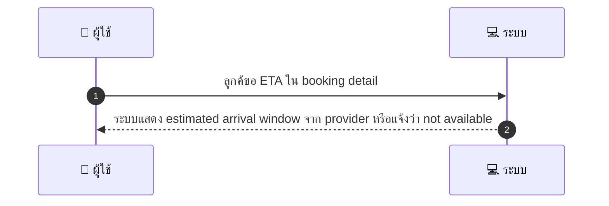
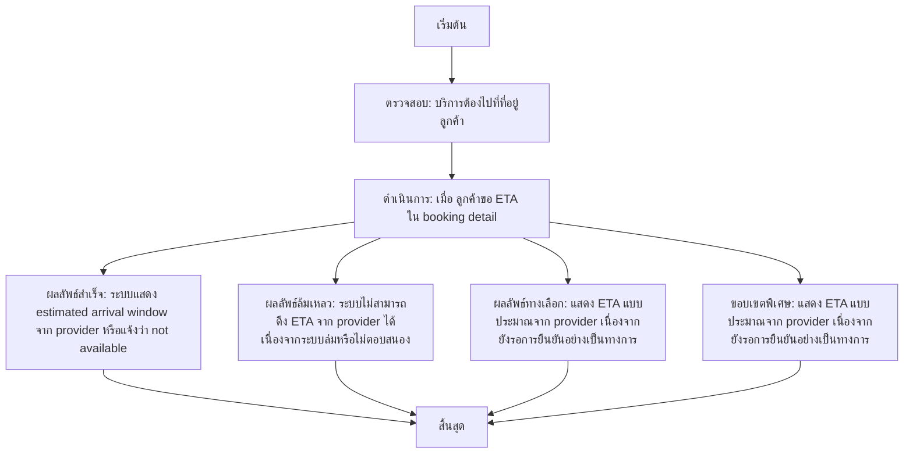

# CUS056 - Request estimated duration/arrival window ETA for on-site services

## 👤 บทบาท
- ลูกค้า

## 🎯 เป้าหมายของเคส
- ในฐานะ: ลูกค้า
- ต้องการ: ขอ ETA หรือช่วงเวลาที่คาดว่าจะมาถึงสำหรับ on-site service
- เพื่อ: เพื่อติดตามและเตรียมตัว

## ⚙️ เงื่อนไขก่อนเริ่ม (Precondition)
- บริการต้องไปที่ที่อยู่ลูกค้า

## 🧭 ผลลัพธ์และสถานการณ์
- ✅ ผลลัพธ์ที่คาดหวัง (Success Flow): ระบบแสดง estimated arrival window จาก provider หรือแจ้งว่า not available
- ❌ ผลลัพธ์ที่ Failure:
  - ระบบไม่สามารถดึง ETA จาก provider ได้เนื่องจากระบบล่มหรือไม่ตอบสนอง
  - ข้อมูล ETA ใน booking detail ไม่ถูกต้องหรือหายไป ทำให้ไม่สามารถแสดง ETA ได้
  - เกิดข้อผิดพลาดเครือข่ายระหว่างแพลตฟอร์มกับ provider ส่งผลให้ไม่สามารถคำนวณ ETA ได้
  - บริการระหว่างผู้ให้บริการถึงยังไม่สามารถยืนยัน ETA ได้อย่างทันท่วงที
- 🔄 ผลลัพธ์ทางเลือก:
  - แสดง ETA แบบประมาณจาก provider เนื่องจากยังรอการยืนยันอย่างเป็นทางการ
  - แจ้งว่า ETA ไม่พร้อมใช้งานตอนนี้และจะอัปเดตเมื่อ provider ยืนยัน
  - แสดงช่วงเวลาที่คาดการณ์ไว้ (เช่น 14:30-15:00) โดยไม่รับประกันความแม่นยำ
  - ให้ลูกค้าติดตามการอัปเดต ETA แบบเรียลไทม์จนกว่าจะมาถึง
- ⚠️ ผลลัพธ์ขอบเขตพิเศษ:
  - แสดง ETA แบบประมาณจาก provider เนื่องจากยังรอการยืนยันอย่างเป็นทางการ
  - แจ้งว่า ETA ไม่พร้อมใช้งานตอนนี้และจะอัปเดตเมื่อ provider ยืนยัน
  - แสดงช่วงเวลาที่คาดการณ์ไว้ (เช่น 14:30-15:00) โดยไม่รับประกันความแม่นยำ
  - ให้ลูกค้าติดตามการอัปเดต ETA แบบเรียลไทม์จนกว่าจะมาถึง

## ✅ เกณฑ์การยอมรับ (Acceptance Criteria)
- ETA shown when provider confirms
- updates if provider delays
- notify customer of changes

## ⏱ ลำดับความสำคัญ / SLA
- Priority: P1
- SLA: ETA update within 10m of provider change

---

## 🔁 Sequence Diagram  
> แสดงลำดับเหตุการณ์ระหว่าง "ผู้ใช้" กับ "ระบบ"

---

## 🧭 Flowchart Diagram
> แสดงขั้นตอนการทำงานของระบบอย่างเข้าใจง่าย

