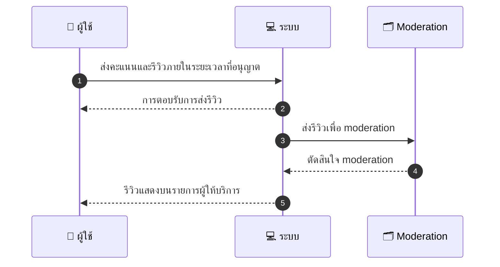
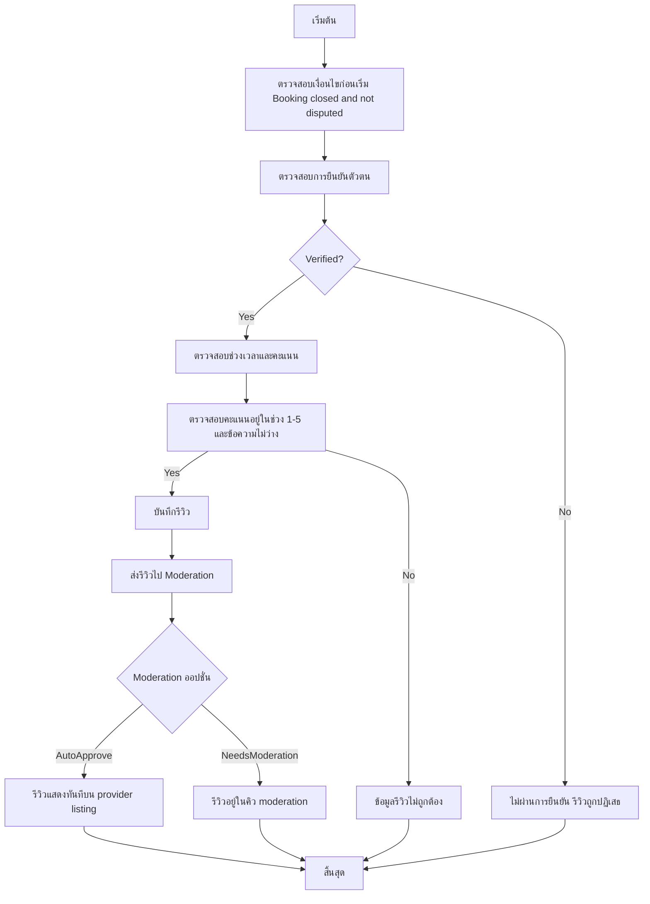

# CUS008 - Reviews & Ratings Customer

## 👤 บทบาท
- ลูกค้า

## 🎯 เป้าหมายของเคส
- ในฐานะ
- ต้องการ
- เพื่อ

- ในฐานะ: ลูกค้า
- ต้องการ: ให้คะแนนและรีวิวหลังการใช้บริการ
- เพื่อ: เพื่อช่วยผู้ใช้คนอื่นตัดสินใจ

## ⚙️ เงื่อนไขก่อนเริ่ม (Precondition)
- Booking closed and not disputed

## 🧭 ผลลัพธ์และสถานการณ์
- ✅ ผลลัพธ์ที่คาดหวัง (Success Flow): Review saved and displayed on provider listing subject to moderation
- ❌ ผลลัพธ์ที่ Failure:
  - ระบบล้มเหลวในการบันทึกรีวิว Internal server error และรีวิวถูกทิ้ง
  - ผู้ใช้ยังไม่ผ่านการยืนยันตัวตน ไม่สามารถรีวิวได้
  - ข้อมูลรีวิวไม่ถูกต้อง: คะแนนนอกช่วง 1-5 หรือข้อความว่าง
  - รีวิวซ้ำสำหรับการจองเดียวกันจากลูกค้าเดียวกัน
- 🔄 ผลลัพธ์ทางเลือก:
  - รีวิวถูกบันทึกและแสดงบน provider listing แต่ถูกคิว moderation ทำเครื่องหมายว่าอยู่ในระหว่างตรวจสอบ pending moderation
  - รีวิวถูกบันทึกและแสดงทันทีเมื่อผ่านการตรวจสอบอัตโนมัติ
  - ผู้ใช้สามารถแก้ไข/ลบรีวิวที่บันทึกได้ภายในระยะเวลาอนุญาต
  - รีวิวผ่านการตรวจสอบด้วยมนุษย์ เนื้อหาถูกอนุมัติหรือปฏิเสธโดย Moderation
- ⚠️ ผลลัพธ์ขอบเขตพิเศษ:
  - รีวิวถูกบันทึกและแสดงบน provider listing แต่ถูกคิว moderation ทำเครื่องหมายว่าอยู่ในระหว่างตรวจสอบ pending moderation
  - รีวิวถูกบันทึกและแสดงทันทีเมื่อผ่านการตรวจสอบอัตโนมัติ
  - ผู้ใช้สามารถแก้ไข/ลบรีวิวที่บันทึกได้ภายในระยะเวลาอนุญาต
  - รีวิวผ่านการตรวจสอบด้วยมนุษย์ เนื้อหาถูกอนุมัติหรือปฏิเสธโดย Moderation

## ✅ เกณฑ์การยอมรับ (Acceptance Criteria)
- Only verified customers can review
- moderation queue for flagged content
- review window 30 days

## ⏱ ลำดับความสำคัญ / SLA
- Priority: P2
- SLA: Review window 30 days

---

## 🔁 Sequence Diagram  
> แสดงลำดับเหตุการณ์ระหว่าง "ผู้ใช้" กับ "ระบบ"

---

## 🧭 Flowchart Diagram
> แสดงขั้นตอนการทำงานของระบบอย่างเข้าใจง่าย

