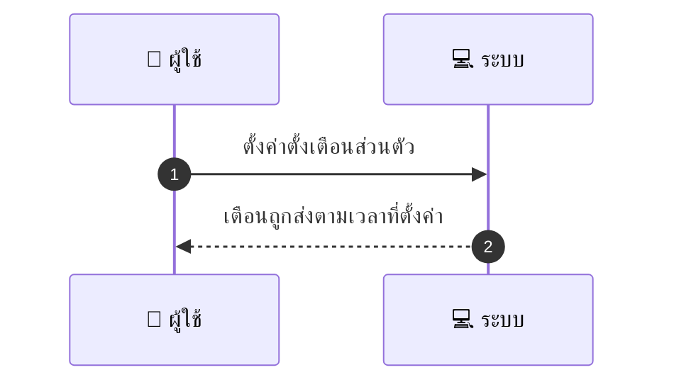
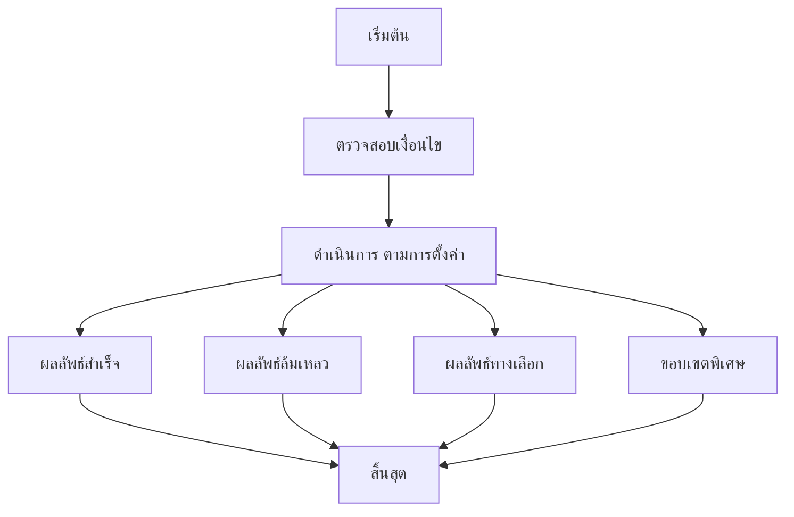

# CUS022 - ขอบันทึกเตือนความจำ Set Reminder Calendar Add

## 👤 บทบาท
- ลูกค้า

## 🎯 เป้าหมายของเคส
- ในฐานะ
- ต้องการ ตั้ง reminder ส่วนตัว email/SMS/push สำหรับ booking
- เพื่อ เพื่อรับเตือนเพิ่มเติมนอกเหนือจาก provider

## ⚙️ เงื่อนไขก่อนเริ่ม (Precondition)
- ลูกค้าตั้ง reminder 24/6/1hr

## 🧭 ผลลัพธ์และสถานการณ์
- ✅ ผลลัพธ์ที่คาดหวัง (Success Flow): Respect user prefs do-not-disturb settings reminder dispatch logged and retried on failure
- ❌ ผลลัพธ์ที่ Failure:
  - การส่ง reminder ล้มเหลวเนื่องจากอีเมล/เบอร์โทรศัพท์ไม่ถูกต้อง หรือถูกบล็อกโดยผู้ให้บริการ
  - ข้อผิดพลาดจากผู้ให้บริการส่งข้อความ SMS/Push หรือ API ล้มเหลว ทำให้การ dispatch ไม่สำเร็จ
  - การเตือนถูกปฏิเสธจาก Do Not Disturb หรือการตั้งค่าส่วนตัวของผู้ใช้ที่ห้ามการแจ้งเตือน
  - วงจร retry ส่งล้มเหลวหมดเมื่อพยายามส่งในรอบต่าง ๆ ทำให้ไม่สามารถ dispatch ได้
  - ข้อมูลการตั้งเตือนขาดหรือลักษณะเวลาไม่ถูกต้อง ทำให้ระบบไม่สามารถ dispatch
  - บัญชีผู้ใช้ถูกระงับหรือมีสถานะที่ไม่อนุญาตให้ส่งการเตือน
- 🔄 ผลลัพธ์ทางเลือก:
  - ระบบจะพยายามส่งผ่านช่องทางสำรองตามที่ผู้ใช้ตั้งไว้ เช่น จากอีเมลไปยัง SMS หรือ Push
  - หากช่องทางเดิมถูกบล็อกหรือไม่พร้อมใช้งาน ระบบจะสลับไปใช้ช่องทางที่ใช้งานได้โดยอัตโนมัติ
  - เตือนรอในคิวและแจ้งผู้ใช้ว่าเตือนจะถูกส่งเมื่อสถานะการส่งพร้อม
  - เมื่อ DND เปิดใช้งาน ผู้ใช้จะเห็นข้อความแจ้งเตือนว่าเตือนจะถูกหยุดจนกว่าจะยกเลิก DND
  - แสดงสถานะเตือนบนแดชบอร์ดและยืนยันเวลาส่งที่คาดหวังให้ผู้ใช้ทราบ
  - ถ้าผู้ใช้ปรับการตั้งค่าความถี่หรือช่องทาง ระบบอัปเดตคิวและยืนยันผลลัพธ์ใหม่
- ⚠️ ผลลัพธ์ขอบเขตพิเศษ:
  - ระบบจะพยายามส่งผ่านช่องทางสำรองตามที่ผู้ใช้ตั้งไว้ เช่น จากอีเมลไปยัง SMS หรือ Push
  - หากช่องทางเดิมถูกบล็อกหรือไม่พร้อมใช้งาน ระบบจะสลับไปใช้ช่องทางที่ใช้งานได้โดยอัตโนมัติ
  - เตือนรอในคิวและแจ้งผู้ใช้ว่าเตือนจะถูกส่งเมื่อสถานะการส่งพร้อม
  - เมื่อ DND เปิดใช้งาน ผู้ใช้จะเห็นข้อความแจ้งเตือนว่าเตือนจะถูกหยุดจนกว่าจะยกเลิก DND
  - แสดงสถานะเตือนบนแดชบอร์ดและยืนยันเวลาส่งที่คาดหวังให้ผู้ใช้ทราบ
  - ถ้าผู้ใช้ปรับการตั้งค่าความถี่หรือช่องทาง ระบบอัปเดตคิวและยืนยันผลลัพธ์ใหม่

## ✅ เกณฑ์การยอมรับ (Acceptance Criteria)
- ต้องส่งเตือนตามการตั้งค่าของผู้ใช้และบันทึกการ dispatch สำเร็จ
- และสามารถรีทรีได้หากล้มเหลว

## ⏱ ลำดับความสำคัญ / SLA
- Priority: P2
- SLA: reminders sent at scheduled times

---

## 🔁 Sequence Diagram  
> แสดงลำดับเหตุการณ์ระหว่าง "ผู้ใช้" กับ "ระบบ"

---

## 🧭 Flowchart Diagram
> แสดงขั้นตอนการทำงานของระบบอย่างเข้าใจง่าย

