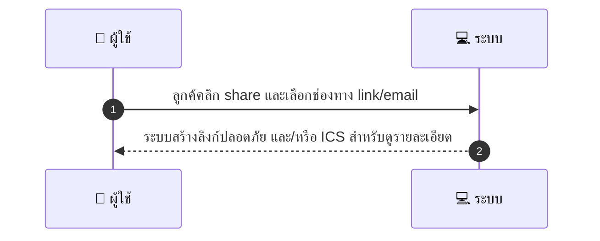
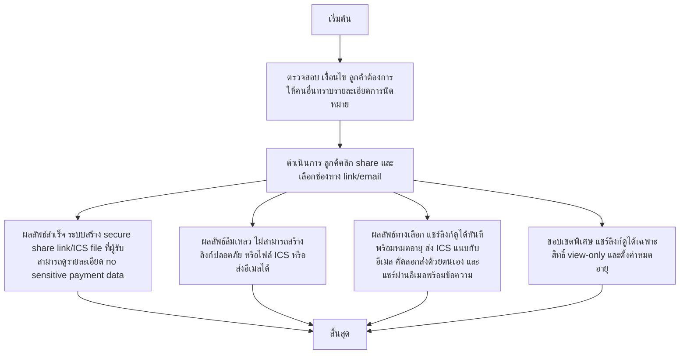

# CUS023 - แชร์ booking กับผู้อื่น Share Booking

## 📝 คำอธิบาย Use Case
ผู้ใช้งานคือ ลูกค้า ต้องการแชร์รายละเอียดการนัดหมายให้ผู้อื่นทราบ เพื่อแจ้งคนในครอบครัวหรือผู้เกี่ยวข้อง ผ่านช่องทาง link, email หรือ ICS โดยระบบจะสร้างลิงก์ที่ปลอดภัยหรือ ICS แนบอีเมล และมีมาตรการความปลอดภัย เช่น จำกัดการเข้าถึงเป็นดูได้อย่างเดียว และควบคุมวันหมดอายุ

## 👤 บทบาท
- ลูกค้า

## 🎯 เป้าหมายของเคส
- ในฐานะ ลูกค้า
- ต้องการ แชร์รายละเอียด booking ให้ผู้อื่นดู
- เพื่อ แจ้งคนในครอบครัวหรือผู้ที่เกี่ยวข้อง

## ⚙️ เงื่อนไขก่อนเริ่ม (Precondition)
- ลูกค้าต้องการให้คนอื่นทราบรายละเอียดการนัดหมาย

## 🧭 ผลลัพธ์และสถานการณ์
- ✅ ผลลัพธ์ที่คาดหวัง (Success Flow): ระบบสร้าง secure share link/ICS file ที่ผู้รับสามารถดูรายละเอียด no sensitive payment data
- ❌ ผลลัพธ์ที่ Failure:  
  - ไม่สามารถสร้างลิงก์แชร์ที่ปลอดภัยได้เนื่องจากข้อผิดพลาดของเซิร์ฟเวอร์
  - ไม่สามารถสร้างไฟล์ ICS ได้ในขณะนี้ กรณีเลือกส่งผ่าน ICS
  - เกิดข้อผิดพลาดในการตรวจสอบข้อมูลนัดหมาย ทำให้ไม่สามารถดำเนินการแชร์ได้
  - อีเมลของผู้รับไม่ถูกต้องหรือไม่สามารถส่งอีเมลถึงผู้รับได้
- 🔄 ผลลัพธ์ทางเลือก:  
  - แชร์ลิงก์แบบดูอย่างเดียว พร้อมตั้งวันหมดอายุ
  - ส่งไฟล์ ICS แนบกับอีเมลถึงผู้รับ
  - คัดลอกลิงก์และส่งผ่านแชท/ข้อความด้วยตนเอง
  - แชร์ผ่านอีเมลพร้อมข้อความอธิบายสั้นๆ และคำแนะนำในการดูข้อมูล
- ⚠️ ผลลัพธ์ขอบเขตพิเศษ:  
  - แชร์ลิงก์แบบดูอย่างเดียว พร้อมตั้งวันหมดอายุ
  - ส่งไฟล์ ICS แนบกับอีเมลถึงผู้รับ
  - คัดลอกลิงก์และส่งผ่านแชท/ข้อความด้วยตนเอง
  - แชร์ผ่านอีเมลพร้อมข้อความอธิบายสั้นๆ และคำแนะนำในการดูข้อมูล

## ✅ เกณฑ์การยอมรับ (Acceptance Criteria)
- Link expiry configurable
- access control view-only

## ⏱ ลำดับความสำคัญ / SLA
- Priority: P2
- SLA: generate link 3s

---

## 🔁 Sequence Diagram  
> แสดงลำดับเหตุการณ์ระหว่าง "ผู้ใช้" กับ "ระบบ"

---

## 🧭 Flowchart Diagram  
> แสดงขั้นตอนการทำงานของระบบอย่างเข้าใจง่าย

