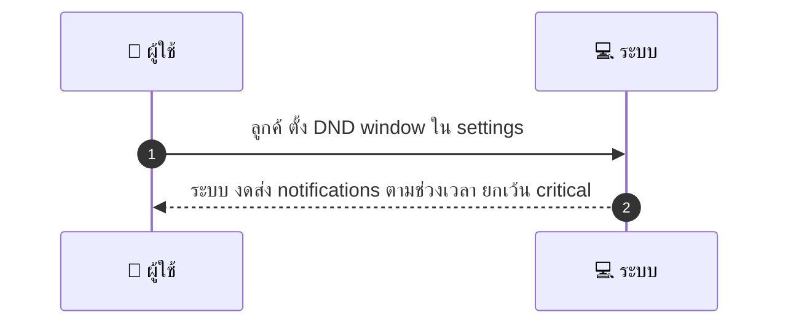
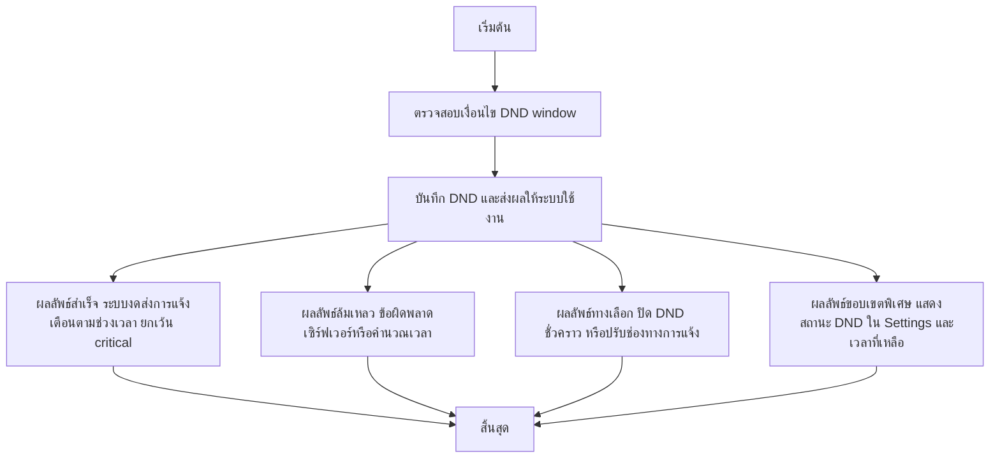

# CUS045 - ตั้งค่า Do Not Disturb / Quiet Hours สำหรับ notifications

## 👤 บทบาท
- ลูกค้า

## 🎯 เป้าหมายของเคส
- ในฐานะ ลูกค้า
- ต้องการ ตั้ง DND เวลาไม่ต้องการรับ push/SMS
- เพื่อ เพื่อไม่ถูกรบกวนในช่วงเวลาที่กำหนด

## ⚙️ เงื่อนไขก่อนเริ่ม (Precondition)
- ลูกค้าไม่ต้องการรับ push/SMS ในช่วงเวลาหนึ่ง

## 🧭 ผลลัพธ์และสถานการณ์
- ✅ ผลลัพธ์ที่คาดหวัง (Success Flow): ระบบงดส่ง notifications ตามช่วงเวลา ยกเว้น critical
- ❌ ผลลัพธ์ที่ Failure:
  - ไม่สามารถบันทึก DND window ได้จากข้อผิดพลาดเซิร์ฟเวอร์ ทำให้การตั้งค่าไม่ถูกนำไปใช้งาน
  - เวลาช่วง DND ไม่ถูกนำไปใช้งานจริงบนระบบส่ง notifications เนื่องจากปัญหาการคำนวณเวลา/Timezone
  - การซิงค์ DND ไม่สำเร็จระหว่างอุปกรณ์ ทำให้บางอุปกรณ์ยังรับการแจ้งเตือน
  - Validation error ในการตั้งค่า เช่น เวลาเริ่มต้นมากกว่าวันที่สิ้นสุด หรือช่วงเวลานอกขอบเขต 24 ชั่วโมง
  - การ override สำหรับ critical alerts ไม่ทำงานตามที่ config ทำให้รับแจ้งเตือนสำคัญในช่วง DND
- 🔄 ผลลัพธ์ทางเลือก:
  - ผู้ใช้ปิด DND ชั่วคราวระหว่างช่วง DND เพื่อดูการแจ้งเตือน
  - ผู้ใช้กำหนด DND ให้ครอบคลุมเฉพาะ push หรือ sms เท่านั้น โดยช่องทางที่เลือกจะถูกระงับการแจ้งเตือน
  - ผู้ใช้ปรับ DND ให้ครอบคลุมบางช่องทาง เช่น ปิด DND สำหรับ Push แต่ SMS ยังคงถูกส่ง
  - มีการเปลี่ยนแปลงเวลา DND ให้สั้นลงหรือยาวขึ้น พร้อมยืนยันการเปลี่ยนแปลง
  - ระบบแสดงสถานะ DND ในหน้า Settings พร้อมสรุปเวลาที่เหลือและสถานะอุปกรณ์ที่ถูกปิดรับการแจ้งเตือน
- ⚠️ ผลลัพธ์ขอบเขตพิเศษ:
  - ผู้ใช้ปิด DND ชั่วคราวระหว่างช่วง DND เพื่อดูการแจ้งเตือน
  - ผู้ใช้กำหนด DND ให้ครอบคลุมเฉพาะ push หรือ sms เท่านั้น โดยช่องทางที่เลือกจะถูกระงับการแจ้งเตือน
  - ผู้ใช้ปรับ DND ให้ครอบคลุมบางช่องทาง เช่น ปิด DND สำหรับ Push แต่ SMS ยังคงถูกส่ง
  - มีการเปลี่ยนแปลงเวลา DND ให้สั้นลงหรือยาวขึ้น พร้อมยืนยันการเปลี่ยนแปลง
  - ระบบแสดงสถานะ DND ในหน้า Settings พร้อมสรุปเวลาที่เหลือและสถานะอุปกรณ์ที่ถูกปิดรับการแจ้งเตือน
- ✅ เกณฑ์การยอมรับ (Acceptance Criteria)
- - Respect DND across channels
- - override for critical alerts configurable

## ⏱ ลำดับความสำคัญ / SLA
- Priority: P2
- SLA: setting applied immediately

---

## 🔁 Sequence Diagram  
> แสดงลำดับเหตุการณ์ระหว่าง "ผู้ใช้" กับ "ระบบ"

---

## 🧭 Flowchart Diagram
> แสดงขั้นตอนการทำงานของระบบอย่างเข้าใจง่าย

