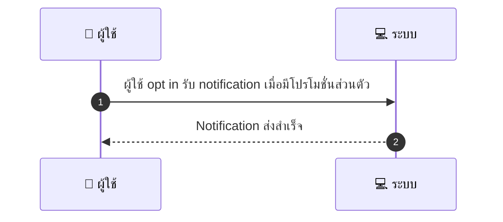
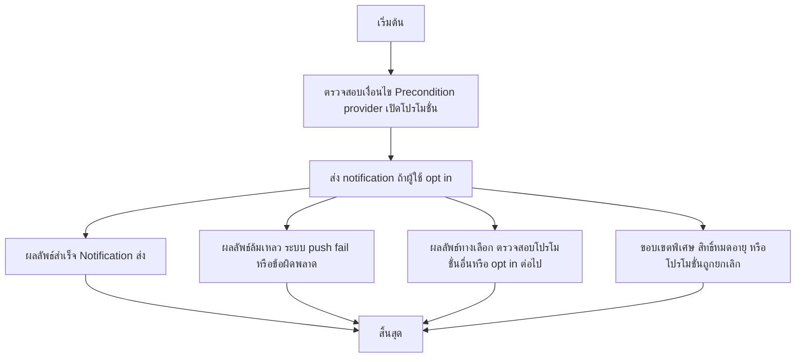

# CUS050 - รับการแจ้งเตือนเมื่อผู้ให้บริการมีโปรโมชั่นส่วนตัว Provider-specific Promo

## 👤 บทบาท
- ลูกค้า

## 🎯 เป้าหมายของเคส
- ในฐานะ ลูกค้า
- ต้องการ ได้รับ notification เมื่อ provider มอบโปรโมชั่นส่วนตัว
- เพื่อ ไม่พลาดดีลจาก provider ที่ชอบ

## ⚙️ เงื่อนไขก่อนเริ่ม (Precondition)
- Provider เปิดโปรโมชั่นเฉพาะลูกค้าเดิม รายการโปรด

## 🧭 ผลลัพธ์และสถานการณ์
- ✅ ผลลัพธ์ที่คาดหวัง (Success Flow): Opt-in ถูกต้อง และมีตัวเลือก apply coupon ด้วยคลิกเดียว
- ❌ ผลลัพธ์ที่ Failure:
  - ไม่สามารถส่งการแจ้งเตือนไปยังผู้ใช้เนื่องจากข้อผิดพลาดทางระบบ/บริการ push notification ล้มเหลว
  - โปรโมชั่นหมดอายุหรือถูกยกเลิกก่อนที่ผู้ใช้จะคลิก Apply
  - เกิดข้อผิดพลาดในการประมวลผล Apply Coupon สิทธิ์การใช้งานไม่ตรงเงื่อนไขหรือหมดระยะเวลาการใช้งาน
- 🔄 ผลลัพธ์ทางเลือก:
  - ผู้ใช้ไม่ได้ opt-in หรือ opt-in ถูกยกเลิกระหว่างช่วงโปรโมชั่น แต่ระบบยังคงตรวจสอบโปรโมชั่นอื่น ๆ ได้
  - ผู้ใช้ได้รับการแจ้งเตือนแต่เลือกไม่รับข้อความหรือยกเลิกการติดตามโปรโมชั่นนี้
  - ได้รับ notification แต่ไม่พบโปรโมชั่นที่ตรงกับรายการโปรดแพลตฟอร์มของผู้ใช้ในช่วงเวลานั้น
- ⚠️ ผลลัพธ์ขอบเขตพิเศษ:
  - ผู้ใช้ไม่ได้ opt-in หรือ opt-in ถูกยกเลิกระหว่างช่วงโปรโมชั่น แต่ระบบยังคงตรวจสอบโปรโมชั่นอื่น ๆ ได้
  - ผู้ใช้ได้รับการแจ้งเตือนแต่เลือกไม่รับข้อความหรือยกเลิกการติดตามโปรโมชั่นนี้
  - ได้รับ notification แต่ไม่พบโปรโมชั่นที่ตรงกับรายการโปรดแพลตฟอร์มของผู้ใช้ในช่วงเวลานั้น

## ✅ เกณฑ์การยอมรับ (Acceptance Criteria)
- Notify ถึงผู้ใช้ภายในไม่กี่นาที
- ผู้ใช้ที่ opt-in ถูกต้องและสถานะยังคงถูกยืนยัน
- หากคลิก Apply Coupon ต้องทำการตรวจสอบสิทธิ์และใช้งานได้สำเร็จ
- ระบบไม่เกิดข้อผิดพลาดสำคัญระหว่างทาง

## ⏱ ลำดับความสำคัญ / SLA
- Priority: P2
- SLA: notify within minutes

---

## 🔁 Sequence Diagram  
> แสดงลำดับเหตุการณ์ระหว่าง "ผู้ใช้" กับ "ระบบ"

---

## 🧭 Flowchart Diagram
> แสดงขั้นตอนการทำงานของระบบอย่างเข้าใจง่าย

