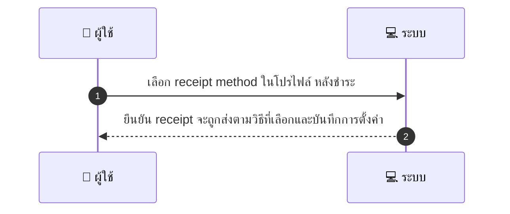
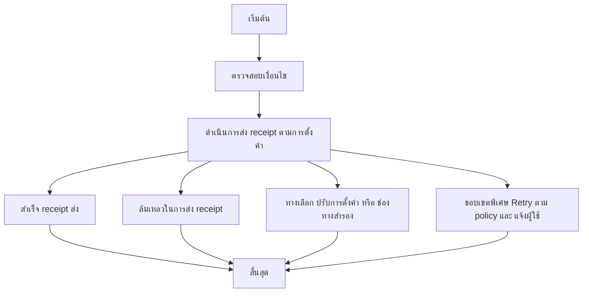

# CUS052 - ตั้งค่า preferred payment receipt method email/SMS

## 👤 บทบาท
- ลูกค้า

## 🎯 เป้าหมายของเคส
- ในฐานะ ลูกค้า
- ต้องการ เลือกรูปแบบการส่ง receipt หลังชำระ
- เพื่อ เพื่อรับเอกสารในช่องทางที่ต้องการ

## ⚙️ เงื่อนไขก่อนเริ่ม (Precondition)
- ลูกค้าต้องการรูปแบบ receipt ที่ส่งหลังชำระ

## 🧭 ผลลัพธ์และสถานการณ์
- ✅ ผลลัพธ์ที่คาดหวัง (Success Flow): Receipt ส่งตามที่เลือกและบันทึกการตั้งค่า
- ❌ ผลลัพธ์ที่ Failure:
  - Receipt ไม่ถูกส่งตามวิธีที่เลือกหลังการชำระ เนื่องจากข้อผิดพลาดในการส่ง Email/SMS และระบบเข้าสู่ขั้นตอน retry ตาม policy
  - ข้อมูลการติดต่อในโปรไฟล์ไม่ถูกต้องหรือไม่มีค่า ทำให้ไม่สามารถส่ง receipt ได้
  - ระบบภายในล้มเหลวขณะส่ง receipt และไม่สามารถส่งจนกว่าจะมีการแก้ไข
- 🔄 ผลลัพธ์ทางเลือก:
  - ผู้ใช้เปลี่ยนวิธีรับ receipt ในโปรไฟล์ระหว่างกระบวนการ หรือหลังการชำระ Receipt ถูกส่งตามวิธีใหม่ในการรอบถัดไป
  - Receipt ถูกส่งสำเร็จผ่านช่องทางสำรองเมื่อช่องทางหลักล้มเหลว โดยไม่ส่งผลกระทบกับรายการถัดไป
  - ระบบแจ้งผู้ใช้ว่าสามารถเปลี่ยนการตั้งค่าการรับ receipt ได้ตลอดเวลา และการเปลี่ยนมีผลกับการทำธุรกรรมถัดไป
- ⚠️ ผลลัพธ์ขอบเขตพิเศษ:
  - ผู้ใช้เปลี่ยนวิธีรับ receipt ในโปรไฟล์ระหว่างกระบวนการ หรือหลังการชำระ Receipt ถูกส่งตามวิธีใหม่ในการรอบถัดไป
  - Receipt ถูกส่งสำเร็จผ่านช่องทางสำรองเมื่อช่องทางหลักล้มเหลว โดยไม่ส่งผลกระทบกับรายการถัดไป
  - ระบบแจ้งผู้ใช้ว่าสามารถเปลี่ยนการตั้งค่าการรับ receipt ได้ตลอดเวลา และการเปลี่ยนมีผลกับการทำธุรกรรมถัดไป

## ✅ เกณฑ์การยอมรับ (Acceptance Criteria)
- Email/SMS delivered with retry policy
- user can change anytime

## ⏱ ลำดับความสำคัญ / SLA
- Priority: P2
- SLA: immediate

---

## 🔁 Sequence Diagram  
> แสดงลำดับเหตุการณ์ระหว่าง "ผู้ใช้" กับ "ระบบ"

---

## 🧭 Flowchart Diagram
> แสดงขั้นตอนการทำงานของระบบอย่างเข้าใจง่าย

