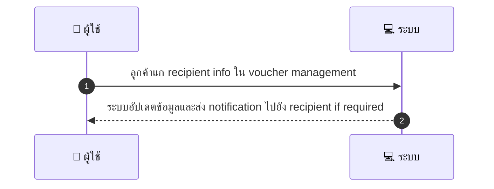
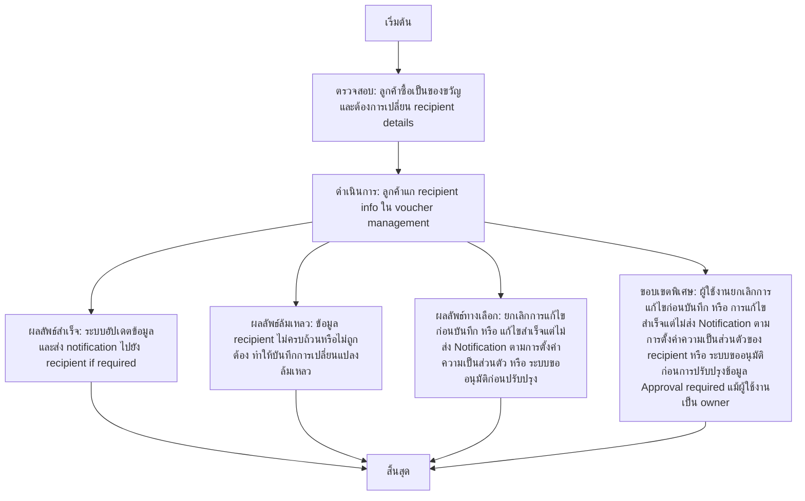

# CUS054 - แก้ไขข้อมูลผู้รับ Recipient Info สำหรับ gift third-party redemption

## 👤 บทบาท
- ลูกค้า

## 🎯 เป้าหมายของเคส
- ในฐานะ ลูกค้า
- ต้องการ แก recipient info ก่อน redemption หากซื้อเป็นของขวัญ
- เพื่อ recipient ได้รับข้อมูลถูกต้อง

## ⚙️ เงื่อนไขก่อนเริ่ม (Precondition)
- ลูกค้าซื้อเป็นของขวัญและต้องการเปลี่ยน recipient details

## 🧭 ผลลัพธ์และสถานการณ์
- ✅ ผลลัพธ์ที่คาดหวัง (Success Flow): ระบบอัปเดตข้อมูลและส่ง notification ไปยัง recipient if required
- ❌ ผลลัพธ์ที่ Failure:  
  - ข้อมูล recipient ไม่ครบถ้วนหรือไม่ถูกต้อง ทำให้บันทึกการเปลี่ยนแปลงล้มเหลว
  - สิทธิ์ไม่พอ ผู้ใช้ไม่มีสิทธิ์แก้ไข recipient info ของของขวัญ
  - ข้อผิดพลาดฐานข้อมูลระหว่างบันทึกการเปลี่ยนแปลง ทำให้ข้อมูลไม่ถูกอัปเดต
  - ความขัดแย้งเวอร์ชัน race condition เกิดขึ้นเมื่อมีการแก้ไขพร้อมกัน
- 🔄 ผลลัพธ์ทางเลือก:  
  - ผู้ใช้งานยกเลิกการแก้ไขก่อนบันทึก
  - การแก้ไขสำเร็จแต่ไม่ส่ง Notification ตามการตั้งค่าความเป็นส่วนตัวของ recipient
  - ระบบขออนุมัติก่อนการปรับปรุงข้อมูล Approval required แม้ผู้ใช้งานเป็น owner
- ⚠️ ผลลัพธ์ขอบเขตพิเศษ:  
  - ผู้ใช้งานยกเลิกการแก้ไขก่อนบันทึก
  - การแก้ไขสำเร็จแต่ไม่ส่ง Notification ตามการตั้งค่าความเป็นส่วนตัวของ recipient
  - ระบบขออนุมัติก่อนการปรับปรุงข้อมูล Approval required แม้ผู้ใช้งานเป็น owner

## ✅ เกณฑ์การยอมรับ (Acceptance Criteria)
- Audit log of changes
- owner-only edit rules
- security checks

## ⏱ ลำดับความสำคัญ / SLA
- Priority: P2
- SLA: update immediate

---

## 🔁 Sequence Diagram  
> แสดงลำดับเหตุการณ์ระหว่าง "ผู้ใช้" กับ "ระบบ"

---

## 🧭 Flowchart Diagram
> แสดงขั้นตอนการทำงานของระบบอย่างเข้าใจง่าย

