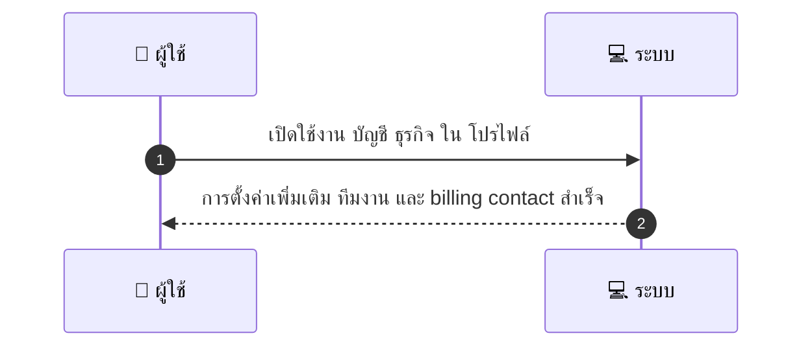
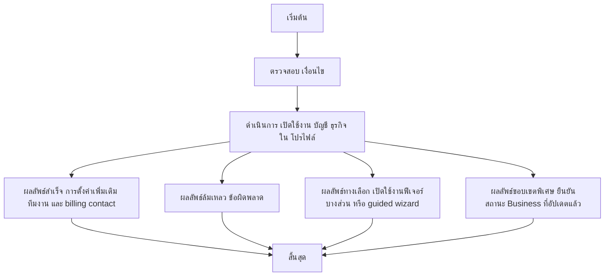

# CUS055 - ตั้งค่าบัญชีสำหรับธุรกิจ Business Account Settings

## 👤 บทบาท
- ลูกค้า

## 🎯 เป้าหมายของเคส
- ในฐานะ
- ต้องการ
- เพื่อ

## ⚙️ เงื่อนไขก่อนเริ่ม (Precondition)
- ลูกค้าเป็นนิติบุคคลที่ต้องการ features ธุรกิจ

## 🧭 ผลลัพธ์และสถานการณ์
- ✅ ผลลัพธ์ที่คาดหวัง (Success Flow): ระบบให้การตั้งค่าเพิ่มเติม ทีมงาน และ billing contact
- ❌ ผลลัพธ์ที่ Failure:  
  - ไม่สามารถเปิดใช้งาน business account ได้เนื่องจากเอกสารยืนยันนิติบุคคลไม่ครบถ้วนหรือถูกปฏิเสธ
  - ไม่สามารถเชิญสมาชิกทีมเข้าสู่ระบบได้เพราะอีเมลซ้ำกับบัญชีเดิม หรือบทบาทที่เลือกไม่รองรับ
  - ไม่สามารถสร้างหรือเชื่อมโยงบัญชี invoicing เนื่องจากสกุลเงิน/ประเทศที่ไม่รองรับ
- 🔄 ผลลัพธ์ทางเลือก:  
  - เปิดใช้งานฟีเจอร์ธุรกิจบางส่วนก่อน เช่น เปิดใช้งาน multi-user ได้แต่ยังไม่เปิดใช้งาน invoicing
  - ให้ผู้ใช้งานทำผ่าน guided wizard เพื่อกำหนดทีมผู้ใช้งานและข้อมูล billing contact ทีละขั้น
  - องค์กรมี Business Account อยู่แล้ว ระบบยืนยันสถานะเป็น Business แบบอัปเดตโดยไม่มีการยกเลิกข้อมูลเดิม
- ⚠️ ผลลัพธ์ขอบเขตพิเศษ:  
  - เปิดใช้งานฟีเจอร์ธุรกิจบางส่วนก่อน เช่น เปิดใช้งาน multi-user ได้แต่ยังไม่เปิดใช้งาน invoicing
  - ให้ผู้ใช้งานทำผ่าน guided wizard เพื่อกำหนดทีมผู้ใช้งานและข้อมูล billing contact ทีละขั้น
  - องค์กรมี Business Account อยู่แล้ว ระบบยืนยันสถานะเป็น Business แบบอัปเดตโดยไม่มีการยกเลิกข้อมูลเดิม

## ✅ เกณฑ์การยอมรับ (Acceptance Criteria)
- Invite team members, role-based access, centralized invoices

## ⏱ ลำดับความสำคัญ / SLA
- Priority: P2
- SLA: setup 10m

---

## 🔁 Sequence Diagram  
> แสดงลำดับเหตุการณ์ระหว่าง "ผู้ใช้" กับ "ระบบ"

---

## 🧭 Flowchart Diagram
> แสดงขั้นตอนการทำงานของระบบอย่างเข้าใจง่าย

