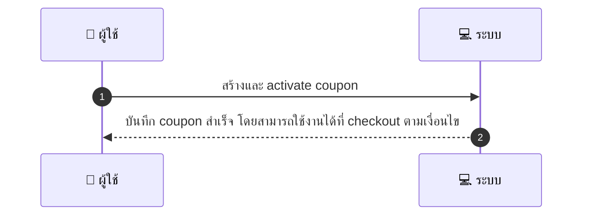
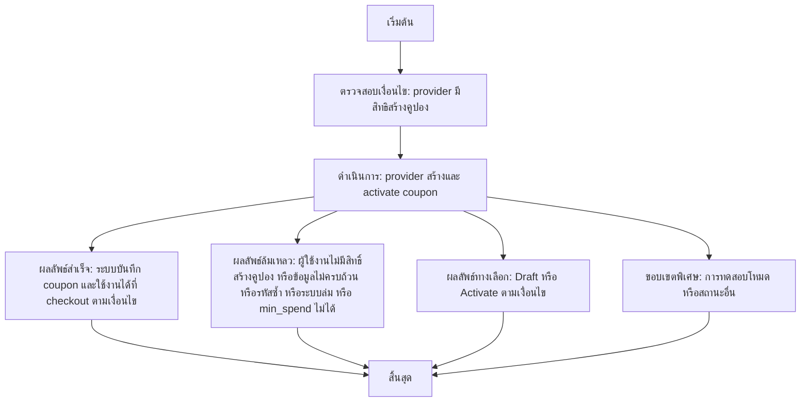

# ASYS002 - Create Coupon / Voucher

## 👤 บทบาท
- ผู้ให้บริการ/ผู้ดูแลระบบ

## 🎯 เป้าหมายของเคส
- ในฐานะ Provider/Admin
- ต้องการ สร้างคูปองประเภทต่างๆ percentage/fixed/BOGO และตั้งเงื่อนไขการใช้
- เพื่อ โปรโมตบริการและขาย voucher

## ⚙️ เงื่อนไขก่อนเริ่ม (Precondition)
- Provider มีสิทธิสร้างคูปอง

## 🧭 ผลลัพธ์และสถานการณ์
- ✅ ผลลัพธ์ที่คาดหวัง (Success Flow): ระบบบันทึก coupon และสามารถใช้ได้ที่ checkout ตามเงื่อนไข
- ❌ ผลลัพธ์ที่ Failure:
  - ผู้ใช้งานไม่มีสิทธิ์สร้างคูปอง
  - ข้อมูลคูปองไม่ครบถ้วนหรือติด validations
  - รหัสคูปองซ้ำกับคูปองที่มีอยู่ในระบบ
  - ระบบล่ม/ฐานข้อมูลล้มเหลวระหว่างบันทึก
  - เงื่อนไขใช้งานไม่สอดคล้อง เช่น min_spend เกินความสามารถของสินค้าบางรายการ
- 🔄 ผลลัพธ์ทางเลือก:
  - คูปองถูกสร้างสำเร็จแต่ยังอยู่ในสถานะ Draft ยังไม่ Activate
  - คูปองถูกสร้างและ Activate ทันที พร้อมข้อจำกัดการใช้งานที่ระบุ
  - คูปองถูกสร้างตามประเภทที่เลือก percentage/fixed/BOGO และใช้งานได้กับบริการ/Provider ที่ระบุ
  - คูปองถูกสร้างในโหมดทดสอบก่อนเปิดใช้งานจริง
- ⚠️ ผลลัพธ์ขอบเขตพิเศษ:
  - คูปองถูกสร้างสำเร็จแต่ยังอยู่ในสถานะ Draft ยังไม่ Activate
  - คูปองถูกสร้างและ Activate ทันที พร้อมข้อจำกัดการใช้งานที่ระบุ
  - คูปองถูกสร้างตามประเภทที่เลือก percentage/fixed/BOGO และใช้งานได้กับบริการ/Provider ที่ระบุ
  - คูปองถูกสร้างในโหมดทดสอบก่อนเปิดใช้งานจริง

## ✅ เกณฑ์การยอมรับ (Acceptance Criteria)
- Validations: validity window
- min_spend
- applicable_services/providers
- usage_limit per user/global
- lifecycle states visible
- concurrency-safe redemption prevention

## ⏱ ลำดับความสำคัญ / SLA
- Priority: P0
- SLA: N / A

---

## 🔁 Sequence Diagram  
> แสดงลำดับเหตุการณ์ระหว่าง "ผู้ใช้" กับ "ระบบ"

---

## 🧭 Flowchart Diagram
> แสดงขั้นตอนการทำงานของระบบอย่างเข้าใจง่าย

