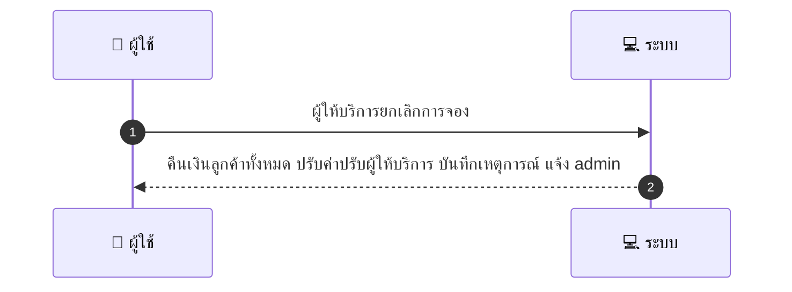
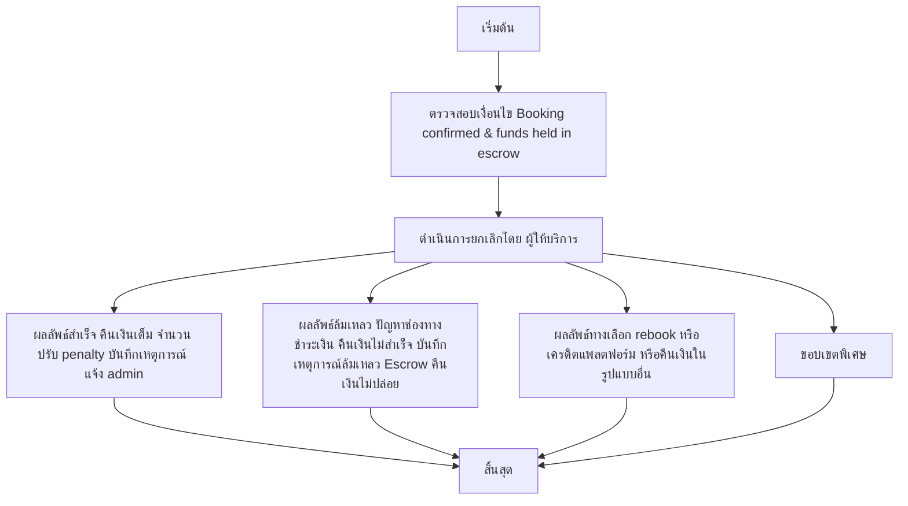

# MCC004 - Provider Cancellation Before Service

## 👤 บทบาท
- ผู้ให้บริการ

## 🎯 เป้าหมายของเคส
- ในฐานะ ผู้ให้บริการ
- ต้องการ ยกเลิก booking และระบบต้องดำเนินการคืนเงิน/penalty ตาม policy
- เพื่อ ให้ลูกค้าได้รับการคุ้มครอง

## ⚙️ เงื่อนไขก่อนเริ่ม (Precondition)
- Booking confirmed & funds held in escrow

## 🧭 ผลลัพธ์และสถานการณ์
- ✅ ผลลัพธ์ที่คาดหวัง (Success Flow): คืนเงินลูกค้าทั้งหมด ปรับค่าปรับผู้ให้บริการ บันทึกเหตุการณ์ และแจ้งผู้ดูแลระบบ
- ❌ ผลลัพธ์ที่ Failure:  
  - การคืนเงินล้มเหลว: ปัญหาช่องทางชำระเงินทำให้ไม่สามารถคืนเงินลูกค้าได้ภายใน SLA
  - ไม่สามารถบันทึกเหตุการณ์/log หรือแจ้งผู้ดูแลระบบได้ ทำให้การติดตามไม่สมบูรณ์
  - Escrow ไม่ปล่อยเงินคืนหรือถูกอธิบายว่าไม่สามารถดำเนินการได้หลังจากการยกเลิก
- 🔄 ผลลัพธ์ทางเลือก:  
  - ลูกค้าเลือกย้ายการจองไปยังวันที่ใหม่กับผู้ให้บริการเดิมโดยไม่เสียค่าธรรมเนียม (rebook) และระบบออกใบยืนยันการจองใหม่
  - ลูกค้าเลือกรับเครดิตในแพลตฟอร์มแทนการคืนเงินสด และเครดิตจะใช้งานในการจองครั้งถัดไป
  - ลูกค้าขอคืนเงินเต็มจำนวนในรูปแบบบัตรเครดิต/วิธีชำระเงินอื่นที่ไม่ใช่ escrow และการจ่ายค่าใช้จ่ายเพิ่มเติมถูกยกเลิก
- ⚠️ ผลลัพธ์ขอบเขตพิเศษ:  
  - ลูกค้าเลือกย้ายการจองไปยังวันที่ใหม่กับผู้ให้บริการเดิมโดยไม่เสียค่าธรรมเนียม (rebook) และระบบออกใบยืนยันการจองใหม่
  - ลูกค้าเลือกรับเครดิตในแพลตฟอร์มแทนการคืนเงินสด และเครดิตจะใช้งานในการจองครั้งถัดไป
  - ลูกค้าขอคืนเงินเต็มจำนวนในรูปแบบบัตรเครดิต/วิธีชำระเงินอื่นที่ไม่ใช่ escrow และการจ่ายค่าใช้จ่ายเพิ่มเติมถูกยกเลิก

## ✅ เกณฑ์การยอมรับ (Acceptance Criteria)
- Refund initiated immediately
- provider flagged for review
- admin notified
- repeated cancellations lead to restrictions

## ⏱ ลำดับความสำคัญ / SLA
- Priority: P0
- SLA: 
  - Refund initiated immediate
  - admin review workflow

---

## 🔁 Sequence Diagram  
> แสดงลำดับเหตุการณ์ระหว่าง "ผู้ใช้" กับ "ระบบ"

---

## 🧭 Flowchart Diagram
> แสดงขั้นตอนการทำงานของระบบอย่างเข้าใจง่าย

