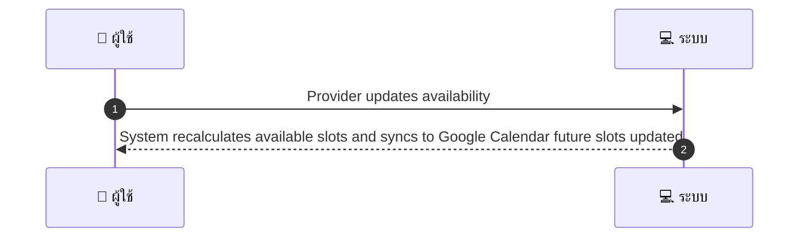
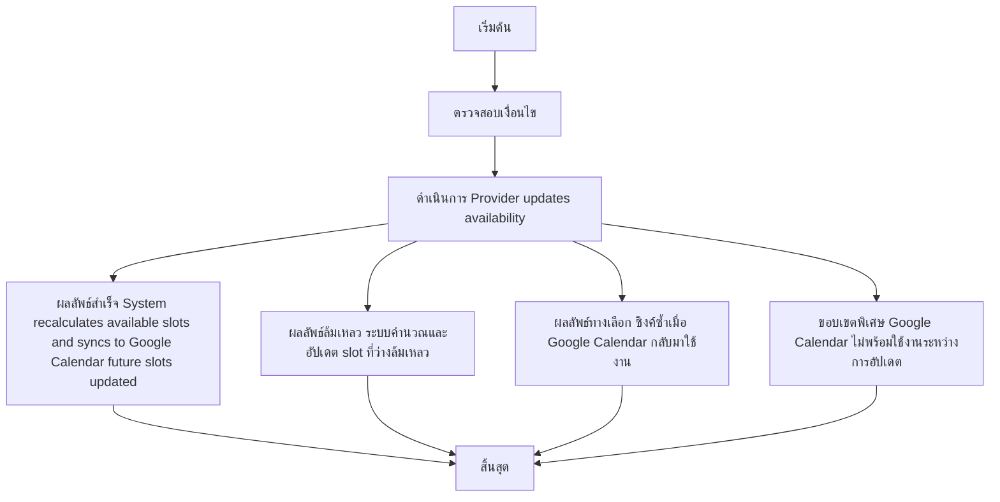

# MCC007 - Provider Availability Management

## 👤 บทบาท
- ผู้ให้บริการ

## 🎯 เป้าหมายของเคส
- ในฐานะ ผู้ให้บริการ
- ต้องการ จัดการตารางเวลา บล็อกวันหยุด ตั้งเวลาทำงาน
- เพื่อ ให้ลูกค้าเห็นเวลาที่สามารถจองได้จริง

## ⚙️ เงื่อนไขก่อนเริ่ม Precondition
- Provider configures weekly schedule and special days off

## 🧭 ผลลัพธ์และสถานการณ์
- ✅ ผลลัพธ์ที่คาดหวัง Success Flow: System recalculates available slots and syncs to Google Calendar future slots updated confirmed bookings unaffected
- ❌ ผลลัพธ์ที่ Failure:
  - ระบบคำนวณและอัปเดต slot ที่ว่างล้มเหลวหลังการเปลี่ยนแปลง ทำให้ข้อมูล availability แสดงไม่ถูกต้อง
  - บันทึกการเปลี่ยนแปลงล้มเหลวในฐานข้อมูล ส่งผลให้สถานะ availability ไม่เปลี่ยนแปลง
  - การซิงค์ข้อมูลกับ Google Calendar ล้มเหลว หรือ API ถูกปฏิเสธ ทำให้ปฏิทีนอกระบบไม่สะท้อนการเปลี่ยนแปลง
  - การจองที่ยืนยันอยู่เดิมถูกกระทบหรือถูกยกเลิกโดยไม่ตั้งใจระหว่างอัปเดต
  - ข้อผิดพลาดความสอดคล้องของวันหยุดพิเศษกับตารางเวลาทำให้เกิดการคอนฟลิค
- 🔄 ผลลัพธ์ทางเลือก:
  - ระบบจะทำการซิงค์ซ้ำอัตโนมัติเมื่อเครือข่ายหรือตัวเชื่อม Google Calendar กลับมาใช้งาน
  - แสดงสถานะ Partial Availability Updated หากมีบางช่วงเวลาที่อัปเดตสำเร็จและบางช่วงยังรอการประมวลผล
  - แจ้งเตือนผู้ให้บริการเพื่อทำการ override ด้วยตนเองหากพบความขัดแย้งระหว่างตารางเวลากับการจองที่ยืนยัน
  - หากวันหยุดพิเศษมีผลกระทบต่อการจองที่ยืนยัน ระบบจะรักษาการจองเดิมไว้และบล็อก slot ที่เกี่ยวข้องในอนาคตแทน
  - หาก Google Calendar ไม่พร้อมใช้งานในระหว่างการอัปเดต ระบบจะรอซิงค์และไม่กระทบการจองที่ยืนยันแล้ว
- ⚠️ ผลลัพธ์ขอบเขตพิเศษ:
  - ระบบจะทำการซิงค์ซ้ำอัตโนมัติเมื่อเครือข่ายหรือตัวเชื่อม Google Calendar กลับมาใช้งาน
  - แสดงสถานะ Partial Availability Updated หากมีบางช่วงเวลาที่อัปเดตสำเร็จและบางช่วงยังรอการประมวลผล
  - แจ้งเตือนผู้ให้บริการเพื่อทำการ override ด้วยตนเองหากพบความขัดแย้งระหว่างตารางเวลากับการจองที่ยืนยัน
  - หากวันหยุดพิเศษมีผลกระทบต่อการจองที่ยืนยัน ระบบจะรักษาการจองเดิมไว้และบล็อก slot ที่เกี่ยวข้องในอนาคตแทน
  - หาก Google Calendar ไม่พร้อมใช้งานในระหว่างการอัปเดต ระบบจะรอซิงค์และไม่กระทบการจองที่ยืนยันแล้ว
- ✅ เกณฑ์การยอมรับ Acceptance Criteria
  - Availability changes effective immediately for future slots
  - existing confirmed bookings preserved
  - sync to Google Calendar attempted

- ⏱ ลำดับความสำคัญ / SLA
  - Priority P0
  - SLA Availability changes immediate

## 🔁 Sequence Diagram
> แสดงลำดับเหตุการณ์ระหว่าง "ผู้ใช้" กับ "ระบบ"

## 🧭 Flowchart Diagram
> แสดงขั้นตอนการทำงานของระบบอย่างเข้าใจง่าย

