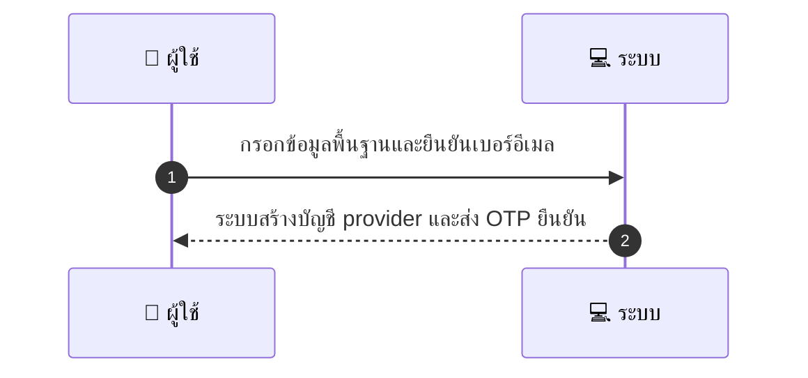
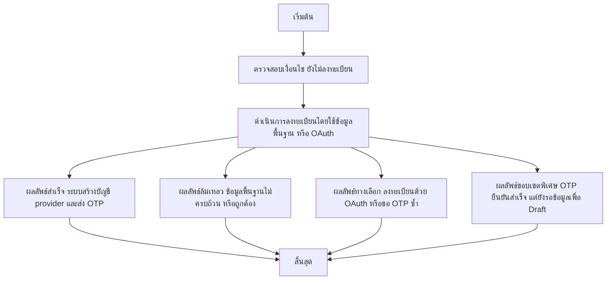

# MCC009 - ลงทะเบียนผู้ให้บริการแบบพื้นฐาน

## 👤 บทบาท
- ผู้ให้บริการ

## 🎯 เป้าหมายของเคส
- ในฐานะ: ผู้ให้บริการ
- ต้องการ: ลงทะเบียนบัญชีผู้ให้บริการด้วยข้อมูลพื้นฐาน
- เพื่อ: เพื่อเริ่มใช้งานบนแพลตฟอร์ม

## 🧭 อธิบาย Use Case
ผู้ให้บริการต้องการสร้างบัญชีบนแพลตฟอร์มด้วยข้อมูลพื้นฐานเพื่อเริ่มใช้งาน ระบบจะส่ง OTP เพื่อยืนยันตัวตนและสร้าง draft ของโปรไฟล์ผู้ให้บริการ หากข้อมูลไม่ครบหรือมีข้อผิดพลาด ระบบจะให้แนะแนวทางแก้ไขหรือทางเลือกอื่น เช่น ใช้ OAuth หรือขอ OTP ซ้ำได้

## ⚙️ เงื่อนไขก่อนเริ่ม (Precondition)
- ผู้ให้บริการยังไม่ลงทะเบียน

## 🧭 ผลลัพธ์และสถานการณ์
- ✅ ผลลัพธ์ที่คาดหวัง (Success Flow): ระบบสร้างบัญชี provider และส่ง OTP ยืนยัน
- ❌ ผลลัพธ์ที่ Failure:  
  - ข้อมูลพื้นฐานไม่ครบถ้วนหรือไม่ถูกต้อง
  - เบอร์ติดต่อหรืออีเมลที่ลงทะเบียนถูกใช้งานแล้ว
  - OTP ไม่ถูกต้องหรือหมดอายุ
  - ระบบสร้างบัญชี provider ล้มเหลว
  - เครือข่ายล้มเหลวระหว่างขั้นตอนลงทะเบียน
- 🔄 ผลลัพธ์ทางเลือก:  
  - ผู้ใช้งานลงทะเบียนด้วย OAuth Google หรือ Apple แทนข้อมูลพื้นฐาน
  - ผู้ใช้งานขอ OTP ซ้ำได้เมื่อไม่รับ OTP ครั้งแรก
  - OTP ยืนยันสำเร็จ แต่ข้อมูลบางส่วนยังรอการกรอก เพื่อสร้าง draft ต่อไป
- ⚠️ ผลลัพธ์ขอบเขตพิเศษ:  
  - ผู้ใช้งานลงทะเบียนด้วย OAuth Google หรือ Apple แทนข้อมูลพื้นฐาน
  - ผู้ใช้งานขอ OTP ซ้ำได้เมื่อไม่รับ OTP ครั้งแรก
  - OTP ยืนยันสำเร็จ แต่ข้อมูลบางส่วนยังรอการกรอก เพื่อสร้าง draft ต่อไป

## ✅ เกณฑ์การยอมรับ (Acceptance Criteria)
- รองรับ fields พื้นฐาน
- ส่ง OTP
- หลังยืนยันสร้าง profile draft

## ⏱ ลำดับความสำคัญ / SLA
- Priority: P0
- SLA: OTP ภายใน 5s

---

## 🔁 Sequence Diagram  
> แสดงลำดับเหตุการณ์ระหว่าง "ผู้ใช้" กับ "ระบบ"

---

## 🧭 Flowchart Diagram
> แสดงขั้นตอนการทำงานของระบบอย่างเข้าใจง่าย

