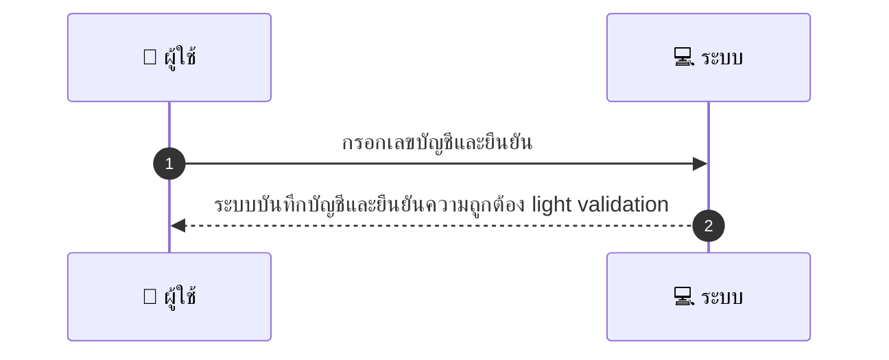
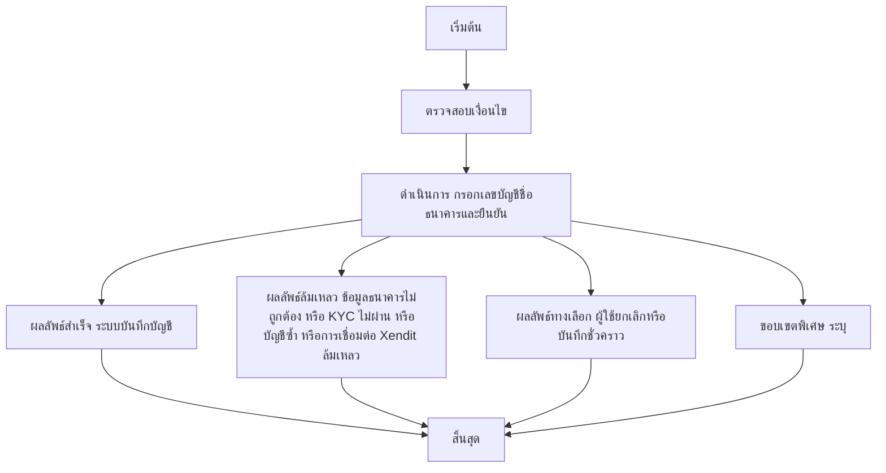

# MCC011 - กรอกข้อมูลบัญชีรับเงิน Bank Account

## 👤 บทบาท
- ผู้ให้บริการ

## 🎯 เป้าหมายของเคส
- ในฐานะ ผู้ให้บริการ
- ต้องการ เพิ่มบัญชีธนาคารสำหรับรับ payout
- เพื่อ เพื่อรับเงินจากแพลตฟอร์มผ่าน Xendit disbursement

## ⚙️ เงื่อนไขก่อนเริ่ม (Precondition)
- ผู้ให้บริการ KYC ผ่านขั้นต่ำ

## 🧭 ผลลัพธ์และสถานการณ์
- ✅ ผลลัพธ์ที่คาดหวัง (Success Flow): ระบบบันทึกบัญชีและยืนยันความถูกต้อง light validation  
- ❌ ผลลัพธ์ที่ Failure:  
  - ข้อมูลบัญชีธนาคารไม่ถูกต้อง รูปแบบเลขบัญชีชื่อธนาคารไม่ตรงกับมาตรฐาน
  - ชื่อธนาคารไม่ตรงกับเลขบัญชีที่ระบุ
  - KYC ขั้นต่ำยังไม่ผ่าน
  - บัญชีธนาคารซ้ำกับบัญชีที่มีอยู่แล้ว
  - การเชื่อมต่อกับระบบ disbursement ของ Xendit ล้มเหลวชั่วคราว
- 🔄 ผลลัพธ์ทางเลือก:  
  - ผู้ใช้ยกเลิกการบันทึกบัญชีระหว่างขั้นตอน
  - สถานะบัญชีบันทึกเป็น Pending verification รอการยืนยัน
  - ข้อมูลถูกบันทึกชั่วคราวเพื่อแก้ไขก่อนยืนยันการใช้งานจริง
- ⚠️ ผลลัพธ์ขอบเขตพิเศษ:  
  - ผู้ใช้ยกเลิกการบันทึกบัญชีระหว่างขั้นตอน
  - สถานะบัญชีบันทึกเป็น Pending verification รอการยืนยัน
  - ข้อมูลถูกบันทึกชั่วคราวเพื่อแก้ไขก่อนยืนยันการใช้งานจริง

## ✅ เกณฑ์การยอมรับ (Acceptance Criteria)
- Validate format, mask sensitive data, test micro deposit optional

## ⏱ ลำดับความสำคัญ / SLA
- Priority: P0
- SLA: Validation immediate

---

## 🔁 Sequence Diagram  
> แสดงลำดับเหตุการณ์ระหว่าง "ผู้ใช้" กับ "ระบบ"

---

## 🧭 Flowchart Diagram
> แสดงขั้นตอนการทำงานของระบบอย่างเข้าใจง่าย

