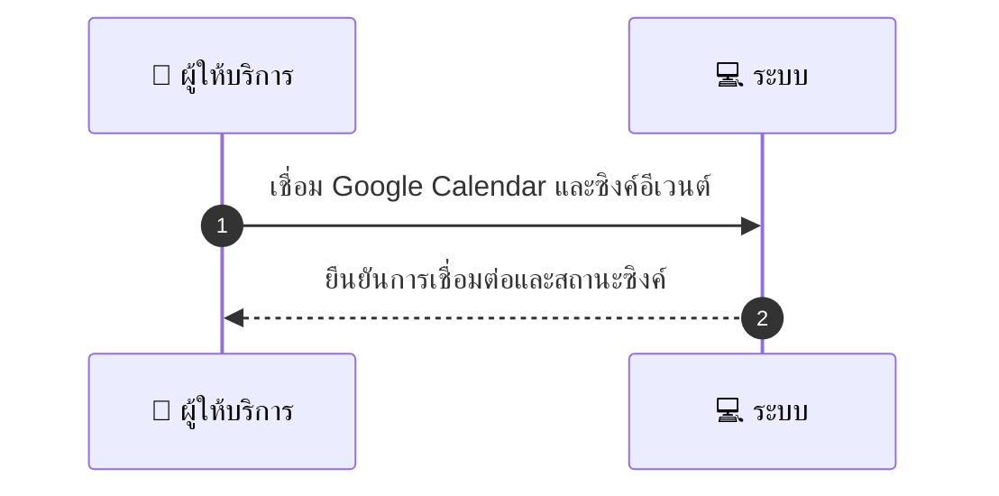
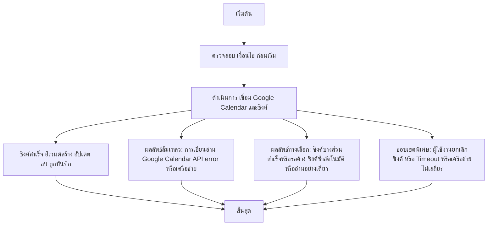

# MCC015 - ซิงค์ปฏิทิน Google แบบ 2-way

## 👤 บทบาท
- ผู้ให้บริการ

## 🎯 เป้าหมายของเคส
- ในฐานะ ผู้ให้บริการ
- ต้องการ เชื่อม Google Calendar เพื่อ sync อีเวนต์ read/write
- เพื่อ ป้องกัน double booking และอัปเดตทั้งสองฝั่ง

## ⚙️ เงื่อนไขก่อนเริ่ม (Precondition)
- Provider ให้สิทธิ OAuth ให้แพลตฟอร์ม

## 🧭 ผลลัพธ์และสถานการณ์
- ✅ ผลลัพธ์ที่คาดหวัง (Success Flow): Events โต้ตอบ create update delete ถูก synced และ conflicts ถูกแจ้ง
- ❌ ผลลัพธ์ที่ Failure:
  - การเขียนอ่านอีเวนต์จาก Google Calendar ล้มเหลว เนื่องจาก Google API error หรือปัญหาเครือข่าย
  - OAuth token ถูกปฏิเสธหรือหมดอายุ ทำให้ไม่สามารถเรียก Google Calendar API ได้
  - ขีดจำกัด quota หรือ rate limit ของ Google Calendar ถูกเรียกใช้งานเกิน
  - การแมปฟิลด์อีเวนต์ระหว่างแพลตฟอร์มกับ Google Calendar ทำให้ข้อมูลไม่ถูกต้อง/ไม่สามารถบันทึกได้
- 🔄 ผลลัพธ์ทางเลือก:
  - ผู้ใช้งานเลือกยกเลิกการซิงค์กลางคัน
  - ซิงค์บางส่วนสำเร็จและบางส่วนยังคงค้าง (partial sync)
  - ระบบทำการซิงค์ซ้ำอัตโนมัติเมื่อเครือข่ายกลับมา
  - เลือกโหมดซิงค์ชั่วคราวเป็นอ่านอย่างเดียว เพื่อป้องกันความขัดแย้ง
- ⚠️ ผลลัพธ์ขอบเขตพิเศษ:
  - ผู้ใช้งานเลือกยกเลิกการซิงค์กลางคัน
  - ซิงค์บางส่วนสำเร็จและบางส่วนยังคงค้าง (partial sync)
  - ระบบทำการซิงค์ซ้ำอัตโนมัติเมื่อเครือข่ายกลับมา
  - เลือกโหมดซิงค์ชั่วคราวเป็นอ่านอย่างเดียว เพื่อป้องกันความขัดแย้ง

## ✅ เกณฑ์การยอมรับ (Acceptance Criteria)
- Store refresh token encrypted
- conflict detection & notify
- retries up to 3

## ⏱ ลำดับความสำคัญ / SLA
- Priority: P0
- SLA: 
  - Immediate write attempt
  - Retries up to 3

---

## 🔁 Sequence Diagram  
> แสดงลำดับเหตุการณ์ระหว่าง "ผู้ให้บริการ" กับ "ระบบ"

---

## 🧭 Flowchart Diagram
> แสดงขั้นตอนการทำงานของระบบอย่างเข้าใจง่าย

