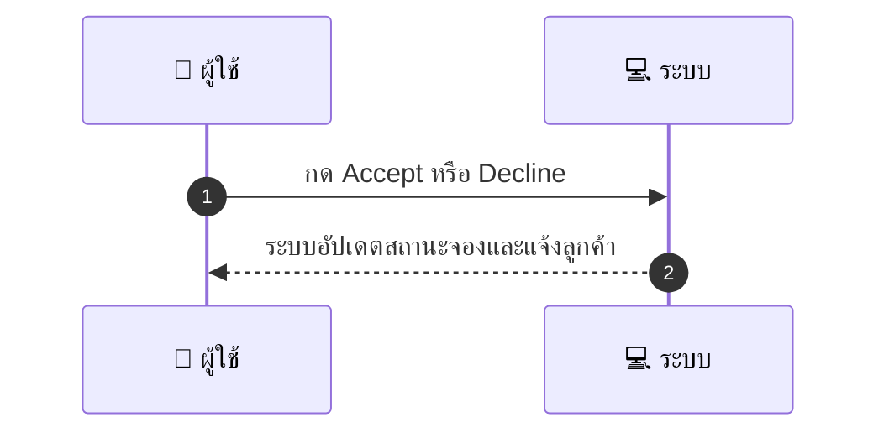
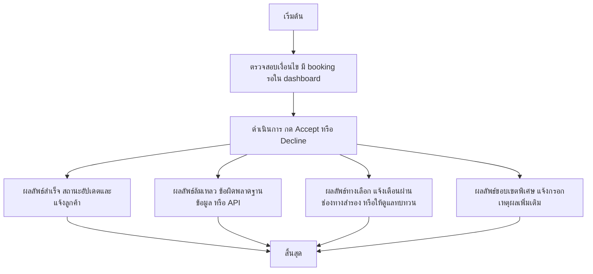

# MCC017 - ยืนยัน/ปฏิเสธการจอง Accept/Decline Booking

## 👤 บทบาท
- ผู้ให้บริการ

## 🎯 เป้าหมายของเคส
- ในฐานะ ผู้ให้บริการ
- ต้องการ สามารถยืนยันหรือปฏิเสธ booking ที่เข้ามา
- เพื่อ เพื่อจัดการกำลังคนและเวลางาน

## ⚙️ เงื่อนไขก่อนเริ่ม (Precondition)
- มี booking รอใน dashboard

## 🧭 ผลลัพธ์และสถานการณ์
- ✅ ผลลัพธ์ที่คาดหวัง (Success Flow): ระบบอัปเดตสถานะ booking และแจ้งลูกค้า
- ❌ ผลลัพธ์ที่ Failure:
  - ไม่สามารถอัปเดตสถานะการจองเป็น 'Accepted' หรือ 'Declined' ได้เนื่องจากข้อผิดพลาดฐานข้อมูล
  - ไม่สามารถบันทึกเหตุผลการปฏิเสธลงในระบบ
  - ไม่สามารถส่งการแจ้งเตือนไปยังลูกค้าได้
  - การเรียก API ภายในล้มเหลว ส่งผลให้สถานะไม่อัปเดต
  - ข้อมูล booking ไม่พบในระบบหรือถูกยกเลิกระหว่างการดำเนินการ
- 🔄 ผลลัพธ์ทางเลือก:
  - สถานะถูกอัปเดตสำเร็จ แต่การแจ้งลูกค้าผ่านช่องทางในระบบล้มเหลว ระบบจะพยายามแจ้งเตือนผ่านช่องทางสำรอง
  - มีกรณีที่ Booking ถูกยืนยันโดยผู้ให้บริการรายอื่นก่อนหน้า ทำให้ไม่สามารถ Accept ได้ ระบบจะแจ้งเตือนให้ผู้ดูแลทบทวน
  - การปฏิเสธสำเร็จแต่ไม่มีเหตุผลบันทึกในระบบ ระบบจะแจ้งให้ผู้ให้บริการกรอกเหตุผลเพิ่มเติม
- ⚠️ ผลลัพธ์ขอบเขตพิเศษ:
  - สถานะถูกอัปเดตสำเร็จ แต่การแจ้งลูกค้าผ่านช่องทางในระบบล้มเหลว ระบบจะพยายามแจ้งเตือนผ่านช่องทางสำรอง
  - มีกรณีที่ Booking ถูกยืนยันโดยผู้ให้บริการรายอื่นก่อนหน้า ทำให้ไม่สามารถ Accept ได้ ระบบจะแจ้งเตือนให้ผู้ดูแลทบทวน
  - การปฏิเสธสำเร็จแต่ไม่มีเหตุผลบันทึกในระบบ ระบบจะแจ้งให้ผู้ให้บริการกรอกเหตุผลเพิ่มเติม

## ✅ เกณฑ์การยอมรับ (Acceptance Criteria)
- Status updated
- notify customer
- decline reason recorded

## ⏱ ลำดับความสำคัญ / SLA
- Priority: P0
- SLA: Action response 1s

---

## 🔁 Sequence Diagram  
> แสดงลำดับเหตุการณ์ระหว่าง "ผู้ใช้" กับ "ระบบ"

---

## 🧭 Flowchart Diagram
> แสดงขั้นตอนการทำงานของระบบอย่างเข้าใจง่าย

