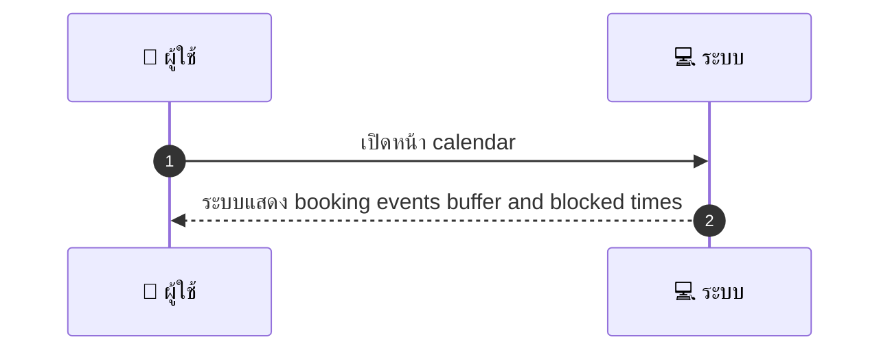
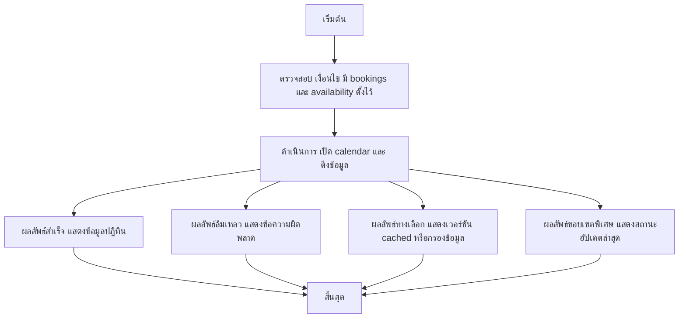

# MCC019 - ดูปฏิทินรวมของร้าน Provider Calendar View

## 👤 บทบาท
- ผู้ให้บริการ

## 🎯 เป้าหมายของเคส
- ในฐานะ ผู้ให้บริการ
- ต้องการ ดูมุมมองปฏิทินรายวัน สัปดาห์ เดือน ของ booking และบันทึกงาน
- เพื่อ วางแผนการทำงาน

## ⚙️ เงื่อนไขก่อนเริ่ม (Precondition)
- มี bookings และ availability ถูกตั้งไว้

## 🧭 ผลลัพธ์และสถานการณ์
- ✅ ผลลัพธ์ที่คาดหวัง (Success Flow): ระบบแสดง booking events buffer and blocked times
- ❌ ผลลัพธ์ที่ Failure:
  - ไม่สามารถโหลดข้อมูลปฏิทินได้เนื่องจากเครือข่ายถูกตัดขาด
  - ปฏิทินล่มเพราะข้อผิดพลาดภายในเซิร์ฟเวอร์ 500 ขณะดึง bookings/availability
  - สิทธิ์เข้าถึงปฏิทินถูกปฏิเสธ ผู้ให้บริการไม่สามารถดูข้อมูล
  - ข้อมูล sync กับ Google ไม่สำเร็จ ทำให้สถานะ sync เป็นล้มเหลว
- 🔄 ผลลัพธ์ทางเลือก:
  - แสดงข้อมูลเป็นเวอร์ชัน cached เมื่อไม่มีการเชื่อมต่ออินเทอร์เน็ต
  - แสดงเฉพาะ bookings ที่ยืนยันแล้ว confirmed โดยไม่รวม pending/blocked ใน view
  - ปรับมุมมองให้อ่านง่ายขึ้นในกรณีข้อมูลบางส่วนไม่พร้อม เช่น โหมด list แยกรายการสำคัญ
  - แจ้งเตือนผู้ใช้ให้กดยืนยันเพื่อรีเฟรชข้อมูลเมื่อการเชื่อมต่อกลับมา
  - แสดงสถานะอัปเดตล่าสุดของข้อมูลเพื่อบอกผู้ใช้ว่าข้อมูลบางส่วนอัปเดตไม่ครบถ้วน
- ⚠️ ผลลัพธ์ขอบเขตพิเศษ:
  - แสดงข้อมูลเป็นเวอร์ชัน cached เมื่อไม่มีการเชื่อมต่ออินเทอร์เน็ต
  - แสดงเฉพาะ bookings ที่ยืนยันแล้ว confirmed โดยไม่รวม pending/blocked ใน view
  - ปรับมุมมองให้อ่านง่ายขึ้นในกรณีข้อมูลบางส่วนไม่พร้อม เช่น โหมด list แยกรายการสำคัญ
  - แจ้งเตือนผู้ใช้ให้กดยืนยันเพื่อรีเฟรชข้อมูลเมื่อการเชื่อมต่อกลับมา
  - แสดงสถานะอัปเดตล่าสุดของข้อมูลเพื่อบอกผู้ใช้ว่าข้อมูลบางส่วนอัปเดตไม่ครบถ้วน

## ✅ เกณฑ์การยอมรับ (Acceptance Criteria)
- Calendar shows confirmed, pending, blocked
- sync status with Google

## ⏱ ลำดับความสำคัญ / SLA
- Priority: P0
- SLA: Load 2s typical

---

## 🔁 Sequence Diagram  
> แสดงลำดับเหตุการณ์ระหว่าง "ผู้ใช้" กับ "ระบบ"

---

## 🧭 Flowchart Diagram
> แสดงขั้นตอนการทำงานของระบบอย่างเข้าใจง่าย

