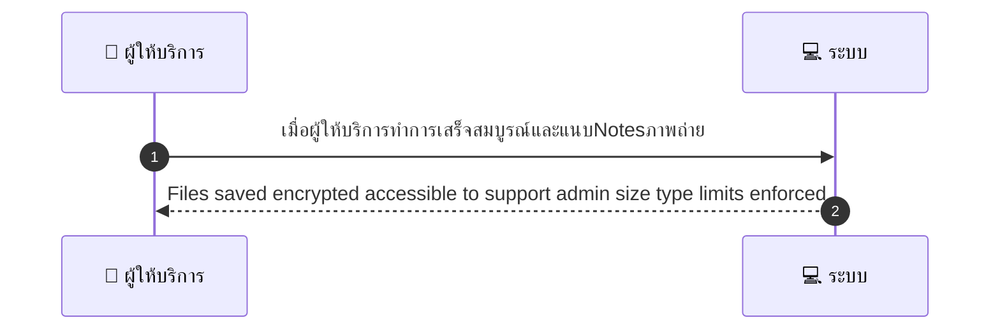
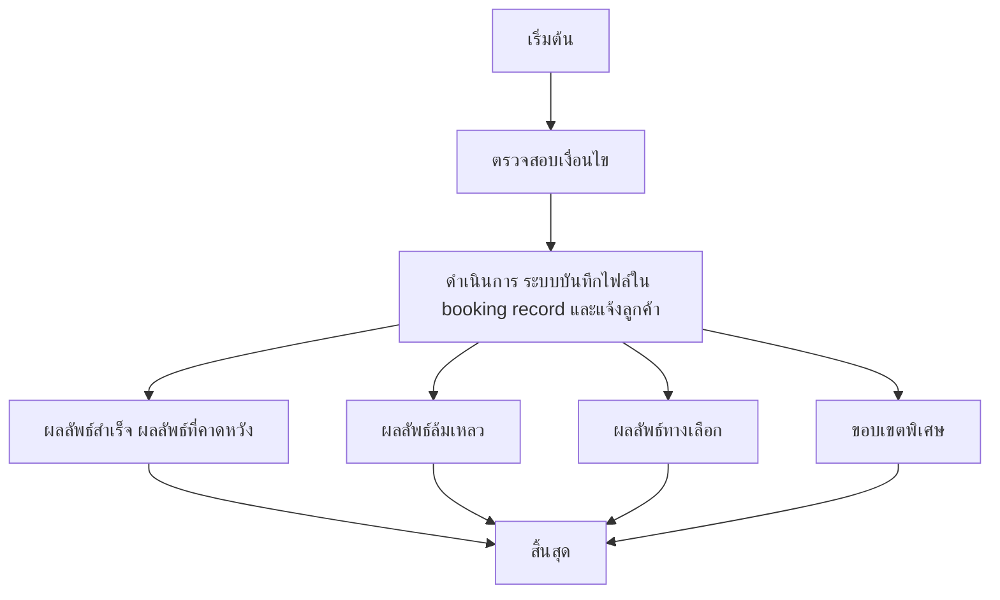

# MCC021 - ถ่ายภาพ/เพิ่มหมายเหตุหลังให้บริการ Post-Service Notes

## 👤 บทบาท
- ผู้ให้บริการ

## 🎯 เป้าหมายของเคส
- ในฐานะ ผู้ให้บริการ
- ต้องการ แนบภาพถ่ายหรือบันทึกเหตุการณ์หลังบริการเสร็จ
- เพื่อ เป็นหลักฐานการให้บริการและช่วยในการ dispute

## ⚙️ เงื่อนไขก่อนเริ่ม (Precondition)
- Provider marks complete and adds notes photos

## 🧭 ผลลัพธ์และสถานการณ์
- ✅ ผลลัพธ์ที่คาดหวัง (Success Flow): Files saved encrypted accessible to support admin size type limits enforced
- ❌ ผลลัพธ์ที่ Failure:
  - ไม่สามารถอัปโหลดไฟล์ได้ เนื่องจากขนาดไฟล์เกินข้อกำหนดสูงสุด
  - ชนิดไฟล์ไม่รองรับสำหรับแนบไฟล์
  - การเข้ารหัสไฟล์ล้มเหลวระหว่างการบันทึก
  - การบันทึกข้อมูลลง booking record ล้มเหลว
  - ไม่สามารถแจ้งเตือนไปยังลูกค้าเมื่อบันทึกเสร็จ
- 🔄 ผลลัพธ์ทางเลือก:
  - บันทึกสำเร็จแบบ Notes-only ไม่มีไฟล์แนบ
  - บันทึกสำเร็จพร้อมแนบไฟล์อย่างน้อยหนึ่งไฟล์ที่ผ่านการตรวจสอบความปลอดภัย
  - บันทึกสำเร็จแต่ระบบแจ้งเตือนไปยังลูกค้าช้ากว่าปกติ ดีเลย์ 1 2 นาที
  - บันทึกสำเร็จแต่ไฟล์แนบถูกตรวจสอบความปลอดภัยและรออนุมัติเผยแพร่โดยทีมสนับสนุน
  - บันทึกสำเร็จและผู้ให้บริการสามารถแก้ไข notes ได้ภายหลังหากจำเป็น
- ⚠️ ผลลัพธ์ขอบเขตพิเศษ:
  - บันทึกสำเร็จแบบ Notes-only ไม่มีไฟล์แนบ
  - บันทึกสำเร็จพร้อมแนบไฟล์อย่างน้อยหนึ่งไฟล์ที่ผ่านการตรวจสอบความปลอดภัย
  - บันทึกสำเร็จแต่ระบบแจ้งเตือนไปยังลูกค้าช้ากว่าปกติ ดีเลย์ 1 2 นาที
  - บันทึกสำเร็จแต่ไฟล์แนบถูกตรวจสอบความปลอดภัยและรออนุมัติเผยแพร่โดยทีมสนับสนุน
  - บันทึกสำเร็จและผู้ให้บริการสามารถแก้ไข notes ได้ภายหลังหากจำเป็น

## ✅ เกณฑ์การยอมรับ (Acceptance Criteria)
- ไฟล์ถูกบันทึกและเข้าถึงได้โดยทีมสนับสนุนและผู้ดูแลระบบ
- ไฟล์ถูกเข้ารหัสเรียบร้อย
- ขนาดและชนิดไฟล์อยู่ในข้อกำหนด
- บันทึกข้อมูลลง booking record สำเร็จ
- แจ้งลูกค้าสำเร็จเมื่อบันทึกเสร็จ

## ⏱ ลำดับความสำคัญ / SLA
- Priority: P0
- SLA: Upload 30s

---

## 🔁 Sequence Diagram  
> แสดงลำดับเหตุการณ์ระหว่าง ผู้ให้บริการ กับ ระบบ

---

## 🧭 Flowchart Diagram
> แสดงขั้นตอนการทำงานของระบบอย่างเข้าใจง่าย

