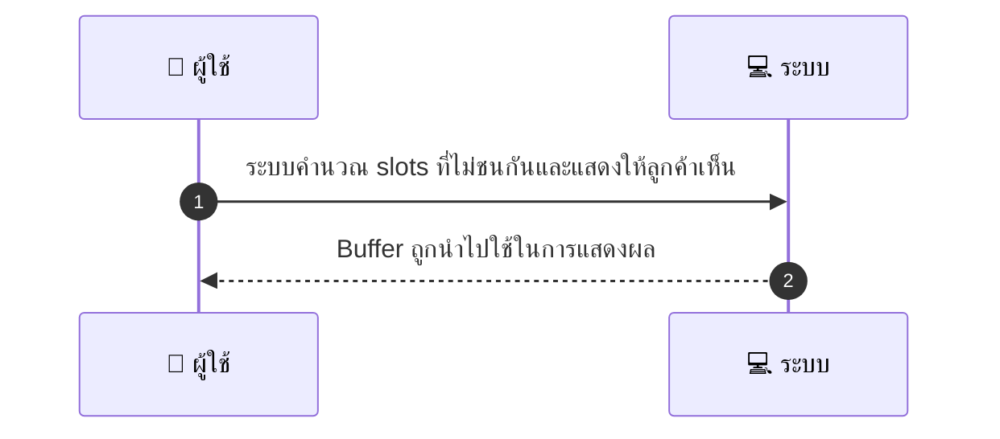
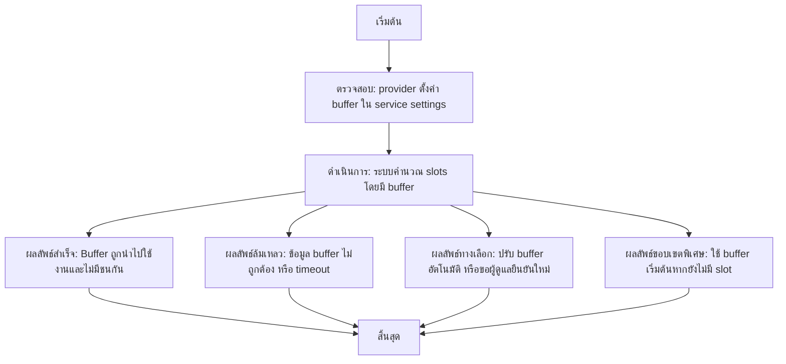

# MCC026 - ตั้งค่าค่า buffer ก่อน-หลังบริการ

## 👤 บทบาท
- ผู้ให้บริการ

## 🎯 เป้าหมายของเคส
- ในฐานะ ผู้ให้บริการ
- ต้องการ กำหนด buffer time ก่อนและหลังบริการแต่ละรายการ
- เพื่อ เพื่อจะมีเวลาจัดเตรียมและเคลียร์สถานที่

## ⚙️ เงื่อนไขก่อนเริ่ม (Precondition)
- Provider ตั้งค่า buffer ใน service settings

## 🧭 ผลลัพธ์และสถานการณ์
- ✅ ผลลัพธ์ที่คาดหวัง (Success Flow): Buffer respected in slot availability and conflict avoidance
- ❌ ผลลัพธ์ที่ Failure:
  - การบันทึกค่า buffer ไม่สำเร็จเนื่องจากข้อมูลไม่ถูกต้อง
  - ไม่พบช่วงเวลาว่าง slot ที่ไม่ชนกันตาม buffer ที่ตั้งไว้
  - การคำนวณ slots เกิด timeout หรือข้อผิดพลาด ทำให้ไม่สามารถแสดงผลให้ลูกค้าได้
- 🔄 ผลลัพธ์ทางเลือก:
  - ระบบจะปรับ buffer ให้อัตโนมัติให้น้อยลงหากไม่มี slot เพียงพอ และแจ้งผู้ใช้งาน
  - ระบบเสนอให้ผู้ดูแลปรับค่า buffer และยืนยันการคำนวณใหม่
  - ระบบอาจใช้ค่ buffer เริ่มต้นสำหรับบริการบางรายการเพื่อให้มี slot เพียงพอ
- ⚠️ ผลลัพธ์ขอบเขตพิเศษ:
  - ระบบจะปรับ buffer ให้อัตโนมัติให้น้อยลงหากไม่มี slot เพียงพอ และแจ้งผู้ใช้งาน
  - ระบบเสนอให้ผู้ดูแลปรับค่า buffer และยืนยันการคำนวณใหม่
  - ระบบอาจใช้ค่ buffer เริ่มต้นสำหรับบริการบางรายการเพื่อให้มี slot เพียงพอ

## ✅ เกณฑ์การยอมรับ (Acceptance Criteria)
- ค่า buffer ถูกบันทึกสำเร็จ
- การคำนวณช่วงเวลาสำหรับ slots ไม่ชนกันและถูกต้อง
- ช่วงเวลาที่แสดงให้ลูกค้าปราศจากความขัดแย้งและเสถียรภาพการแสดงผล
- คำนวณเสร็จภายในเวลาที่กำหนด ( SLA )

## ⏱ ลำดับความสำคัญ / SLA
- Priority: P0
- SLA: Availability calc 1s

---

## 🔁 Sequence Diagram  
> แสดงลำดับเหตุการณ์ระหว่าง "ผู้ใช้" กับ "ระบบ"

---

## 🧭 Flowchart Diagram
> แสดงขั้นตอนการทำงานของระบบอย่างเข้าใจง่าย

