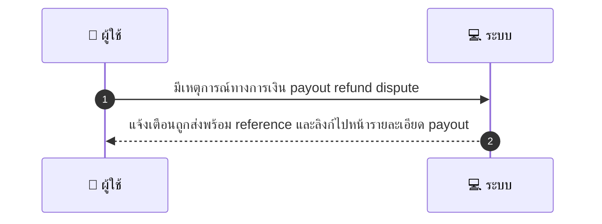
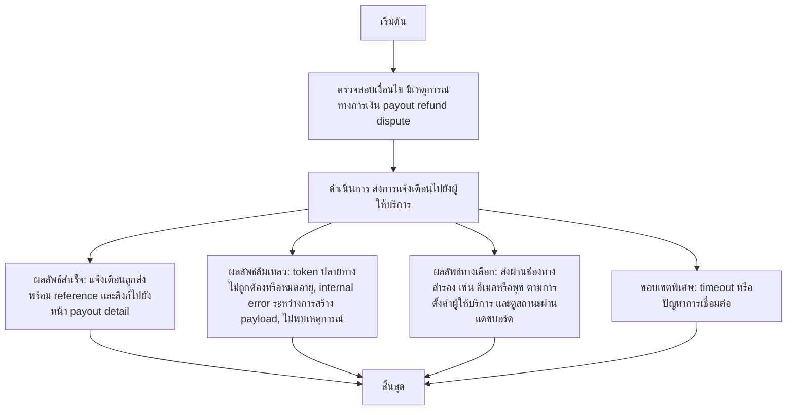

# MCC044 - ดูการแจ้งเตือนทางการเงิน Financial Alerts

## 👤 บทบาท
- ผู้ให้บริการ

## 🎯 เป้าหมายของเคส
- ในฐานะ ผู้ให้บริการ
- ต้องการ รับแจ้งเตือนเมื่อมี payout refund หรือ dispute
- เพื่อ เพื่อให้ติดตามสถานะการเงินได้ทันเวลา

## ⚙️ เงื่อนไขก่อนเริ่ม (Precondition)
- There are financial events payout refund dispute

## 🧭 ผลลัพธ์และสถานการณ์
- ✅ ผลลัพธ์ที่คาดหวัง (Success Flow): แจ้งเตือนรวม reference และขั้นตอนถัดไป
- ❌ ผลลัพธ์ที่ Failure:
  - token ปลายทางไม่ถูกต้องหรือหมดอายุ
  - internal error ระหว่างการสร้าง payload
  - ไม่พบเหตุการณ์ทางการเงินที่อ้างอิงอยู่ในระบบเมื่อทำการแจ้งเตือน
- 🔄 ผลลัพธ์ทางเลือก:
  - การแจ้งเตือนถูกส่งผ่านช่องทางสำรองที่ใช้งานได้ อีเมลหรือพุช ตามการตั้งค่าผู้ให้บริการ
  - ผู้ให้บริการสามารถดูสถานะและรายละเอียดเพิ่มเติมได้จากแดชบอร์ด และติดตามผ่านตัวเลือก ติดตามสถานะ
  - ข้อความแจ้งเตือนรวม reference และมีลิงก์ไปยังหน้า payout detail อยู่ในคำอธิบายเมื่อสามารถสร้างลิงก์ได้
- ⚠️ ผลลัพธ์ขอบเขตพิเศษ:
  - การแจ้งเตือนถูกส่งผ่านช่องทางสำรองที่ใช้งานได้ อีเมลหรือพุช ตามการตั้งค่าผู้ให้บริการ
  - ผู้ให้บริการสามารถดูสถานะและรายละเอียดเพิ่มเติมได้จากแดชบอร์ด และติดตามผ่านตัวเลือก ติดตามสถานะ
  - ข้อความแจ้งเตือนรวม reference และมีลิงก์ไปยังหน้า payout detail อยู่ในคำอธิบายเมื่อสามารถสร้างลิงก์ได้

## ✅ เกณฑ์การยอมรับ (Acceptance Criteria)
- Delivery logged
- link to payout detail page

## ⏱ ลำดับความสำคัญ / SLA
- Priority: P0
- SLA: Notify immediate

---

## 🔁 Sequence Diagram  
> แสดงลำดับเหตุการณ์ระหว่าง "ผู้ใช้" กับ "ระบบ"

---

## 🧭 Flowchart Diagram
> แสดงขั้นตอนการทำงานของระบบอย่างเข้าใจง่าย

