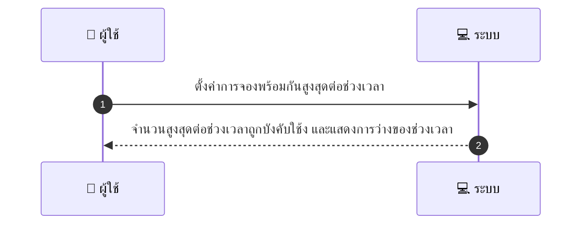
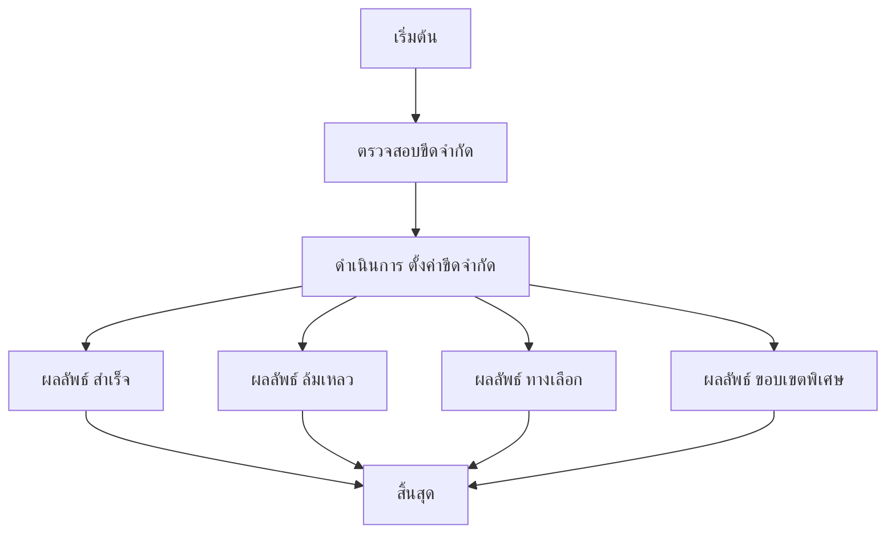

# MCC054 - จัดการ peak capacity และรับจำกัดจำนวน booking ต่อช่วงเวลา

## 👤 บทบาท
- ผู้ให้บริการ

## 🎯 เป้าหมายของเคส
- ในฐานะ ผู้ให้บริการ
- ต้องการ ตั้งค่าการจองพร้อมกันสูงสุดต่อช่วงเวลา
- เพื่อ ควบคุมคุณภาพการให้บริการเมื่อทรัพยากรจำกัด

## ⚙️ เงื่อนไขก่อนเริ่ม (Precondition)
- ผู้ให้บริการมีทรัพยากรจำกัด เช่น 2 ทีม และเมื่อผู้ให้บริการตั้งค่าการจองพร้อมกันสูงสุดต่อช่วงเวลา

## 🧭 ผลลัพธ์และสถานการณ์
- ✅ ผลลัพธ์ที่คาดหวัง (Success Flow): ระบบบังคับใช้งขีดจำกัดต่อช่วงเวลเมื่อสร้างการจอง และแสดงการว่างของช่วงเวลา
- ❌ ผลลัพธ์ที่ Failure:  
  - การสร้างการจองล้มเหลวเมื่อถึงขีดจำกัดของช่วงเวลาที่เลือก  
  - เกิดข้อผิดพลาดทางเทคนิคขณะตรวจสอบขีดจำกัดหรือบันทึกการจอง  
  - การจองถูกปฏิเสธเนื่องจากไม่มีที่ว่างภายในขีดจำกัดทรัพยากร
- 🔄 ผลลัพธ์ทางเลือก:  
  - ระบบแนะนำเลือกช่วงเวลาที่ว่างหรือทรัพยากรเพิ่มเติม  
  - ระบบเสนอให้รอ(waitlist) หรือจองในวันอื่น  
  - ผู้ดูแลระบบสามารถปรับ cap หรือเปิดใช้งาน burst capacity ตามนโยบาย
- ⚠️ ผลลัพธ์ขอบเขตพิเศษ:  
  - ระบบแนะนำช่วงเวลาที่ว่างหรือทรัพยากรเพิ่มเติม  
  - ระบบเสนอให้รอ(waitlist) หรือจองในวันอื่น  
  - ผู้ดูแลระบบสามารถปรับ cap หรือเปิดใช้งาน burst capacity ตามนโยบาย

## ✅ เกณฑ์การยอมรับ (Acceptance Criteria)
- Cap applied per slot
- overbooking prevented
- notifications when cap reached

## ⏱ ลำดับความสำคัญ / SLA
- Priority: P0
- SLA: Enforce immediate

---

## 🔁 Sequence Diagram  
> แสดงลำดับเหตุการณ์ระหว่าง "ผู้ใช้" กับ "ระบบ"

---

## 🧭 Flowchart Diagram
> แสดงขั้นตอนการทำงานของระบบอย่างเข้าใจง่าย

