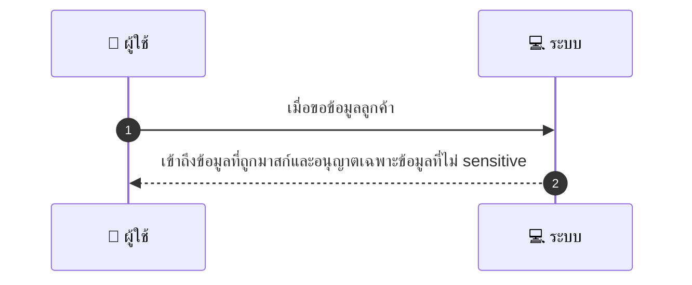
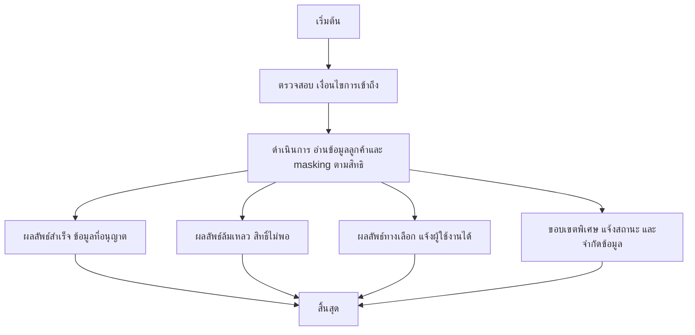

# MCC069 - จัดการความปลอดภัยข้อมูลลูกค้า Masking & Access

## 👤 บทบาท
- ผู้ให้บริการ

## 🎯 เป้าหมายของเคส
- ในฐานะ: ผู้ให้บริการ
- ต้องการ: ดูข้อมูลลูกค้าเท่าที่จำเป็น ไม่เห็นข้อมูล sensitive
- เพื่อ: เพื่อปฏิบัติตาม PDPA and privacy

## ⚙️ เงื่อนไขก่อนเริ่ม (Precondition)
- Provider views booking details

## 🧭 ผลลัพธ์และสถานการณ์
- ✅ ผลลัพธ์ที่คาดหวัง (Success Flow): การควบคุมการเข้าถึงถูกบังคับใช้งาน และมี audit log สำหรับการเข้าถึงข้อมูล
- ❌ ผลลัพธ์ที่ Failure:
  - ไม่สามารถเข้าถึงข้อมูลการจองได้ เนื่องจากสิทธิ์ไม่เพียงพอสำหรับข้อมูลที่ละเอียด
  - เกิดข้อผิดพลาดในการ masking ข้อมูลที่ละเอียด ทำให้ข้อมูลบางส่วนยังแสดง
  - ระบบบันทึกการเข้าถึงข้อมูล audit log ล้มเหลว ปิดการติดตามกิจกรรมผิดพลาด
  - มีข้อผิดพลาดด้านการสื่อสารกับระบบข้อมูลลูกค้า ทำให้ไม่สามารถดึงข้อมูลได้
- 🔄 ผลลัพธ์ทางเลือก:
  - ผู้ใช้งานเห็นเฉพาะข้อมูลที่ไม่ sensitive ตามสถานะการเข้าถึง
  - ได้รับอนุญาตชั่วคราวจากผู้ดูแลระบบเพื่อเห็นข้อมูลบางส่วนที่ละเอียด
  - ระบบแจ้งว่าไม่สามารถเปิดเผยข้อมูลที่ละเอียด แต่ยังสามารถเห็นข้อมูลทั่วไปที่จำเป็น
- ⚠️ ผลลัพธ์ขอบเขตพิเศษ:
  - ผู้ใช้งานเห็นเฉพาะข้อมูลที่ไม่ sensitive ตามสถานะการเข้าถึง
  - ได้รับอนุญาตชั่วคราวจากผู้ดูแลระบบเพื่อเห็นข้อมูลบางส่วนที่ละเอียด
  - ระบบแจ้งว่าไม่สามารถเปิดเผยข้อมูลที่ละเอียด แต่ยังสามารถเห็นข้อมูลทั่วไปที่จำเป็น

## ✅ เกณฑ์การยอมรับ (Acceptance Criteria)
- ผู้ให้บริการเห็นข้อมูลที่ไม่ sensitive เท่านั้น
- การ masking ทำงานถูกต้องตามนโยบาย PDPA
- มีการบันทึก audit log สำหรับการเข้าถึงข้อมูล
- ระบบแจ้งเตือนเมื่อสิทธิ์ไม่เพียงพอ หรือ masking ล้มเหลว
- ระบบสื่อสารกับระบบข้อมูลลูกค้าปลอดภัย และเสถียร

## ⏱ ลำดับความสำคัญ / SLA
- Priority: P0
- SLA: Masking immediate

---

## 🔁 Sequence Diagram  
> แสดงลำดับเหตุการณ์ระหว่าง "ผู้ใช้" กับ "ระบบ"

---

## 🧭 Flowchart Diagram
> แสดงขั้นตอนการทำงานของระบบอย่างเข้าใจง่าย

