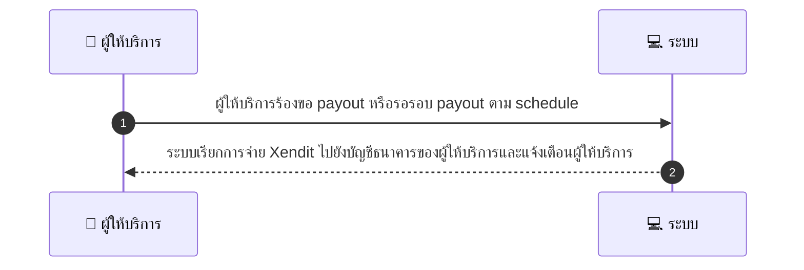
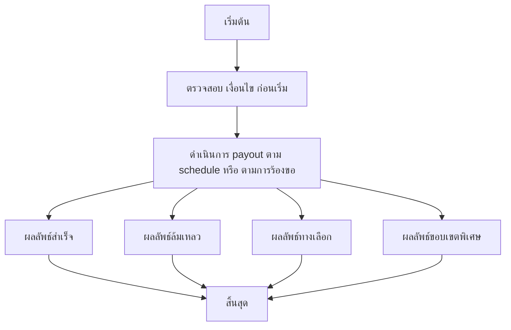

# MCC005 - Payout Request Provider

## 👤 บทบาท
- ผู้ให้บริการ

## 🎯 เป้าหมายของเคส
- ในฐานะ ผู้ให้บริการ
- ต้องการ ขอ payout หรือรับ payout ตาม schedule
- เพื่อ รับเงินจาก escrow หลังปล่อย

## ⚙️ เงื่อนไขก่อนเริ่ม (Precondition)
- ผู้ให้บริการมีเงินที่พร้อมจ่ายอยู่

## 🧭 ผลลัพธ์และสถานการณ์
- ✅ ผลลัพธ์ที่คาดหวัง (Success Flow): ระบบเรียกการจ่ายเงิน Xendit ไปยังบัญชีธนาคารของผู้ให้บริการและแจ้งเตือนผู้ให้บริการ
- ❌ ผลลัพธ์ที่ Failure:  
  - การ payout ล้มเหลวมเพราะยอดเงินที่พร้อมจ่ายไม่พอ  
  - ข้อมูลบัญชีผู้รับไม่ถูกต้องไม่ครบถ้วนทำให้การโอนล้มเหลว  
  - ธนาคารปลายทางปฏิเสธการโอน  
  - ข้อผิดพลาดทางระบบระหว่างเรียก payout API  
  - ข้อจำกัดด้าน compliance AML ทำให้ payout ถูกระงับ
- 🔄 ผลลัพธ์ทางเลือก:  
  - Partial payout จ่ายส่วนหนึ่งของยอดที่พร้อมจ่าย  
  - รอรอบถัดไป payout เลื่อนไปยังรอบถัดไปอัตโนมัติ  
  - ผู้ให้บริการเลือกวิธี payout แบบ manual หรือยืนยันก่อนดำเนินการ  
  - ระบบแจ้งเตือนให้ผู้ให้บริการยืนยันข้อมูลก่อนดำเนินการถัดไป
- ⚠️ ผลลัพธ์ขอบเขตพิเศษ:  
  - Partial payout จ่ายส่วนหนึ่งของยอดที่พร้อมจ่าย  
  - รอรอบถัดไป payout เลื่อนไปยังรอบถัดไปอัตโนมัติ  
  - ผู้ให้บริการเลือกวิธี payout แบบ manual หรือยืนยันก่อนดำเนินการ  
  - ระบบแจ้งเตือนให้ผู้ให้บริการยืนยันข้อมูลก่อนดำเนินการถัดไป

## ✅ เกณฑ์การยอมรับ (Acceptance Criteria)
- ตาราง payout สามารถกำหนดได้เองเป็นอัตโนมัติทุกสัปดาห์หรือตามที่กำหนดด้วยตนเอง
- การจ่ายเงินเสร็จสิ้นภายใน 3 วันทำการ
- ระบบส่งการแจ้งเตือนพร้อมอ้างอิง

## ⏱ ลำดับความสำคัญ / SLA
- Priority: P1
- SLA: การประมวลผล payout ภายใน 3 วันทำการ

---

## 🔁 Sequence Diagram  
> แสดงลำดับเหตุการณ์ระหว่าง "ผู้ใช้" กับ "ระบบ"

---

## 🧭 Flowchart Diagram
> แสดงขั้นตอนการทำงานของระบบอย่างเข้าใจง่าย

