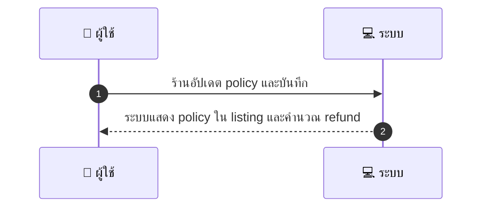
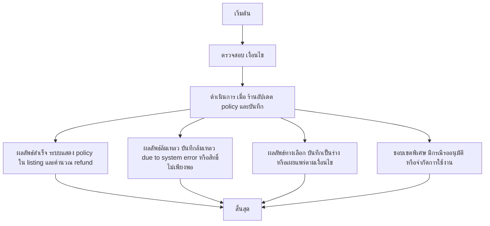

# MCC012 - ตั้งค่านโยบายการยกเลิกของร้าน

## 👤 บทบาท
- ผู้ให้บริการ

## 🎯 เป้าหมายของเคส
- ในฐานะ ผู้ให้บริการ
- ต้องการ กำหนด cancellation policy เฉพาะร้าน within platform rules
- เพื่อ เพื่อให้ลูกค้าเห็นเงื่อนไขก่อนจอง

## ⚙️ เงื่อนไขก่อนเริ่ม (Precondition)
- ร้านมีบัญชีและหน้าจัดการการตั้งค่า

## 🧭 ผลลัพธ์และสถานการณ์
- ✅ ผลลัพธ์ที่คาดหวัง (Success Flow): ระบบแสดง policy ใน listing และใช้คำนวณ refund
- ❌ ผลลัพธ์ที่ Failure:  
  - บันทึกนโยบายล้มเหลวด้วยข้อผิดพลาดของระบบ ทำให้การบันทึกถูกยกเลิก
  - สิทธิ์ไม่เพียงพอ: ผู้ใช้งานไม่มีสิทธิ์แก้ไขนโยบายบนหน้าจัดการ
  - รูปแบบนโยบายไม่ถูกต้อง: ข้อความนโยบายไม่ผ่าน validation ของฟิลด์ และถูกปฏิเสธการบันทึก
  - ข้อมูลนโยบายขาดหายหรือขัดแย้งกับกฎธุรกิจ ทำให้ระบบไม่สามารถบันทึกได้
  - การคำนวณเงินคืนล้มเหลวหลังบันทึก เนื่องจากข้อมูลของนโยบายไม่สมบูรณ์
- 🔄 ผลลัพธ์ทางเลือก:  
  - บันทึกเป็นร่างก่อนเผยแพร่ เพื่อทบทวนก่อนนำไปใช้จริง
  - เผยแพร่ทันทีสำหรับการจองใหม่ แต่การจองที่มีอยู่ยังใช้ policy เดิม
  - เผยแพร่เฉพาะสาขาที่เลือก และรอกำหนดการใช้งานสำหรับสาขาอื่น
  - บันทึกและใช้งานกับรายการที่ระบุเท่านั้น (จำกัดเฉพาะบริการ/รายการที่เลือก)
  - บันทึกเป็นรอบการอนุมัติ: รอการอนุมัติจากผู้ดูแลแพลตฟอร์มก่อนนำไปใช้
- ⚠️ ผลลัพธ์ขอบเขตพิเศษ:  
  - บันทึกเป็นร่างก่อนเผยแพร่ เพื่อทบทวนก่อนนำไปใช้จริง
  - เผยแพร่ทันทีสำหรับการจองใหม่ แต่การจองที่มีอยู่ยังใช้ policy เดิม
  - เผยแพร่เฉพาะสาขาที่เลือก และรอกำหนดการใช้งานสำหรับสาขาอื่น
  - บันทึกและใช้งานกับรายการที่ระบุเท่านั้น (จำกัดเฉพาะบริการ/รายการที่เลือก)
  - บันทึกเป็นรอบการอนุมัติ: รอการอนุมัติจากผู้ดูแลแพลตฟอร์มก่อนนำไปใช้

## ✅ เกณฑ์การยอมรับ (Acceptance Criteria)
- Policy field saved
- applied to booking flow
- visible to customers

## ⏱ ลำดับความสำคัญ / SLA
- Priority: P1
- SLA: Setting immediate

---

## 🔁 Sequence Diagram  
> แสดงลำดับเหตุการณ์ระหว่าง ผู้ใช้งาน กับ ระบบ

---

## 🧭 Flowchart Diagram
> แสดงขั้นตอนการทำงานของระบบอย่างเข้าใจง่าย

