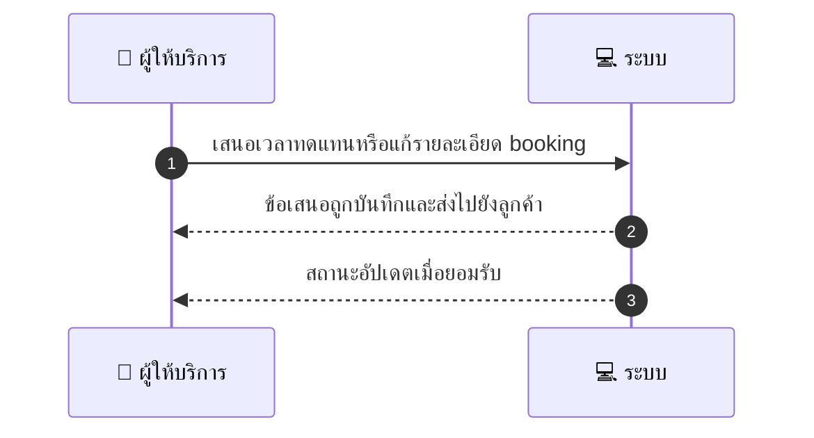
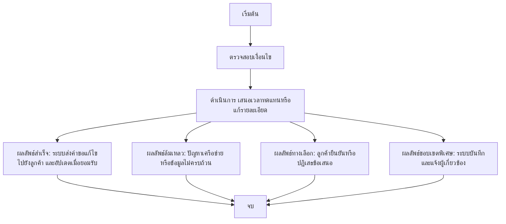

# MCC020 - แก้ไข booking จากฝั่ง provider Modify Booking

## 👤 บทบาท
- ผู้ให้บริการ

## 🎯 เป้าหมายของเคส
- ในฐานะ ผู้ให้บริการ
- ต้องการ เสนอเวลาทดแทนหรือแก้รายละเอียด booking
- เพื่อ เพื่อตอบสนองสถานการณ์จริง

## ⚙️ เงื่อนไขก่อนเริ่ม (Precondition)
- ลูกค้าจองเรียบร้อยและ provider ต้องการเปลี่ยน

## 🧭 ผลลัพธ์และสถานการณ์
- ✅ ผลลัพธ์ที่คาดหวัง (Success Flow): ระบบส่งคำขอแก้ไขไปยังลูกค้าและอัปเดตเมื่อยอมรับ
- ❌ ผลลัพธ์ที่ Failure:
  - ไม่สามารถส่งคำขอแก้ไขไปยังลูกค้าได้ เนื่องจากปัญหาเครือข่ายหรือเซิร์ฟเวอร์ชั่วคราว
  - ข้อมูลการเปลี่ยนแปลงไม่ครบถ้วน/ไม่ถูกต้อง ทำให้บันทึกการแก้ไขล้มเหลว
  - สถานะการเปลี่ยนแปลงถูกยกเลิกโดยระบบระหว่างกระบวนการ
  - escrow/refund ไม่สามารถปรับให้สอดคล้องกับการเปลี่ยนแปลงได้เมื่อมีข้อผิดพลาดในการประมวลผล
- 🔄 ผลลัพธ์ทางเลือก:
  - ลูกค้ายืนยันการเปลี่ยนแปลงตามข้อเสนอที่ provider ส่ง ระบบอัปเดตสถานะbooking
  - ลูกค้าปฏิเสธข้อเสนอและ provider ยื่นข้อเสนอใหม่/เวลาที่แตกต่าง
  - ลูกค้ตอบกลับพร้อมเงื่อนไขเพิ่มเติม (เช่น ค่าธรรมเนียม, ระยะเวลาชัดเจน) ระบบบันทึกและแจ้งให้ผู้เกี่ยวข้องทราบ
- ⚠️ ผลลัพธ์ขอบเขตพิเศษ:
  - ลูกค้ายืนยันการเปลี่ยนแปลงตามข้อเสนอที่ provider ส่ง ระบบอัปเดตสถานะbooking
  - ลูกค้าปฏิเสธข้อเสนอและ provider ยื่นข้อเสนอใหม่/เวลาที่แตกต่าง
  - ลูกค้ตอบกลับพร้อมเงื่อนไขเพิ่มเติม (เช่น ค่าธรรมเนียม, ระยะเวลาชัดเจน) ระบบบันทึกและแจ้งให้ผู้เกี่ยวข้องทราบ
  - ระบบส่งคำขอแก้ไขซ้ำอัตโนมัติเมื่อยังไม่ตอบรับภายในระยะเวลาที่กำหนด

## ✅ เกณฑ์การยอมรับ (Acceptance Criteria)
- Change proposal flow recorded
- if accepted adjust escrow/refunds

## ⏱ ลำดับความสำคัญ / SLA
- Priority: P1
- SLA: Proposal sent within 1s

---

## 🔁 Sequence Diagram  
> แสดงลำดับเหตุการณ์ระหว่าง "ผู้ให้บริการ" กับ "ระบบ"

---

## 🧭 Flowchart Diagram
> แสดงขั้นตอนการทำงานของระบบอย่างเข้าใจง่าย

