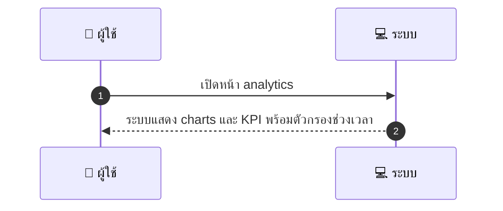
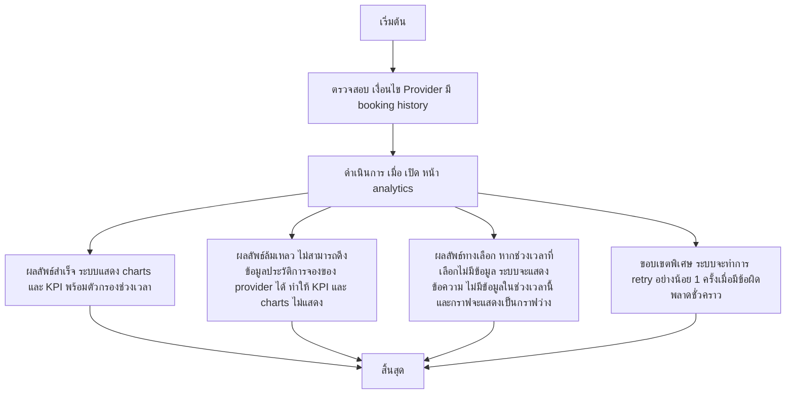

# MCC022 - แสดงสถิติ performance รายสัปดาห์ Provider Analytics

## 👤 บทบาท
- ผู้ให้บริการ

## 🎯 เป้าหมายของเคส
- ในฐานะ ผู้ให้บริการ
- ต้องการ เข้าถึง metrics เช่น bookings, cancellations, revenue
- เพื่อ ปรับปรุงบริการและการตลาด

## ⚙️ เงื่อนไขก่อนเริ่ม (Precondition)
- Provider มี booking history

## 🧭 ผลลัพธ์และสถานการณ์
- ✅ ผลลัพธ์ที่คาดหวัง (Success Flow): ระบบแสดง charts และ KPIs พร้อมตัวกรองช่วงเวลา  
- ❌ ผลลัพธ์ที่ Failure:  
  - ไม่สามารถดึงข้อมูลประวัติการจองของ provider ได้ ทำให้ KPI และ charts ไม่แสดง
  - การโหลดแดชบอร์ดล้มเหลว เนื่องจากข้อผิดพลาดเซิร์ฟเวอร์หรือ timeout
  - การส่งออก CSV ล้มเหลวเพราะเกิดข้อผิดพลาดในการสร้างไฟล์หรือข้อมูลไม่ครบถ้วน
  - ข้อมูล KPI คำนวณไม่ได้ (เช่น ไม่มีข้อมูลในช่วงที่เลือก)
- 🔄 ผลลัพธ์ทางเลือก:  
  - หากช่วงเวลาที่เลือกไม่มีข้อมูล ระบบจะแสดงข้อความ ไม่มีข้อมูลในช่วงเวลานี้ และกราฟจะแสดงเป็นกราฟว่าง
  - ถ้าผู้ใช้เลือกช่วงเวลาที่ต่าง ระบบจะดึงข้อมูลย้อนหลังและอัปเดต KPI ตามช่วงที่เลือก
  - ถ้าการส่งออก CSV ถูกเรียกแต่ไม่มีข้อมูล ระบบจะดาวน์โหลดไฟล์ CSV ที่มี headers เท่านั้น
  - ระบบจะทำการ retry อย่างน้อย 1 ครั้งเมื่อมีข้อผิดพลาดชั่วคราว
- ⚠️ ผลลัพธ์ขอบเขตพิเศษ:  
  - หากช่วงเวลาที่เลือกไม่มีข้อมูล ระบบจะแสดงข้อความ ไม่มีข้อมูลในช่วงเวลานี้ และกราฟจะแสดงเป็นกราฟว่าง
  - ถ้าผู้ใช้เลือกช่วงเวลาที่ต่าง ระบบจะดึงข้อมูลย้อนหลังและอัปเดต KPI ตามช่วงที่เลือก
  - ถ้าการส่งออก CSV ถูกเรียกแต่ไม่มีข้อมูล ระบบจะดาวน์โหลดไฟล์ CSV ที่มี headers เท่านั้น
  - ระบบจะทำการ retry อย่างน้อย 1 ครั้งเมื่อมีข้อผิดพลาดชั่วคราว

## ✅ เกณฑ์การยอมรับ (Acceptance Criteria)
- KPIs: bookings, GMV, conversion rate
- export CSV

## ⏱ ลำดับความสำคัญ / SLA
- Priority: P1
- SLA: Dashboard load 3s

---

## 🔁 Sequence Diagram  
> แสดงลำดับเหตุการณ์ระหว่าง "ผู้ใช้" กับ "ระบบ"

---

## 🧭 Flowchart Diagram
> แสดงขั้นตอนการทำงานของระบบอย่างเข้าใจง่าย

