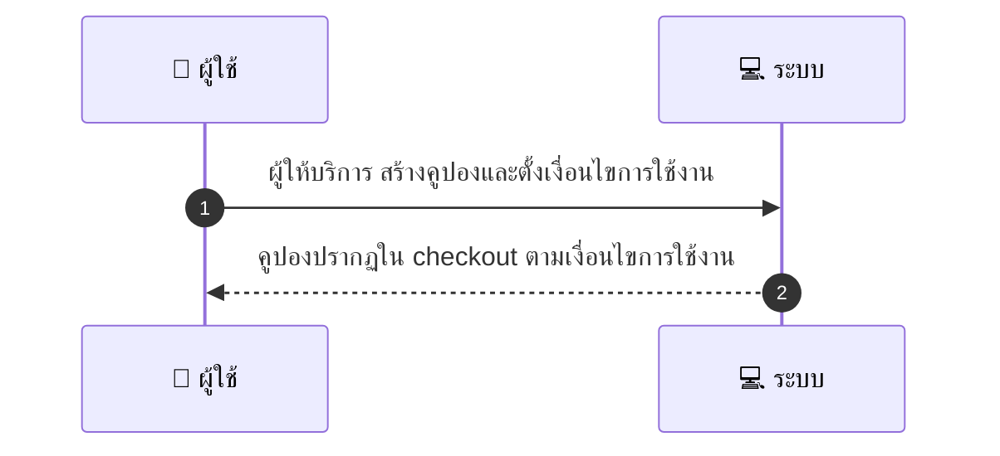
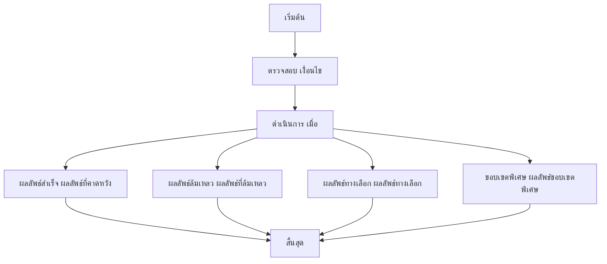

[START_MD structure]

# MCC023 - จัดการคูปอง/ดีลของร้าน Create/Manage Promotions

## 👤 บทบาท
- ผู้ให้บริการ

## 🎯 เป้าหมายของเคส
- ในฐานะ ผู้ให้บริการ
- ต้องการ สร้างคูปอง/ส่วนลดที่ใช้กับบริการของร้าน
- เพื่อ เพื่อกระตุ้นการจอง

## ⚙️ เงื่อนไขก่อนเริ่ม (Precondition)
- Provider มีสิทธิสร้าง promo

## 🧭 ผลลัพธ์และสถานการณ์
- ✅ ผลลัพธ์ที่คาดหวัง (Success Flow): Coupon appears in checkout if applicable redemption rules enforced
- ❌ ผลลัพธ์ที่ Failure:
  - สิทธิ์ของผู้ให้บริการไม่สามารถสร้างโปรโมชั่นได้ ไม่มีสิทธิ์เข้าถึงโมดูล promotions
  - ข้อมูลคูปองไม่ครบถ้วนหรือผิดพลาด รหัสคูปอง เงินส่วนลด วันที่เริ่ม/สิ้นสุด เงื่อนไขการใช้งาน
  - รหัสคูปองซ้ำกับคูปองในระบบ
  - เงื่อนไขการใช้งานขัดแย้งกับนโยบายโปรโมชั่นของร้าน/แพลตฟอร์ม
  - ระบบล้มเหลวขณะบันทึกข้อมูลคูปอง/ข้อผิดพลาดฐานข้อมูล
- 🔄 ผลลัพธ์ทางเลือก:
  - คูปองถูกสร้างแต่สถานะอยู่ระหว่างการทบทวน/อนุมัติ
  - คูปองใช้งานได้กับบริการที่เลือกเท่านั้น และไม่สามารถใช้กับบริการอื่น
  - คูปองปรากฏใน checkout แต่มีข้อจำกัดการใช้งานตามเงื่อนไข เช่น ใช้ได้กับลูกค้ากลุ่มเฉพาะหรือจำนวนครั้งจำกัด
  - การคำนวณส่วนลดทำงานตามลำดับเงื่อนไขและอาจะต้องตรวจสอบการใช้งานซ้ำ
  - คูปองถูกเผยแพร่แต่ยังไม่แสดงผลใน checkout จนกว่าสถานะจะเป็นใช้งานได้
- ⚠️ ผลลัพธ์ขอบเขตพิเศษ:
  - คูปองถูกสร้างแต่สถานะอยู่ระหว่างการทบทวน/อนุมัติ
  - คูปองใช้งานได้กับบริการที่เลือกเท่านั้น และไม่สามารถใช้กับบริการอื่น
  - คูปองปรากฏใน checkout แต่มีข้อจำกัดการใช้งานตามเงื่อนไข เช่น ใช้ได้กับลูกค้ากลุ่มเฉพาะหรือจำนวนครั้งจำกัด
  - การคำนวณส่วนลดทำงานตามลำดับเงื่อนไขและอาจะต้องตรวจสอบการใช้งานซ้ำ
  - คูปองถูกเผยแพร่แต่ยังไม่แสดงผลใน checkout จนกว่าสถานะจะเป็นใช้งานได้

## ✅ เกณฑ์การยอมรับ (Acceptance Criteria)
- Usage limits, validity, applicability saved
- reporting on redemptions

## ⏱ ลำดับความสำคัญ / SLA
- Priority: P1
- SLA: Creation immediate

---

## 🔁 Sequence Diagram  
> แสดงลำดับเหตุการณ์ระหว่าง "ผู้ใช้" กับ "ระบบ"

---

## 🧭 Flowchart Diagram
> แสดงขั้นตอนการทำงานของระบบอย่างเข้าใจง่าย

[END_MD structure]