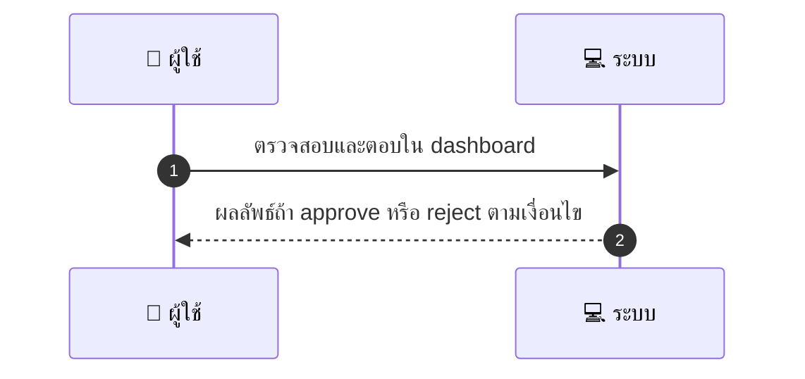
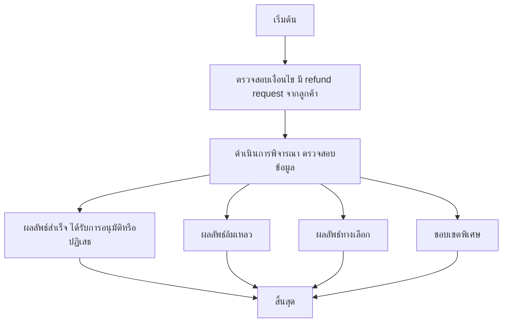

# MCC027 - รับ/ปฏิเสธการคืนเงิน Approve/Reject Refund Requests

## 👤 บทบาท
- ผู้ให้บริการ

## 🎯 เป้าหมายของเคส
- ในฐานะ ผู้ให้บริการ
- ต้องการ พิจารณาคำขอคืนเงินที่ลูกค้าร้องขอและส่งเหตุผล
- เพื่อ เพื่อจัดการ dispute เบื้องต้นก่อน escalation

## ⚙️ เงื่อนไขก่อนเริ่ม (Precondition)
- มี refund request ที่มาจากลูกค้า

## 🧭 ผลลัพธ์และสถานการณ์
- ✅ ผลลัพธ์ที่คาดหวัง (Success Flow): ถ้า approve ระบบจะดำเนินการ refund ผ่าน platform ถ้า reject ส่ง reason to admin
- ❌ ผลลัพธ์ที่ Failure:  
  - ระบบไม่สามารถดำเนินการคืนเงินได้ชั่วคราวเนื่องจากข้อผิดพลาดทางเทคนิคในการเชื่อมต่อกับ payment gateway
  - ข้อมูลคำขอคืนเงินไม่ครบถ้วนหรือไม่ชัดเจน ทำให้ไม่สามารถพิจารณาได้
  - การคืนเงินถูกปฏิเสธโดยแพลตฟอร์มเนื่องจากนโยบายคืนเงินไม่ครอบคลุมกรณีนั้นๆ
  - ตรวจสอบพบธุรกรรมซ้ำหรือลูกค้าพยายามเรียกร้องเงินคืนเกินจำนวนที่อนุมัติ
  - พบข้อผิดพลาดระหว่างขั้นตอนการคืนเงิน ทำให้กระบวนการล้มเหลวใน dashboard
- 🔄 ผลลัพธ์ทางเลือก:  
  - อนุมัติคืนเงินบางส่วน Partial refund ตามการประเมินคืนที่เหมาะสม
  - ขอข้อมูลเพิ่มจากลูกค้าก่อนตัดสินใจ หลักฐานการซื้อ รายละเอียดคำร้อง
  - ส่งเคสไปยัง Admin/Finance เพื่อทบทวนเพิ่มเติม
  - คืนเงินผ่านวิธีการชำระเงินอื่นที่แพลตฟอร์มรองรับ
  - มอบเครดิตให้กับบัญชีผู้ใช้แทนการคืนเงินสด
  - เลื่อนการตอบรับคำขอคืนเงินออกไป 24 48 ชั่วโมงภายใต้ SLA
- ⚠️ ผลลัพธ์ขอบเขตพิเศษ:  
  - อนุมัติคืนเงินบางส่วน Partial refund ตามการประเมินคืนที่เหมาะสม
  - ขอข้อมูลเพิ่มจากลูกค้าก่อนตัดสินใจ หลักฐานการซื้อ รายละเอียดคำร้อง
  - ส่งเคสไปยัง Admin/Finance เพื่อทบทวนเพิ่มเติม
  - คืนเงินผ่านวิธีการชำระเงินอื่นที่แพลตฟอร์มรองรับ
  - มอบเครดิตให้กับบัญชีผู้ใช้แทนการคืนเงินสด
  - เลื่อนการตอบรับคำขอคืนเงินออกไป 24 48 ชั่วโมงภายใต้ SLA
- ✅ เกณฑ์การยอมรับ (Acceptance Criteria)
  - Actions logged
  - cannot bypass marketplace rules
  - SLA for provider response recommended
- ⏱ ลำดับความสำคัญ / SLA
  - Priority: P1
  - SLA: Provider respond =48h

---

## 🔁 Sequence Diagram  
> แสดงลำดับเหตุการณ์ระหว่าง "ผู้ใช้" กับ "ระบบ"

---

## 🧭 Flowchart Diagram
> แสดงขั้นตอนการทำงานของระบบอย่างเข้าใจง่าย

