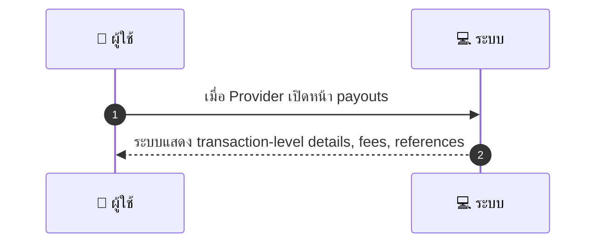
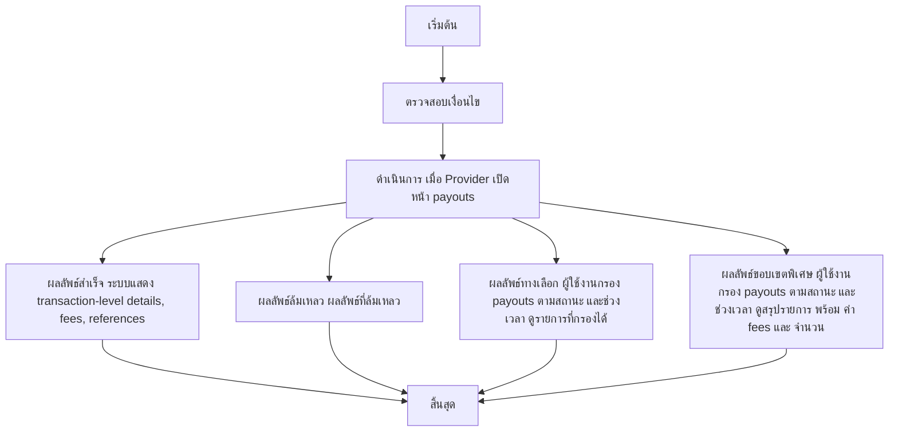

# MCC028 - ดูประวัติ payouts และสถานะการชำระ Payout History

## 👤 บทบาท
- ผู้ให้บริการ

## 🎯 เป้าหมายของเคส
- ในฐานะ
- ต้องการ
  - ดูรายการ payouts, fees และสถานะการจ่ายเงิน
- เพื่อ
  - เพื่อตรวจสอบรายรับและ reconcile

## ⚙️ เงื่อนไขก่อนเริ่ม (Precondition)
- Provider มี payouts records

## 🧭 ผลลัพธ์และสถานการณ์
- ✅ ผลลัพธ์ที่คาดหวัง (Success Flow): ระบบแสดง transaction-level details, fees, references
- ❌ ผลลัพธ์ที่ Failure:
  - เกิดข้อผิดพลาดในการดึงข้อมูล payout จากระบบภายนอก/ฐานข้อมูล
  - ไม่สามารถสร้างหรือดาวน์โหลดไฟล์ CSV สำหรับการส่งออกได้
  - ไม่มีรายการ payouts ตามช่วงเวลาที่เลือก หรือข้อมูลไม่สมบูรณ์
- 🔄 ผลลัพธ์ทางเลือก:
  - ผู้ใช้งานกรองรายการ payouts ตามสถานะ Paid Pending Failed และช่วงเวลา แล้วระบบแสดงผลลัพธ์ที่กรองได้
  - ผู้ใช้งานดูสรุปรายการ payout พร้อมค่า fees รวม และจำนวนรายการในหน้าประวัติ
  - ผู้ใช้งานเรียกดูรายละเอียด payout ทีละรายการ drill-down โดยไม่ออกจากหน้า payouts
  - ผู้ใช้งานเลือก export CSV ของรายการที่แสดงอยู่ และระบบสร้างไฟล์ CSV ตามฟิลด์ที่ระบุ
- ⚠️ ผลลัพธ์ขอบเขตพิเศษ:
  - ผู้ใช้งานกรองรายการ payouts ตามสถานะ Paid Pending Failed และช่วงเวลา แล้วระบบแสดงผลลัพธ์ที่กรองได้
  - ผู้ใช้งานดูสรุปรายการ payout พร้อมค่า fees รวม และจำนวนรายการในหน้าประวัติ
  - ผู้ใช้งานเรียกดูรายละเอียด payout ทีละรายการ drill-down โดยไม่ออกจากหน้า payouts
  - ผู้ใช้งานเลือก export CSV ของรายการที่แสดงอยู่ และระบบสร้างไฟล์ CSV ตามฟิลด์ที่ระบุ

## ✅ เกณฑ์การยอมรับ (Acceptance Criteria)
- Exportable CSV
- detail includes booking_id, payout_id, gross/net, fees, timestamp

## ⏱ ลำดับความสำคัญ / SLA
- Priority: P1
- SLA: Load 3s

---

## 🔁 Sequence Diagram  
> แสดงลำดับเหตุการณ์ระหว่าง "ผู้ใช้" กับ "ระบบ"

---

## 🧭 Flowchart Diagram
> แสดงขั้นตอนการทำงานของระบบอย่างเข้าใจง่าย

