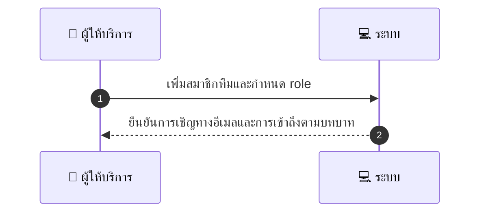
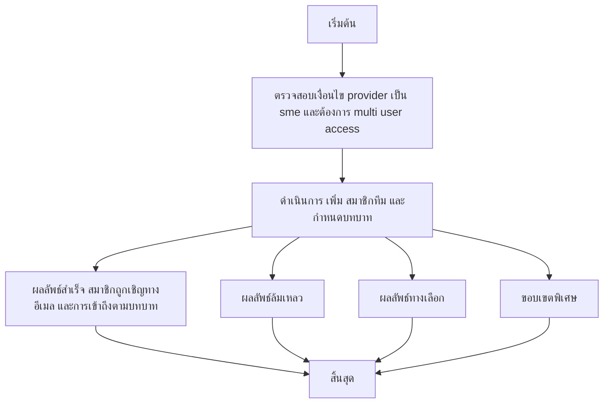

# MCC031 - จัดการทีม/พนักงานในบัญชีร้าน Team Management

## 👤 บทบาท
- ผู้ให้บริการ

## 🎯 เป้าหมายของเคส
- ในฐานะ ผู้ให้บริการ SME
- ต้องการ เพิ่ม ลบ พนักงาน และ กำหนด สิทธิ์ การ จัดการ booking
- เพื่อ เพื่อให้ หลาย ผู้ใช้ จัดการ การ จอง และ payouts

## ⚙️ เงื่อนไขก่อนเริ่ม (Precondition)
- Provider เป็น SME และต้องการ multi-user access

## 🧭 ผลลัพธ์และสถานการณ์
- ✅ ผลลัพธ์ที่คาดหวัง (Success Flow): สมาชิกถูกเชิญทางอีเมลและการเข้าถึงตามบทบาทถูกบังคับ
- ❌ ผลลัพธ์ที่ Failure:  
- 🔄 ผลลัพธ์ทางเลือก:  
- ⚠️ ผลลัพธ์ขอบเขตพิเศษ:  

## ✅ เกณฑ์การยอมรับ (Acceptance Criteria)
- ลิงก์เชิญ สิทธิ์ตามบทบาท และ บันทึกการกระทำ โดย สมาชิกทีม

## ⏱ ลำดับความสำคัญ / SLA
- Priority: P1
- SLA: Invite emails sent 5s

---

## 🔁 Sequence Diagram  
> แสดงลำดับเหตุการณ์ระหว่าง "ผู้ใช้" กับ "ระบบ"

---

## 🧭 Flowchart Diagram
> แสดงขั้นตอนการทำงานของระบบอย่างเข้าใจง่าย

