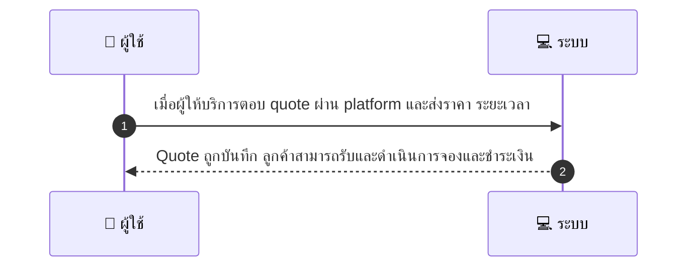
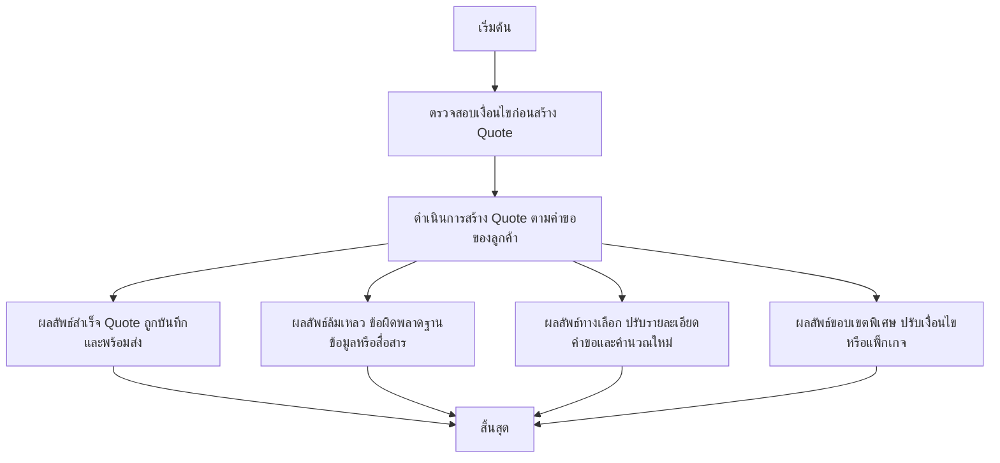

# MCC033 - รับคำขอ quote/estimate ก่อนจอง Request Quote

## 👤 บทบาท
- ผู้ให้บริการ

## 🎯 เป้าหมายของเคส
- ในฐานะ ผู้ให้บริการ
- ต้องการ ตอบคำขอราคา/ประเมินงานจากลูกค้าก่อนยืนยัน booking
- เพื่อ เพื่อรองรับบริการที่ต้องประเมินราคา

## ⚙️ เงื่อนไขก่อนเริ่ม (Precondition)
- ลูกค้าส่ง request with details

## 🧭 ผลลัพธ์และสถานการณ์
- ✅ ผลลัพธ์ที่คาดหวัง (Success Flow): Quote ถูกบันทึก ลูกค้าสามารถรับและดำเนินการจองและชำระเงิน
- ❌ ผลลัพธ์ที่ Failure:
  - Quote ถูกบันทึกลงระบบไม่สำเร็จเนื่องจากข้อผิดพลาดฐานข้อมูล DB error หรือปัญหาการเชื่อมต่อระบบ
  - ไม่สามารถส่ง Quote ไปยังลูกค้าผ่าน platform เนื่องจากปัญหาการสื่อสารหรือเครือข่าย
  - ข้อมูลคำขอราคาขาดหรือตัวแปรราค ไม่ถูกต้อง ทำให้คำนวณราคาหรือระยะเวลาไม่สำเร็จ
  - ประเภทบริการ/ภูมิภาคที่ลูกค้าระบุไม่รองรับ ทำให้ไม่สามารถสร้าง Quote ได้
- 🔄 ผลลัพธ์ทางเลือก:
  - ลูกค้าขอปรับรายละเอียดในคำขอ เช่น วันเวลา ปริมาณงาน หรือข้อกำหนดเพิ่มเติม และขอ Quote ใหม่
  - ลูกค้าต้องการเลือกแพ็กเกจบริการที่ต่างจากที่เสนอ และขอคำนวณราคใหม่
  - ลูกค้าขอเงื่อนไขการชำระเงินที่ยืดหยุ่นหรือการชำระเงินภายหลัง
  - ลูกค้ายังไม่ยืนยันการจองหลังจากรับ Quote ต้องการเวลาในการพิจารณา
- ⚠️ ผลลัพธ์ขอบเขตพิเศษ:
  - ลูกค้าขอปรับรายละเอียดในคำขอ เช่น วันเวลา ปริมาณงาน หรือข้อกำหนดเพิ่มเติม และขอ Quote ใหม่
  - ลูกค้าต้องการเลือกแพ็กเกจบริการที่ต่างจากที่เสนอ และขอคำนวณราคใหม่
  - ลูกค้าขอเงื่อนไขการชำระเงินที่ยืดหยุ่นหรือการชำระเงินภายหลัง
  - ลูกค้ายังไม่ยืนยันการจองหลังจากรับ Quote ต้องการเวลาในการพิจารณา
- ✅ เกณฑ์การยอมรับ
- ⏱ ลำดับความสำคัญ / SLA
- Priority: P1
- SLA: Quote response within 48h

---

## 🔁 Sequence Diagram  
> แสดงลำดับเหตุการณ์ระหว่าง "ผู้ใช้" กับ "ระบบ"

---

## 🧭 Flowchart Diagram
> แสดงขั้นตอนการทำงานของระบบอย่างเข้าใจง่าย

