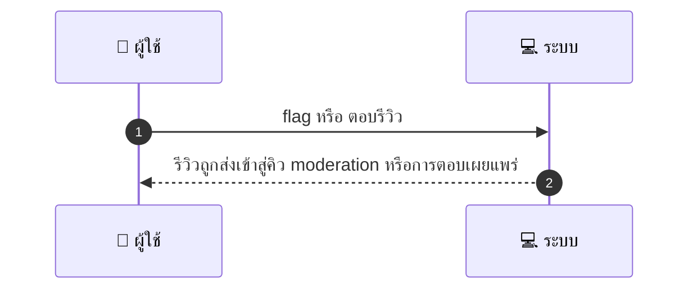
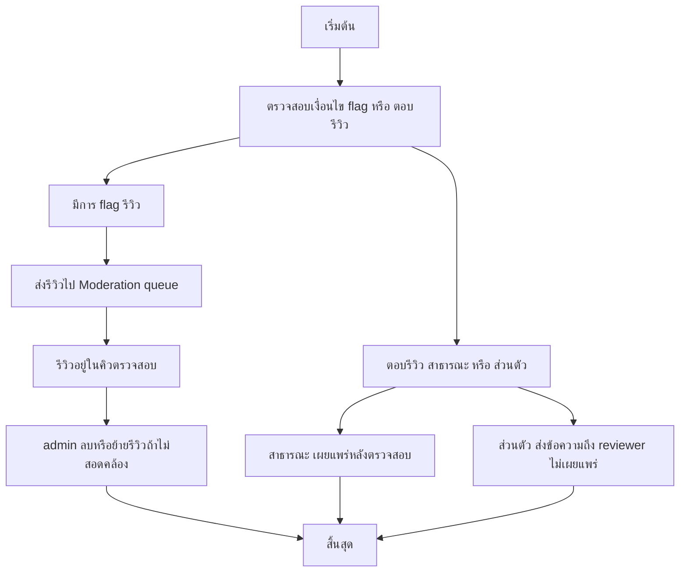

# MCC034 - จัดการรีวิว/คอมเมนต์ Moderate Reviews

## 👤 บทบาท
- ผู้ให้บริการ

## 🎯 เป้าหมายของเคส
- ในฐานะ ผู้ให้บริการ
- ต้องการ ตอบรีวิวหรือขอให้ admin review content ที่ไม่เหมาะสม
- เพื่อ เพื่อรักษาชื่อเสียงและจัดการ feedback

## ⚙️ เงื่อนไขก่อนเริ่ม (Precondition)
- Customer post review หลัง booking closed

## 🧭 ผลลัพธ์และสถานการณ์
- ✅ ผลลัพธ์ที่คาดหวัง (Success Flow): Flagged reviews go to moderation queue provider responses visible abuse prevention
- ❌ ผลลัพธ์ที่ Failure:
  - ระบบไม่สามารถส่งคำ flag รีวิวไปยังทีม Moderation ได้ชั่วคราว
  - เกิดข้อผิดพลาดในการบันทึกสถานะรีวิวว่าอยู่ในคิวตรวจสอบ
  - รีวิวที่ถูก flag ไม่ถูกตรวจสอบและถูกเผยแพร่ต่อไปโดยไม่ได้รับการตรวจสอบ
  - ไม่พบรีวิวที่ถูก flag หรือระบุว่าไม่เหมาะสม
- 🔄 ผลลัพธ์ทางเลือก:
  - ผู้ให้บริการตอบรีวิวผ่านช่องทางส่วนตัวแก่ผู้รีวิวโดยไม่เผยแพร่สู่สาธารณะ
  - รีวิวถูกระงับการเผยแพร่ชั่วคราวระหว่างการตรวจสอบ
  - ระบบแจ้งเตือนให้ provider แก้ไขข้อความรีวิวให้สอดคล้องกับนโยบายก่อนเผยแพร่
  - admin สามารถลบหรือย้ายรีวิวออกจากแพลตฟอร์มได้ถ้าพบว่าไม่สอดคล้อง
- ⚠️ ผลลัพธ์ขอบเขตพิเศษ:
  - ผู้ให้บริการตอบรีวิวผ่านช่องทางส่วนตัวแก่ผู้รีวิวโดยไม่เผยแพร่สู่สาธารณะ
  - รีวิวถูกระงับการเผยแพร่ชั่วคราวระหว่างการตรวจสอบ
  - ระบบแจ้งเตือนให้ provider แก้ไขข้อความรีวิวให้สอดคล้องกับนโยบายก่อนเผยแพร่
  - admin สามารถลบหรือย้ายรีวิวออกจากแพลตฟอร์มได้ถ้าพบว่าไม่สอดคล้อง

## ✅ เกณฑ์การยอมรับ (Acceptance Criteria)
- Flagged รีวิวต้องถูกส่งเข้าสู่ Moderation queue และผู้ให้บริการต้องสามารถตอบผ่านช่องทางส่วนตัวหรือตรวจสอบและเผยแพร่ได้หลังผ่านการตรวจสอบ

## ⏱ ลำดับความสำคัญ / SLA
- Priority: P1
- SLA: Provider response within 7 days

---

## 🔁 Sequence Diagram  
> แสดงลำดับเหตุการณ์ระหว่าง "ผู้ใช้" กับ "ระบบ"

---

## 🧭 Flowchart Diagram
> แสดงขั้นตอนการทำงานของระบบอย่างเข้าใจง่าย

