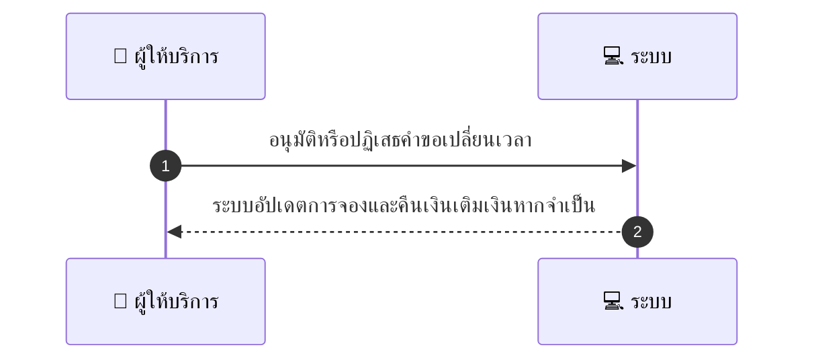
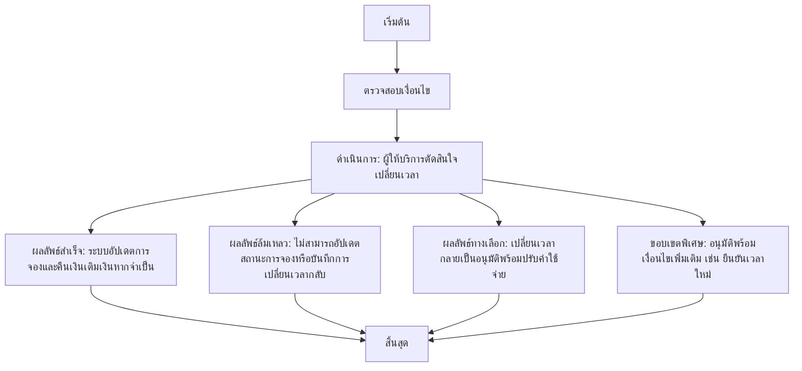

# MCC037 - ตั้งค่าการยอมรับหรือปฏิเสธคำขอเปลี่ยนเวลาก่อนเริ่มงาน

## 👤 บทบาท
- ผู้ให้บริการ

## 🎯 เป้าหมายของเคส
- ในฐานะ ผู้ให้บริการ
- ต้องการ รับการแจ้งเตือนและกลไกตัดสินใจเปลี่ยนเวลา
- เพื่อ เพื่อป้องกัน misunderstanding

## ⚙️ เงื่อนไขก่อนเริ่ม (Precondition)
- Customer requests time change pre service

## 🧭 ผลลัพธ์และสถานการณ์
- ✅ ผลลัพธ์ที่คาดหวัง (Success Flow): System updates booking and handles refunds top ups if needed
- ❌ ผลลัพธ์ที่ Failure:
  - บันทึกคำขอเปลี่ยนเวลากลับไม่สำเร็จเนื่องจากข้อผิดพลาดระบบ
  - การประมวลผลคืนเงินเติมเงินที่เกี่ยวข้องกับการเปลี่ยนเวลากลับล้มเหลว
  - ไม่สามารถอัปเดตสถานะการจองในระบบหลังการเปลี่ยนเวลากล่าวได้
- 🔄 ผลลัพธ์ทางเลือก:
  - การเปลี่ยนเวลากลายเป็นอนุมัติพร้อมปรับค่าใช้จ่ายส่วนต่างให้ลูกค้า
  - อนุมัติการเปลี่ยนเวลากับเงื่อนไขเพิ่มเติม เช่น ต้องยืนยันเวลาใหม่ในระบบ
  - ปฏิเสธการเปลี่ยนเวลากแต่เสนอเวลาทดแทนที่ว่างในช่วงใกล้เคียง
- ⚠️ ผลลัพธ์ขอบเขตพิเศษ:
  - การเปลี่ยนเวลากลายเป็นอนุมัติพร้อมปรับค่าใช้จ่ายส่วนต่างให้ลูกค้า
  - อนุมัติการเปลี่ยนเวลากับเงื่อนไขเพิ่มเติม เช่น ต้องยืนยันเวลาใหม่ในระบบ
  - ปฏิเสธการเปลี่ยนเวลากแต่เสนอเวลาทดแทนที่ว่างในช่วงใกล้เคียง

## ✅ เกณฑ์การยอมรับ (Acceptance Criteria)
- Change handling logged and notified to customer

## ⏱ ลำดับความสำคัญ / SLA
- Priority: P1
- SLA: - Response <=24h

---

## 🔁 Sequence Diagram  
> แสดงลำดับเหตุการณ์ระหว่าง "ผู้ให้บริการ" กับ "ระบบ"

---

## 🧭 Flowchart Diagram
> แสดงขั้นตอนการทำงานของระบบอย่างเข้าใจง่าย

