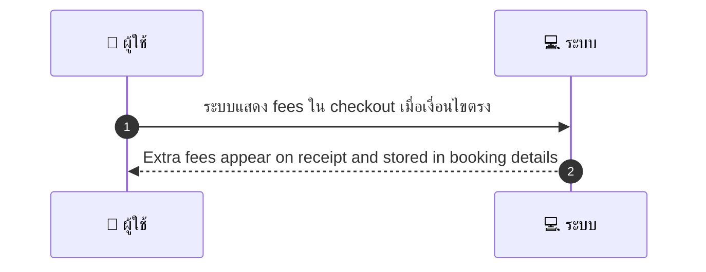

# MCC039 - ตั้งค่าค่าบริการพิเศษ Extra Fees เช่น ค่าที่จอดรถ/ค่าวัสดุ

## 👤 บทบาท
- ผู้ให้บริการ

## 🎯 เป้าหมายของเคส
- ในฐานะ ผู้ให้บริการ
- ต้องการ กำหนด extra charges ที่อาจเกิดขึ้นในบางกรณี
- เพื่อ เพื่อแจ้งลูกค้าล่วงหน้าและรวมใน invoice

## ⚙️ เงื่อนไขก่อนเริ่ม (Precondition)
- Provider ระบุ extra fee types in service settings

## 🧭 ผลลัพธ์และสถานการณ์
- ✅ ผลลัพธ์ที่คาดหวัง (Success Flow): Extra fees appear on receipt and stored in booking details
- ❌ ผลลัพธ์ที่ Failure:  
  - ระบบไม่โหลดข้อมูลประเภทค่าบริการพิเศษจากการตั้งค่า ทำให้ไม่แสดงค่าบริการพิเศษใน checkout
  - ระบบคำนวณค่าบริการพิเศษไม่ถูกต้อง ทำยอดรวมใบเสร็จผิดพลาด
  - ค่าบริการพิเศษไม่ถูกบันทึกลงในรายละเอียดการจองหลัง checkout
- 🔄 ผลลัพธ์ทางเลือก:  
  - มีวิธีเพิ่มเติมในการโหลดข้อมูลค่าบริการพิเศษ
- ⚠️ ผลลัพธ์ขอบเขตพิเศษ:  
  - เวลา timeout หรือปัญหาระบบระหว่างทาง

## ✅ เกณฑ์การยอมรับ (Acceptance Criteria)
- Extra fees ถูกโหลดจากการตั้งค่าและแสดงใน checkout
- Extra fees ถูกบันทึกในรายละเอียดการจอง
- การคำนวณค่าบริการพิเศษถูกต้องและตอบสนองภายใน SLA

## ⏱ ลำดับความสำคัญ / SLA
- Priority: P1
- SLA: Apply calc 1s

---

## 🔁 Sequence Diagram  
> แสดงลำดับเหตุการณ์ระหว่าง "ผู้ใช้" กับ "ระบบ"



---

## 🧭 Flowchart Diagram
> แสดงขั้นตอนการทำงานของระบบอย่างเข้าใจง่าย

```mermaid
flowchart TD
  A[เริ่มต้น] --> B[ตรวจสอบ: [เงื่อนไข]]
  B --> C[ดำเนินการ: ระบบแสดงค่าบริการพิเศษใน checkout]
  C --> D[ผลลัพธ์สำเร็จ: Extra fees ปรากฏในใบเสร็จและบันทึกในรายละเอียดการจอง]
  C --> E[ผลลัพธ์ล้มเหลว: ระบบไม่โหลดข้อมูลประเภทค่าบริการพิเศษจากการตั้งค่า]
  C --> F[ผลลัพธ์ทางเลือก: มีวิธีเพิ่มเติมในการโหลดข้อมูลค่าบริการพิเศษ]
  C --> G[ขอบเขตพิเศษ: เวลา timeout หรือปัญหาระบบระหว่างทาง]
  D --> H[สิ้นสุด]
  E --> H
  F --> H
  G --> H
```

