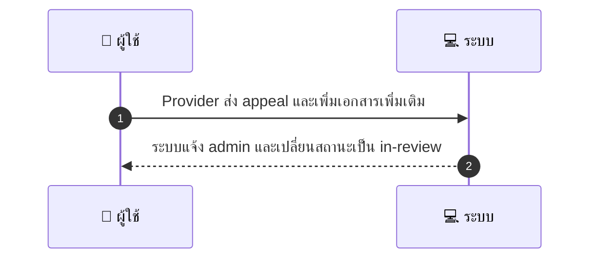
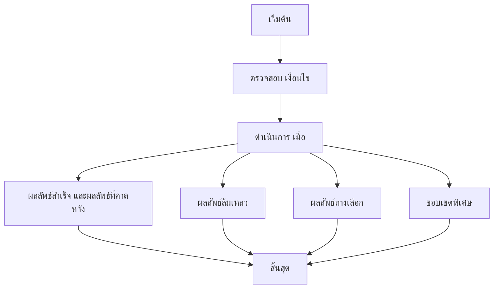

# MCC041 - ขอการช่วยเหลือด้าน KYC จาก admin (KYC Escalation)

## 👤 บทบาท
- ผู้ให้บริการ

## 🎯 เป้าหมายของเคส
- ในฐานะ: ผู้ให้บริการ
- ต้องการ: ขอความช่วยเหลือหากเอกสาร KYC ถูกปฏิเสธ
- เพื่อ: เพื่อเร่งกระบวนการยืนยัน

## ⚙️ เงื่อนไขก่อนเริ่ม (Precondition)
- KYC ถูกปฏิเสธโดย admin

## 🧭 ผลลัพธ์และสถานการณ์
- ✅ ผลลัพธ์ที่คาดหวัง (Success Flow): ระบบแจ้ง admin และเปลี่ยนสถานะเป็น in-review
- ❌ ผลลัพธ์ที่ Failure:  
  - Appeal ถูกบันทึกไม่สำเร็จและไม่สร้างเคส in-review
  - ไม่สามารถอัปเดตสถานะเป็น in-review เนื่องจากข้อผิดพลาดระบบ
  - ระบบไม่ส่งการแจ้งเตือนไปยัง admin ตามลำดับขั้น
- 🔄 ผลลัพธ์ทางเลือก:  
  - Admin ขอเอกสารเพิ่มเติมก่อนดำเนินการพิจารณา
  - สถานะเคสถูกเปลี่ยนเป็น in-review ช้ากว่ากำหนดเนื่องจากรอเอกสารใหม่
  - ผลการพิจารณาเป็นอนุมัติแบบมีเงื่อนไขขึ้นกับเอกสารที่อัปโหลด
- ⚠️ ผลลัพธ์ขอบเขตพิเศษ:  
  - Admin ขอเอกสารเพิ่มเติมก่อนดำเนินการพิจารณา
  - สถานะเคสถูกเปลี่ยนเป็น in-review ช้ากว่ากำหนดเนื่องจากรอเอกสารใหม่
  - ผลการพิจารณาเป็นอนุมัติแบบมีเงื่อนไขขึ้นกับเอกสารที่อัปโหลด

## ✅ เกณฑ์การยอมรับ (Acceptance Criteria)
- Appeal recorded
- provider notified of outcome

## ⏱ ลำดับความสำคัญ / SLA
- Priority: P1
- SLA: Admin review =48h

---

## 🔁 Sequence Diagram  
> แสดงลำดับเหตุการณ์ระหว่าง "ผู้ใช้" กับ "ระบบ"

---

## 🧭 Flowchart Diagram
> แสดงขั้นตอนการทำงานของระบบอย่างเข้าใจง่าย

