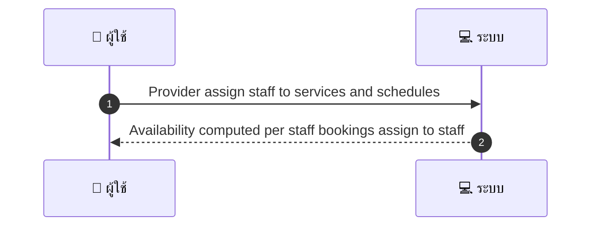
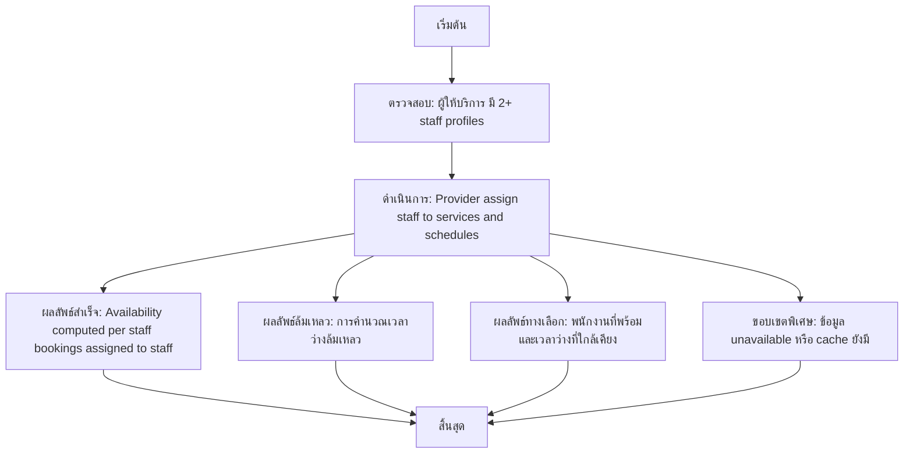

# MCC046 - ตั้งการแสดงเวลาว่างตามพนักงาน Resource-based availability

## 👤 บทบาท
- ผู้ให้บริการ

## 🎯 เป้าหมายของเคส
- ในฐานะ ผู้ให้บริการ มีทีม
- ต้องการ แมปพนักงานกับ service เพื่อแสดง availability จริงของแต่ละคน
- เพื่อ เพื่อให้ลูกค้าจองคนที่ต้องการได้

## ⚙️ เงื่อนไขก่อนเริ่ม (Precondition)
- ผู้ให้บริการ มี 2+ staff profiles

## 🧭 ผลลัพธ์และสถานการณ์
- ✅ ผลลัพธ์ที่คาดหวัง (Success Flow): Availability computed per staff and bookings assigned to staff
- ❌ ผลลัพธ์ที่ Failure:
  - การคำนวณเวลาว่างล้มเหลวด้วย timeout หรือ API error ของระบบทรัพยากร
  - Google Calendar ของพนักงานที่เชื่อมโยงไม่สามารถเข้าถึงได้ OAuth error หรือ permission denied
  - ข้อมูลพนักงานไม่ครบถ้วน เช่น ไม่มี mapping ของบริการหรือ timezone ผิดพลาด
  - เกิดข้อผิดพลาดในการบันทึกการจองลงระบบหลังจากกำหนดเวลา
- 🔄 ผลลัพธ์ทางเลือก:
  - หากพนักงานบางคนไม่ว่างในช่วงเวลาที่ต้องการ ระบบจะเลือกพนักงานคนอื่นที่มี availability ใกล้เคียง
  - หากไม่สามารถซิงค์ Google Calendar ได้ชั่วคราว ระบบจะใช้ข้อมูล availability ล่าสุดที่ cache ไว้และแสดงให้ลูกค้าก่อนได้
  - เสนอเวลาว่างที่ต่างจากเดิม เช่น วัน/ช่วงเวลาที่ว่างของพนักงานแต่ละคนที่พร้อมที่สุด
  - ในกรณีบริการถูกนำเสนอร่วมกับหลายพนักงาน ระบบจะคืนรายการตัวเลือกพนักงานที่พร้อมและให้ลูกค้ากดเลือก
- ⚠️ ผลลัพธ์ขอบเขตพิเศษ:
  - หากพนักงานบางคนไม่ว่างในช่วงเวลาที่ต้องการ ระบบจะเลือกพนักงานคนอื่นที่มี availability ใกล้เคียง
  - หากไม่สามารถซิงค์ Google Calendar ได้ชั่วคราว ระบบจะใช้ข้อมูล availability ล่าสุดที่ cache ไว้และแสดงให้ลูกค้าก่อนได้
  - เสนอเวลาว่างที่ต่างจากเดิม เช่น วัน/ช่วงเวลาที่ว่างของพนักงานแต่ละคนที่พร้อมที่สุด
  - ในกรณีบริการถูกนำเสนอร่วมกับหลายพนักงาน ระบบจะคืนรายการตัวเลือกพนักงานที่พร้อมและให้ลูกค้ากดเลือก

## ✅ เกณฑ์การยอมรับ (Acceptance Criteria)
- Staff calendars sync with Google per staff account if linked

## ⏱ ลำดับความสำคัญ / SLA
- Priority: P1
- SLA: Availability calc 1s

---

## 🔁 Sequence Diagram  
> แสดงลำดับเหตุการณ์ระหว่าง "ผู้ใช้" กับ "ระบบ"

---

## 🧭 Flowchart Diagram
> แสดงขั้นตอนการทำงานของระบบอย่างเข้าใจง่าย

