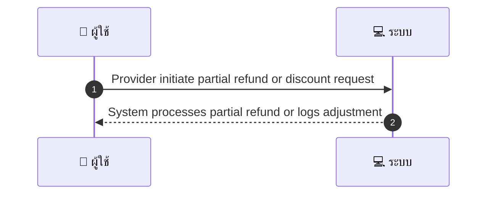
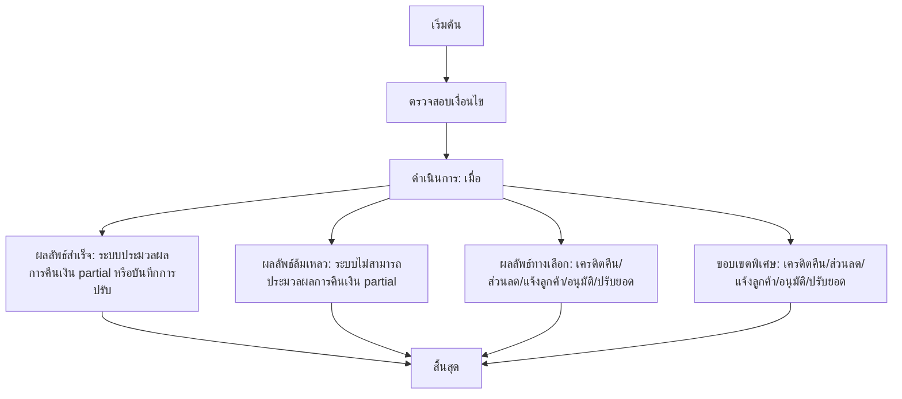

# MCC047 - รับ/จัดการการคืนสินค้า/ส่วนลดหลังการให้บริการ Post-service adjustments

## 👤 บทบาท
- ผู้ให้บริการ

## 🎯 เป้าหมายของเคส
- ในฐานะ
- ต้องการ
- เพื่อ

## ⚙️ เงื่อนไขก่อนเริ่ม (Precondition)
- Customer ขอ adjustment after service

## 🧭 ผลลัพธ์และสถานการณ์
- ✅ ผลลัพธ์ที่คาดหวัง (Success Flow): System processes partial refund via Xendit or logs adjustment to payout
- ❌ ผลลัพธ์ที่ Failure:
  - ระบบไม่สามารถประมวลผลการคืนเงิน partial ได้เนื่องจากวิธีชำระเงินที่ไม่รองรับ
  - รายการบริการไม่พบหรือไม่ตรงกับข้อมูลที่ส่งเพื่อปรับ
  - ข้อมูลเหตุผลในการปรับไม่ครบถ้วนหรือไม่ชัดเจน
  - การคืนเงินถูกปฏิเสธโดยผู้ให้บริการชำระเงินหรือธนาคาร
  - บันทึก audit trail ไม่สมบูรณ์หรือถูกแก้ไข ทำให้ไม่สามารถยืนยันได้
- 🔄 ผลลัพธ์ทางเลือก:
  - เครดิตคืนถูกโอนเข้าบัญชีผู้ใช้แทนการคืนเงินสด
  - ส่วนลดใช้ได้กับการเรียกเก็บครั้งถัดไป
  - แจ้งลูกค้าผ่านอีเมล/แชทว่าได้ดำเนินการและระบุจำนวน/เหตุผล
  - อนุมัติด้วยผู้ดูแลระบบก่อนดำเนินการตามนโยบาย
  - ปรับยอดในใบแจ้งหนี้ถัดไปหรือรายการบริการถัดไปที่ลูกค้าจะใช้
- ⚠️ ผลลัพธ์ขอบเขตพิเศษ:
  - เครดิตคืนถูกโอนเข้าบัญชีผู้ใช้แทนการคืนเงินสด
  - ส่วนลดใช้ได้กับการเรียกเก็บครั้งถัดไป
  - แจ้งลูกค้าผ่านอีเมล/แชทว่าได้ดำเนินการและระบุจำนวน/เหตุผล
  - อนุมัติด้วยผู้ดูแลระบบก่อนดำเนินการตามนโยบาย
  - ปรับยอดในใบแจ้งหนี้ถัดไปหรือรายการบริการถัดไปที่ลูกค้าจะใช้

## ✅ เกณฑ์การยอมรับ (Acceptance Criteria)
- Adjustments require reason and audit trail
- notifications sent

## ⏱ ลำดับความสำคัญ / SLA
- Priority: P1
- SLA: Action within 3 business days

---

## 🔁 Sequence Diagram  
> แสดงลำดับเหตุการณ์ระหว่าง "ผู้ใช้" กับ "ระบบ"

---

## 🧭 Flowchart Diagram
> แสดงขั้นตอนการทำงานของระบบอย่างเข้าใจง่าย

