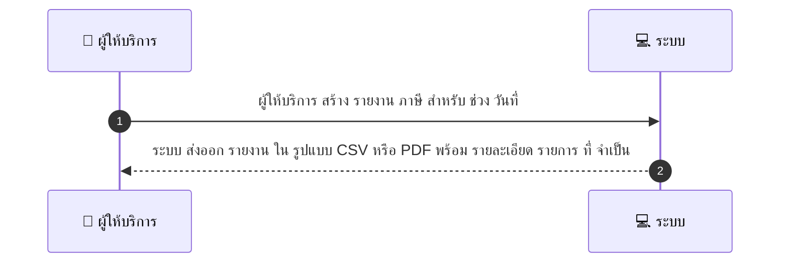
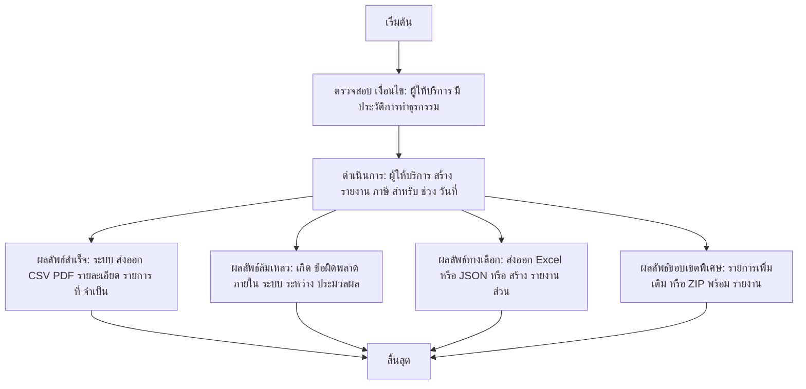

# MCC048 - ตรวจสอบและดาวน์โหลดรายงานภาษี Tax Reports

## 👤 บทบาท
- ผู้ให้บริการ

## 🎯 เป้าหมายของเคส
- ในฐานะ: ผู้ให้บริการ
- ต้องการ: สร้างรายงานที่จำเป็นต่อการยื่นภาษีและบัญชี
- เพื่อ: เพื่อการปฏิบัติตามกฎหมายและ reconciliation

## ⚙️ เงื่อนไขก่อนเริ่ม (Precondition)
- ผู้ให้บริการ มีประวัติการทำธุรกรรม

## 🧭 ผลลัพธ์และสถานการณ์
- ✅ ผลลัพธ์ที่คาดหวัง (Success Flow): ระบบ ส่งออก CSV PDF รายละเอียด รายการ ที่ จำเป็น  
- ❌ ผลลัพธ์ที่ Failure:  
  - เกิดข้อผิดพลาดภายในระบบระหว่างการประมวลผล ทำให้ไม่สามารถสร้าง CSV/PDF ของรายงานภาษีได้
  - ไม่มีประวัติการทำธุรกรรมในช่วงวันที่ระบุหรือข้อมูลไม่ครบถ้วน ทำให้รายงานไม่สามารถประกอบได้อย่างถูกต้อง
  - การส่งออกไฟล์ CSV/PDF ล้มเหลวเนื่องจากปัญหาการเขียนไฟล์หรือสิทธิ์เข้าถึง
  - ข้อมูล VAT breakdown หรือใบแจ้งหนี้ขาดหาย ทำให้รายงานไม่สมบูรณ์
  - การประมวลผลเกิน SLA 60s ในกรณีปกติ ทำให้การสร้างรายงานล้มเหลว
- 🔄 ผลลัพธ์ทางเลือก:  
  - ส่งออกในรูปแบบที่แตกต่าง เช่น Excel .xlsx หรือ JSON แทน CSV/PDF ตามความต้องการของผู้ใช้งาน
  - สร้างรายงานเฉพาะส่วน Partial report ที่รวมเฉพาะรายการที่มี VAT หรือเฉพาะใบแจ้งหนี้
  - ดาวน์โหลดเป็นชุดหลายไฟล์ รายเดือน หรือ ZIP ที่รวมทุกไฟล์รายงาน
  - สร้างสรุป summary พร้อมข้อมูล reconciliation พร้อมรายละเอียดแยกรายการ
  - ปล่อยให้ผู้ใช้งานกำหนดรายการข้อมูลที่จะรวมในรายงานหากข้อมูลบางส่วนไม่พร้อม
- ⚠️ ผลลัพธ์ขอบเขตพิเศษ:  
  - ส่งออกในรูปแบบที่แตกต่าง เช่น Excel .xlsx หรือ JSON แทน CSV/PDF ตามความต้องการของผู้ใช้งาน
  - สร้างรายงานเฉพาะส่วน Partial report ที่รวมเฉพาะรายการที่มี VAT หรือเฉพาะใบแจ้งหนี้
  - ดาวน์โหลดเป็นชุดหลายไฟล์ รายเดือน หรือ ZIP ที่รวมทุกไฟล์รายงาน
  - สร้างสรุป summary พร้อมข้อมูล reconciliation พร้อมรายละเอียดแยกรายการ
  - ปล่อยให้ผู้ใช้งานกำหนดรายการข้อมูลที่จะรวมในรายงานหากข้อมูลบางส่วนไม่พร้อม

## ✅ เกณฑ์การยอมรับ (Acceptance Criteria)
- Include VAT breakdown, invoices, provider details
- exportable

## ⏱ ลำดับความสำคัญ / SLA
- Priority: P1
- SLA: Generate 60s typical

---

## 🔁 Sequence Diagram  
> แสดงลำดับเหตุการณ์ระหว่าง "ผู้ให้บริการ" กับ "ระบบ"

---

## 🧭 Flowchart Diagram
> แสดงขั้นตอนการทำงานของระบบอย่างเข้าใจง่าย

