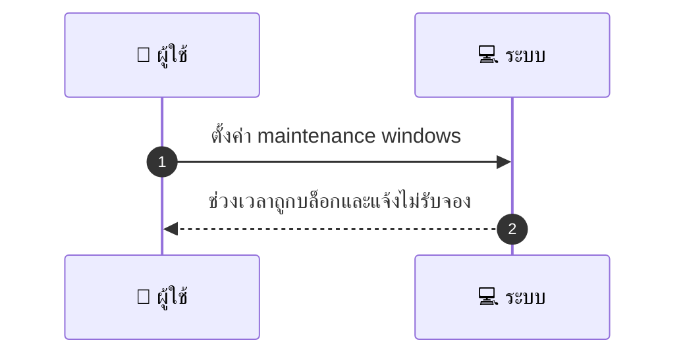
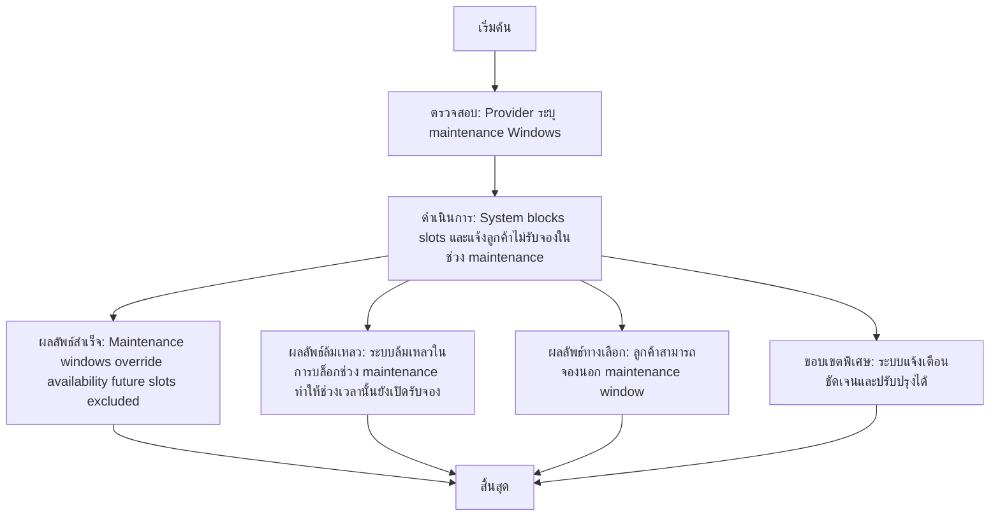

# MCC059 - ตั้งค่ากำหนดการซ่อมรักษา maintenance windows

เคสนี้อธิบายการตั้งค่ากำหนดการซ่อมรักษาเพื่อไม่ให้ลูกค้าจองช่วงเวลาที่ร้านปิดซ่อม ผู้ให้บริการเป็นผู้กำหนด maintenance windows และระบบจะบล็อกช่วงเวลานั้นทันทีเพื่อไม่ให้ลูกค้าสามารถจองได้

## 👤 บทบาท
- ผู้ให้บริการ

## 🎯 เป้าหมายของเคส
- ในฐานะ ผู้ให้บริการ
- ต้องการ ระบุช่วงเวลาที่ปิดให้บริการเพื่อ maintenance
- เพื่อ เพื่อไม่ให้ลูกค้าจองช่วงที่ร้านปิดซ่อม

## ⚙️ เงื่อนไขก่อนเริ่ม (Precondition)
- Provider ระบุ maintenance windows

## 🧭 ผลลัพธ์และสถานการณ์
- ✅ ผลลัพธ์ที่คาดหวัง (Success Flow): Maintenance windows override availability future slots excluded  
- ❌ ผลลัพธ์ที่ Failure:  
  - ระบบล้มเหลวในการบล็อกช่วง maintenance ทำให้ช่วงเวลานั้นยังเปิดรับจองและผู้ใช้งานเห็นสถานะว่าง
- 🔄 ผลลัพธ์ทางเลือก:  
  - ลูกค้าสามารถเลือกจองช่วงเวลาอื่นที่อยู่นอก maintenance window ได้ตามปกติ
  - ระบบแสดงข้อความเตือนชัดเจนว่าไม่รับจองในช่วง maintenance และแนะนำช่วงเวลาที่ว่าง
  - ผู้ให้บริการสามารถปรับปรุงหรือเลื่อน maintenance window ให้สอดคล้องกับความต้องการของลูกค้าชั่วคราวได้
- ⚠️ ผลลัพธ์ขอบเขตพิเศษ:  
  - ลูกค้าสามารถเลือกจองช่วงเวลาอื่นที่อยู่นอก maintenance window ได้ตามปกติ
  - ระบบแสดงข้อความเตือนชัดเจนว่าไม่รับจองในช่วง maintenance และแนะนำช่วงเวลาที่ว่าง
  - ผู้ให้บริการสามารถปรับปรุงหรือเลื่อน maintenance window ให้สอดคล้องกับความต้องการของลูกค้าชั่วคราวได้

## ✅ เกณฑ์การยอมรับ (Acceptance Criteria)
- Maintenance windows ถูกใช้งานจริงและปิดช่วงเวลาที่กำหนดไม่ให้จอง
- ช่วงเวลาที่อยู่ใน maintenance window จะไม่ปรากฏเป็นว่างให้ลูกค้าจอง
- เมื่อ maintenance window ถูกปรับปรุง ระบบต้องบล็อกช่วงเวลานั้นทันที
- ระบบแจ้งเตือนลูกค้าอย่างชัดเจนว่าช่วงนั้นไม่รับจอง

## ⏱ ลำดับความสำคัญ / SLA
- Priority: P1
- SLA: Update immediate

---

## 🔁 Sequence Diagram  
> แสดงลำดับเหตุการณ์ระหว่าง "ผู้ใช้" กับ "ระบบ"

---

## 🧭 Flowchart Diagram
> แสดงขั้นตอนการทำงานของระบบอย่างเข้าใจง่าย

