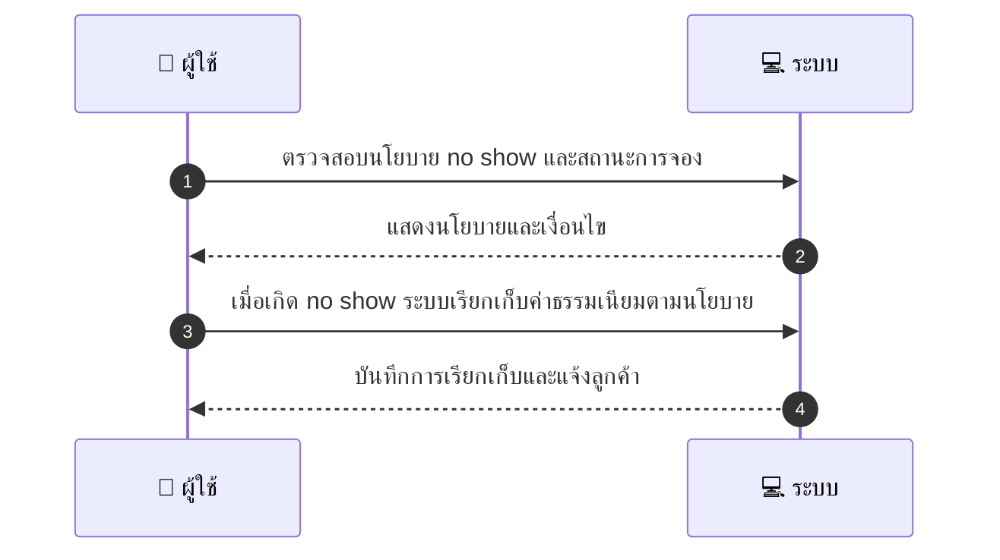
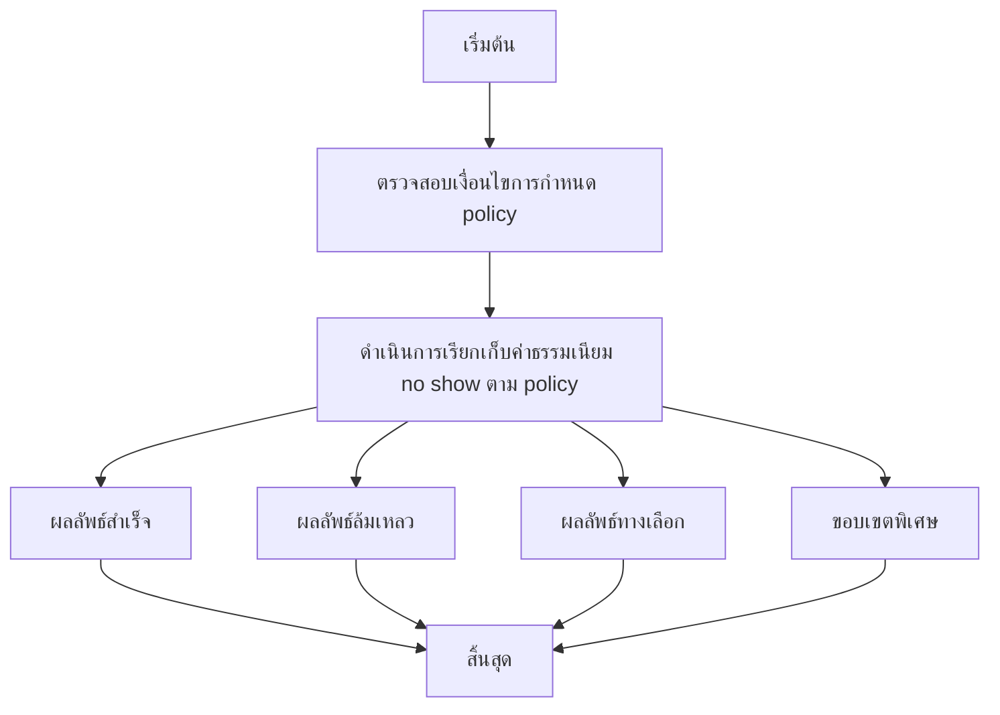

# MCC063 - กำหนด policy สำหรับ no show ของลูกค้า

## 👤 บทบาท
- ผู้ให้บริการ

## 🎯 เป้าหมายของเคส
- ในฐานะ ผู้ให้บริการ
- ต้องการ ตั้งกฎเพิ่มเติมสำหรับการจัดการ no show เช่น fee
- เพื่อ ปกป้องเวลาทำงานของร้าน

## ⚙️ เงื่อนไขก่อนเริ่ม (Precondition)
- ผู้ให้บริการกำหนดนโยบาย no show ภายในขอบเขตของแพลตฟอร์ม

## 🧭 ผลลัพธ์และสถานการณ์
- ✅ ผลลัพธ์ที่คาดหวัง (Success Flow): ค่าธรรมเนียม no show ถูกเรียกเก็บตามนโยบายและบันทึกไว้ ลูกค้าถูกแจ้งเตือน
- ❌ ผลลัพธ์ที่ Failure:
  - ไม่สามารถเรียกเก็บค่าธรรมเนียม no show ตามนโยบายได้เนื่องจากข้อมูลการจองไม่ครบถ้วนหรือสถานะการจองไม่ถูกต้อง
  - ระบบล้มเหลวในการคำนวณค่าธรรมเนียมและบันทึกลงประวัติการเรียกเก็บ
  - การแจ้งเตือนไปยังลูกค้าล่าช้ากว่ากำหนด ทำให้ลูกค้าไม่ทราบเหตุผลการเรียกเก็บ
- 🔄 ผลลัพธ์ทางเลือก:
  - ค่าธรรมเนียม no show ถูกยกเว้นตามนโยบายเนื่องจากเหตุผลที่ผู้ให้บริการอนุมัติหรือเหตุฉุกเฉินที่รับรอง
  - ลูกค้าทำการ reschedule หรือเลื่อนการจองไปยังรอบถัดไปโดยไม่ถูกเรียกเก็บค่าธรรมเนียม
  - ระบบบันทึกสถานะเป็น pending เพื่อตรวจสอบและได้รับการอนุมัติจากผู้ให้บริการก่อนเรียกเก็บ
- ⚠️ ผลลัพธ์ขอบเขตพิเศษ:
  - ค่าธรรมเนียม no show ถูกยกเว้นตามนโยบายเนื่องจากเหตุผลที่ผู้ให้บริการอนุมัติหรือเหตุฉุกเฉินที่รับรอง
  - ลูกค้าทำการ reschedule หรือเลื่อนการจองไปยังรอบถัดไปโดยไม่ถูกเรียกเก็บค่าธรรมเนียม
  - ระบบบันทึกสถานะเป็น pending เพื่อตรวจสอบและได้รับการอนุมัติจากผู้ให้บริการก่อนเรียกเก็บ

## ✅ เกณฑ์การยอมรับ (Acceptance Criteria)
- นโยบายต้องสอดคล้องกับกฎของ Marketplace
- ใช้งานอย่างสม่ำเสมอ

## ⏱ ลำดับความสำคัญ / SLA
- Priority: P1
- SLA: Immediate

---

## 🔁 Sequence Diagram  
> แสดงลำดับเหตุการณ์ระหว่าง ผู้ใช้ กับ ระบบ

---

## 🧭 Flowchart Diagram
> แสดงขั้นตอนการทำงานของระบบอย่างเข้าใจง่าย

