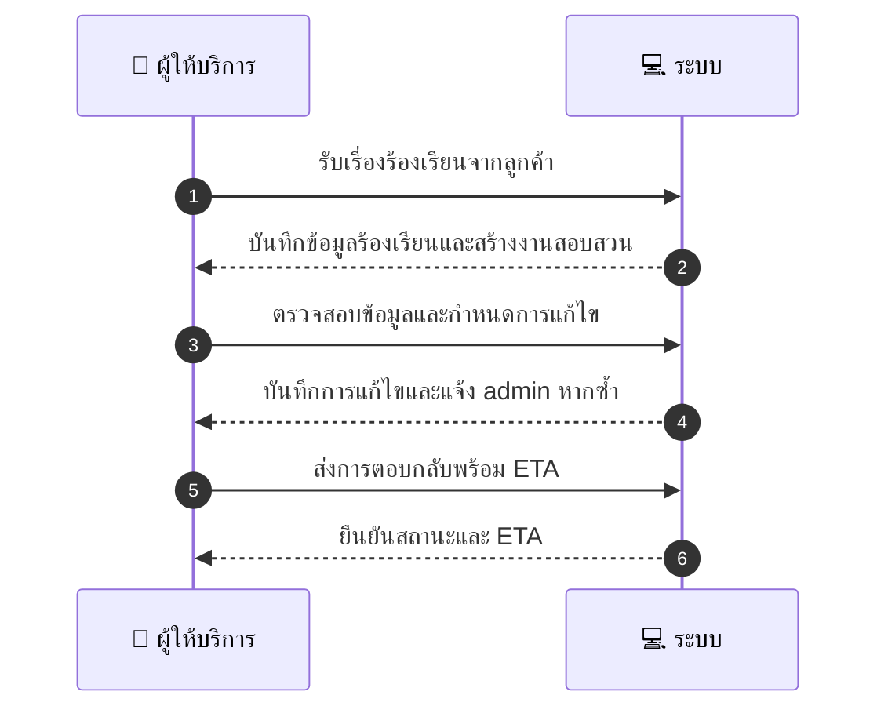
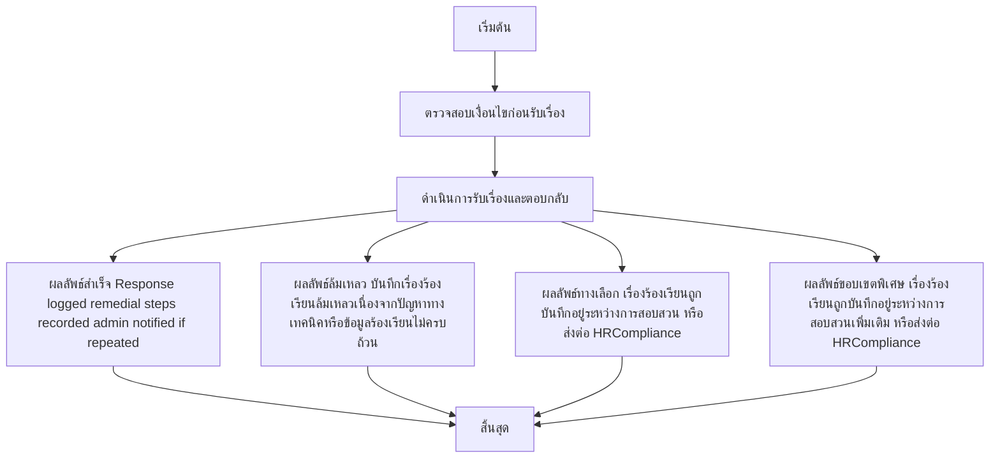

# MCC066 - รับ/จัดการ complaints เกี่ยวกับพฤติกรรมพนักงาน

## 👤 บทบาท
- ผู้ให้บริการ

## 🎯 เป้าหมายของเคส
- ในฐานะ ผู้ให้บริการ
- ต้องการ มีกระบวนการรับเรื่องและตอบกลับ complaints จากลูกค้า
- เพื่อ เพื่อปรับปรุงการบริการและจัดการข้อร้องเรียน

## ⚙️ เงื่อนไขก่อนเริ่ม (Precondition)
- Customer files complaint about staff behavior

## 🧭 ผลลัพธ์และสถานการณ์
- ✅ ผลลัพธ์ที่คาดหวัง (Success Flow): Response logged remedial steps recorded admin notified if repeated
- ❌ ผลลัพธ์ที่ Failure:
  - บันทึกเรื่องร้องเรียนล้มเหลวเนื่องจากปัญหาทางเทคนิคหรือระบบขัดข้อง
  - ข้อมูลร้องเรียนไม่ครบถ้วนหรือไม่ถูกต้อง ทำให้ดำเนินการไม่ได้
  - ไม่พบพฤติกรรมพนักงานตามเอกสารที่ถูกอ้างอิง
  - ไม่สามารถติดต่อผู้ร้องเรียนหรือพนักงานที่เกี่ยวข้องเพื่อตรวจสอบข้อเท็จจริงได้ในระยะเวลาที่กำหนด
- 🔄 ผลลัพธ์ทางเลือก:
  - เรื่องร้องเรียนถูกบันทึกแล้วและอยู่ระหว่างการสอบสวนเพิ่มเติม
  - เรื่องร้องเรียนถูกส่งต่อไปยัง HR/Compliance เพื่อดำเนินการสอบสวน
  - ลูกค้ารับทราบการตอบกลับพร้อม ETA สำหรับการดำเนินการ
  - พนักงานที่เกี่ยวข้องได้รับคำเตือนหรือถูกอบรมชั่วคราวระหว่างการสอบสวน
  - ลูกค้าประสงค์ยุติเรื่องร้องเรียนหรือตกลงแก้ไขผ่านการสื่อสารภายใน
- ⚠️ ผลลัพธ์ขอบเขตพิเศษ:
  - เรื่องร้องเรียนถูกบันทึกแล้วและอยู่ระหว่างการสอบสวนเพิ่มเติม
  - เรื่องร้องเรียนถูกส่งต่อไปยัง HR/Compliance เพื่อดำเนินการสอบสวน
  - ลูกค้ารับทราบการตอบกลับพร้อม ETA สำหรับการดำเนินการ
  - พนักงานที่เกี่ยวข้องได้รับคำเตือนหรือถูกอบรมชั่วคราวระหว่างการสอบสวน
  - ลูกค้าประสงค์ยุติเรื่องร้องเรียนหรือตกลงแก้ไขผ่านการสื่อสารภายใน

## ✅ เกณฑ์การยอมรับ (Acceptance Criteria)
- All required data captured; response logged; remedial steps recorded; admin notified on repeats; status within SLA

## ⏱ ลำดับความสำคัญ / SLA
- Priority: P1
- SLA: Respond =7 days

---

## 🔁 Sequence Diagram  
> แสดงลำดับเหตุการณ์ระหว่าง "ผู้ใช้" กับ "ระบบ"

---

## 🧭 Flowchart Diagram  
> แสดงขั้นตอนการทำงานของระบบอย่างเข้าใจง่าย

