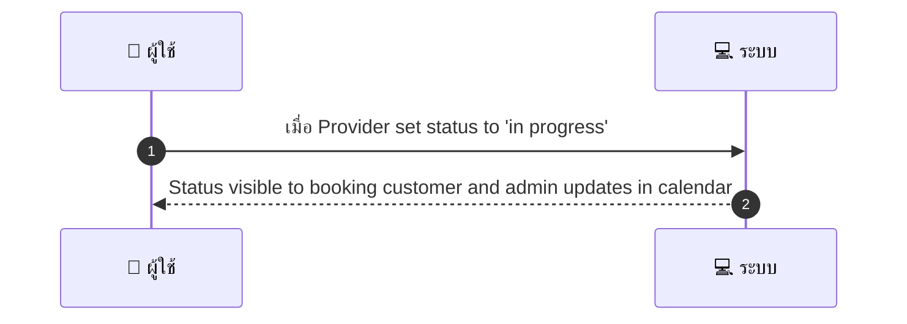
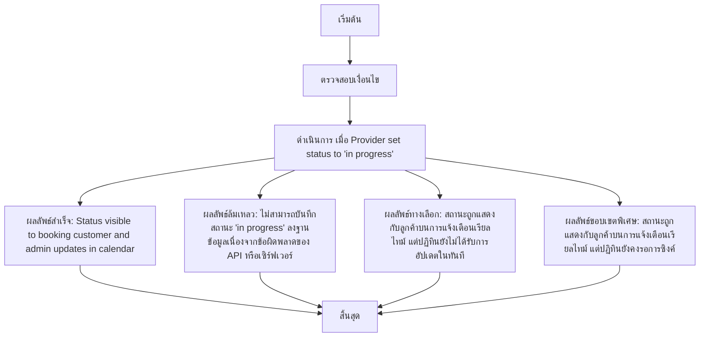

# MCC072 - แสดงสเตตัส 'กำลังให้บริการ' บน listing/การจองแบบเรียลไทม์

## 👤 บทบาท
- ผู้ให้บริการ

## 🎯 เป้าหมายของเคส
- ในฐานะ: ผู้ให้บริการ
- ต้องการ: อัปเดตสถานะเมื่อกำลังให้บริการเพื่อแจ้งสถานะลูกค้าที่เกี่ยวข้อง
- เพื่อ: เพื่อความโปร่งใสระหว่างการให้บริการ

## ⚙️ เงื่อนไขก่อนเริ่ม (Precondition)
- Provider start service

## 🧭 ผลลัพธ์และสถานการณ์
- ✅ ผลลัพธ์ที่คาดหวัง (Success Flow): Status visible to booking customer and admin updates in calendar
- ❌ ผลลัพธ์ที่ Failure:
  - ไม่สามารถบันทึกสถานะ 'in progress' ลงฐานข้อมูลเนื่องจากข้อผิดพลาดของ API หรือเซิร์ฟเวอร์
  - การแจ้งสถานะถึงลูกค้าหรือ Admin ล้มเหลว ทำให้ข้อมูลสถานะไม่ปรากฏขึ้น
  - การอัปเดตสถานะไม่ถูกบันทึกลงระบบกลาง และสถานะยังคงเป็นเดิม
  - การตอบสนองเกิน SLA หรือไม่ทันภายใน 1 วินาที
- 🔄 ผลลัพธ์ทางเลือก:
  - สถานะถูกแสดงกับลูกค้าบนการแจ้งเตือนเรียลไทม์ แต่ปฏิทินยังไม่ได้รับการอัปเดตในทันที
  - สถานะปรากฏบน listing ของลูกค้า/ Admin แต่ปฏิทินยังคงรอการซิงค์
  - ลูกค้าต้องทำการรีเฟรชหน้าจอเพื่อเห็นสถานะใหม่
  - เมื่อระบบเครือข่ายมี latency, การอัปเดตสำเร็จแต่ล่าช้ากว่า 1-2 วินาที แต่ยังไม่ถือว่าเป็นความล้มเหลว
- ⚠️ ผลลัพธ์ขอบเขตพิเศษ:
  - สถานะถูกแสดงกับลูกค้าบนการแจ้งเตือนเรียลไทม์ แต่ปฏิทินยังไม่ได้รับการอัปเดตในทันที
  - สถานะปรากฏบน listing ของลูกค้า/ Admin แต่ปฏิทินยังคงรอการซิงค์
  - ลูกค้าต้องทำการรีเฟรชหน้าจอเพื่อเห็นสถานะใหม่
  - เมื่อระบบเครือข่ายมี latency, การอัปเดตสำเร็จแต่ล่าช้ากว่า 1-2 วินาที แต่ยังไม่ถือว่าเป็นความล้มเหลว

## ✅ เกณฑ์การยอมรับ (Acceptance Criteria)
- สถานะอัปเดตแล้วแสดงผลต่อผู้จองและ Admin ได้ถูกต้อง
- การอัปเดตถูกบันทึกลงฐานข้อมูลและระบบกลาง
- ปฏิทินและ listing ซิงค์ข้อมูลภายใน SLA
- เวลาตอบสนองไม่เกิน 1 วินาที

## ⏱ ลำดับความสำคัญ / SLA
- Priority: P1
- SLA: Status update <1s

---

## 🔁 Sequence Diagram  
> แสดงลำดับเหตุการณ์ระหว่าง "ผู้ใช้" กับ "ระบบ"

---

## 🧭 Flowchart Diagram
> แสดงขั้นตอนการทำงานของระบบอย่างเข้าใจง่าย

