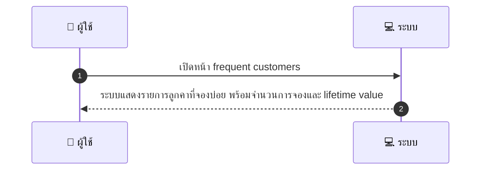
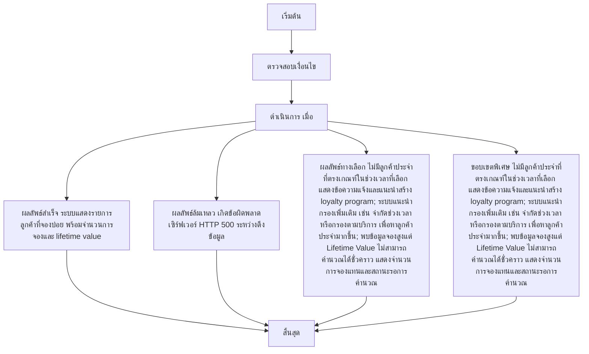

# MCC038 - ดูรายการลูกคาที่จองบ่อย Frequent Customers

## 👤 บทบาท
- ผู้ให้บริการ

## 🎯 เป้าหมายของเคส
- ในฐานะ ผู้ให้บริการ
- ต้องการ เข้าถึงรายการลูกค้าที่จองบ่อยเพื่อเสนอ loyalty program
- เพื่อ รักษาฐานลูกค้า

## ⚙️ เงื่อนไขก่อนเริ่ม (Precondition)
- Provider มี booking history

## 🧭 ผลลัพธ์และสถานการณ์
- ✅ ผลลัพธ์ที่คาดหวัง (Success Flow): System shows list with booking counts and lifetime value  
- ❌ ผลลัพธ์ที่ Failure:  
  - เกิดข้อผิดพลาดเซิร์ฟเวอร์ขณะดึงข้อมูลรายการลูกค้าที่จองบ่อย HTTP 500 ทำให้ไม่สามารถแสดงรายการได้
  - การส่งออก Export รายการไม่สำเร็จ เนื่องจากข้อผิดพลาดของระบบหรือสิทธิ์ไฟล์
  - ผู้ใช้งานไม่มีสิทธิ์เข้าถึงหน้าดู Frequent Customers ทำให้หน้าจอว่างเปล่า
- 🔄 ผลลัพธ์ทางเลือก:  
  - ไม่มีลูกค้าประจำที่ตรงเกณฑ์ในช่วงเวลาที่เลือก แสดงข้อความแจ้งและแนะนำสร้าง loyalty program
  - ระบบแนะนำกรองเพิ่มเติม เช่น จำกัดช่วงเวลา หรือกรองตามบริการ เพื่อหาลูกค้าประจำมากขึ้น
  - พบข้อมูลจองสูงแต่ Lifetime Value ไม่สามารถคำนวณได้ชั่วคราว แสดงจำนวนการจองแทนและสถานะรอการคำนวณ
- ⚠️ ผลลัพธ์ขอบเขตพิเศษ:  
  - ไม่มีลูกค้าประจำที่ตรงเกณฑ์ในช่วงเวลาที่เลือก แสดงข้อความแจ้งและแนะนำสร้าง loyalty program
  - ระบบแนะนำกรองเพิ่มเติม เช่น จำกัดช่วงเวลา หรือกรองตามบริการ เพื่อหาลูกค้าประจำมากขึ้น
  - พบข้อมูลจองสูงแต่ Lifetime Value ไม่สามารถคำนวณได้ชั่วคราว แสดงจำนวนการจองแทนและสถานะรอการคำนวณ

## ✅ เกณฑ์การยอมรับ (Acceptance Criteria)
- Exportable list and quick action to offer coupon

## ⏱ ลำดับความสำคัญ / SLA
- Priority: P2
- SLA: Load 3s

---

## 🔁 Sequence Diagram  
> แสดงลำดับเหตุการณ์ระหว่าง "ผู้ใช้" กับ "ระบบ"

---

## 🧭 Flowchart Diagram
> แสดงขั้นตอนการทำงานของระบบอย่างเข้าใจง่าย

