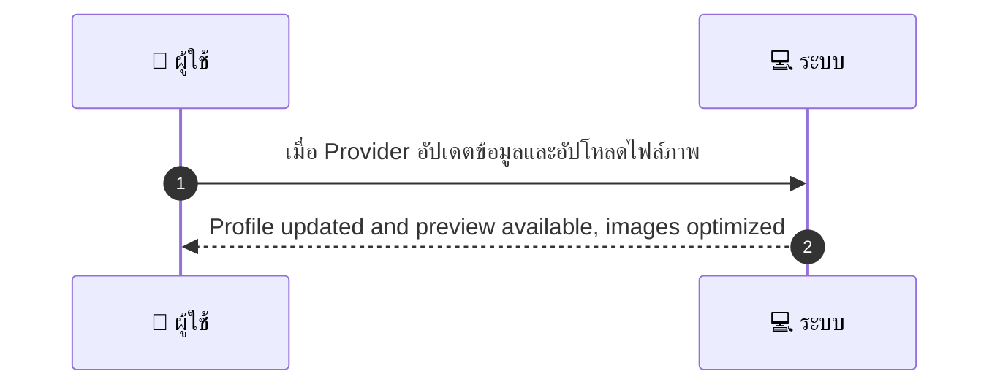
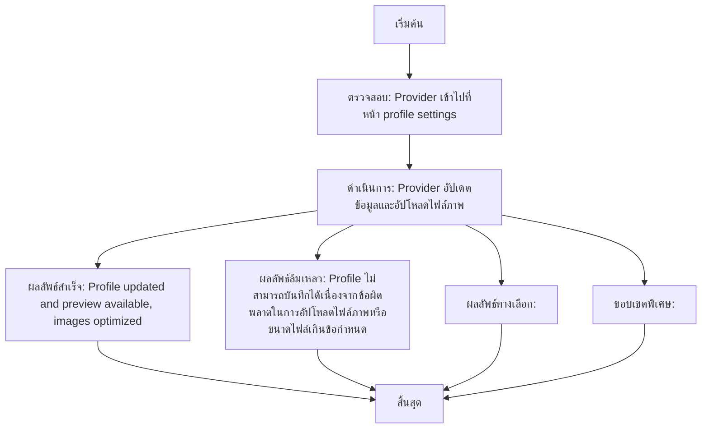

# MCC057 - ตั้งชื่อ/ปรับแต่งหน้าโปรไฟล์ร้าน Profile Branding

## 👤 บทบาท
- ผู้ให้บริการ

## 🎯 เป้าหมายของเคส
- ในฐานะ ผู้ให้บริการ
- ต้องการ แก้ไขรูป โลโก้ คำอธิบาย และภาพแกลเลอรี่ของร้าน
- เพื่อ เพิ่มความน่าสนใจและแสดงความเป็นมืออาชีพ

## ⚙️ เงื่อนไขก่อนเริ่ม (Precondition)
- Provider เข้าไปที่หน้า profile settings

## 🧭 ผลลัพธ์และสถานการณ์
- ✅ ผลลัพธ์ที่คาดหวัง (Success Flow): Profile updated and preview available, images optimized
- ❌ ผลลัพธ์ที่ Failure: 
  - Profile ไม่สามารถบันทึกได้เนื่องจากข้อผิดพลาดในการอัปโหลดไฟล์ภาพหรือขนาดไฟล์เกินข้อกำหนด
  - ข้อมูลฟิลด์ที่จำเป็นไม่ครบถ้วน เช่น ชื่อร้านหรือคำอธิบายไม่ถูกต้อง ต้องกรอกข้อมูลให้ครบถ้วนก่อนบันทึก
  - เซิร์ฟเวอร์ขัดข้องระหว่างกระบวนการอัปเดต ส่งข้อความแจ้งผู้ใช้งานและให้ตรวจสอบภายหลัง
- 🔄 ผลลัพธ์ทางเลือก:  
  - 
- ⚠️ ผลลัพธ์ขอบเขตพิเศษ:  
  - 
- ✅ เกณฑ์การยอมรับ (Acceptance Criteria)
  - Image size limits
  - preview before publish
  - SEO fields editable

## ⏱ ลำดับความสำคัญ / SLA
- Priority: P2
- SLA: Update immediate

---

## 🔁 Sequence Diagram  
> แสดงลำดับเหตุการณ์ระหว่าง "ผู้ใช้" กับ "ระบบ"

---

## 🧭 Flowchart Diagram
> แสดงขั้นตอนการทำงานของระบบอย่างเข้าใจง่าย

