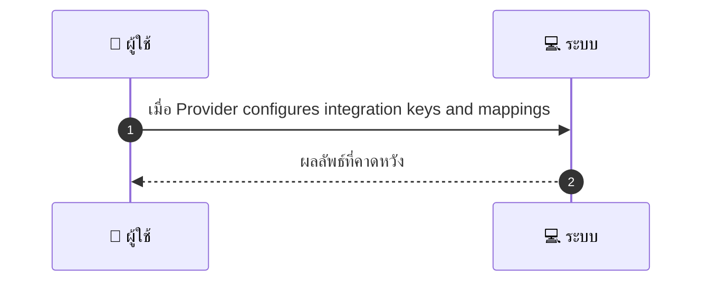
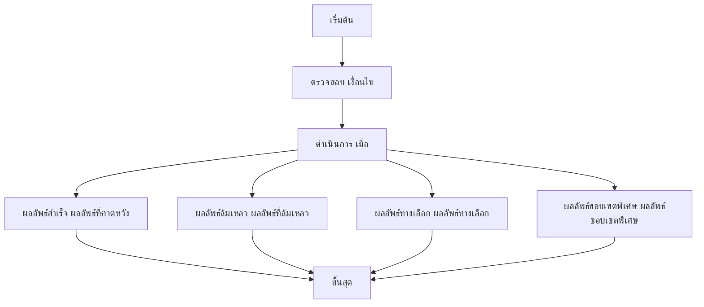

เพื่อให้ทีม Marketing Dev QA เข้าใจ flow ได้ง่าย ผมสรุปภาพรวมก่อน จากข้อมูลที่คุณให้ ผู้ให้บริการต้องเชื่อมต่อข้อมูลการจองและ payouts ไปยังระบบ POS/CRM ภายนอกผ่าน API ของผู้ให้บริการนั้น ระบบจะพยายามส่งข้อมูลไปยังปลายทางตาม Mapping ที่ตั้งค่า หากสำเร็จจะส่งข้อมูลไปยังปลายทางทั้งหมด หากไม่สำเร็จจะมีระบบคิว Retry และแจ้งเตือนให้ดูแลทำ reconciliation ต่อไป

# MCC064 - เชื่อมต่อกับระบบ POS หรือ CRM ภายนอก Integration

## 👤 บทบาท
- ผู้ให้บริการ

## 🎯 เป้าหมายของเคส
- ในฐานะ ผู้ให้บริการ
- ต้องการ เชื่อมข้อมูล booking payouts ไปยัง POS CRM ของร้าน
- เพื่อ เพื่อให้การบริหารเป็นระบบเดียว

## ⚙️ เงื่อนไขก่อนเริ่ม (Precondition)
- Provider has external system with API
- เมื่อ Provider configures integration keys and mappings

## 🧭 ผลลัพธ์และสถานการณ์
- ✅ ผลลัพธ์ที่คาดหวัง (Success Flow): System pushes events booking payment refund to provider endpoint
- ❌ ผลลัพธ์ที่ Failure: 
  - การเชื่อมต่อกับระบบ POS CRM ล้มเหลว เนื่องจากเครือข่ายไม่ถึงปลายทาง
  - Token/credentials ไม่ถูกต้องหรือหมดอายุ ทำให้การยืนยันตัวตนล้มเหลว
  - Payload ของ booking payouts ผิดรูปแบบหรือข้อมูลไม่ครบ ทำให้ปลายทางปฏิเสธ
  - API ของ POS CRM คืนข้อผิดพลาด 4xx/5xx หรือไม่ตอบสนองตามเวลาที่กำหนด
  - Retry policy ครบถ้วนแล้วแต่ยังไม่สำเร็จ ส่งผลให้ข้อมูลไม่ถูกส่งไปยังปลายทาง
- 🔄 ผลลัพธ์ทางเลือก: 
  - บางรายการถูกส่งสำเร็จ ส่วนรายการอื่นๆ ถูกคิวเพื่อ retry ภายหลัง
  - ระบบวางเหตุการณ์ไว้ในคิว Pending พร้อมสถานะ Retry และเวลาส่งใหม่อัตโนมัติ
  - ผู้ดูแลได้รับแจ้งเตือนให้ทำ reconciliation ด้วยตนเอง
  - หาก mapping ไม่สมบูรณ์ ระบบจะเปิดโหมดตรวจสอบ mappings และอนุญาตให้ผู้ดูแลแก้ไข
  - กรณี API รองรับเวอร์ชันเก่า ระบบเลือกใช้งานเวอร์ชันที่เข้ากันได้แทนเวอร์ชันปัจจุบัน
- ⚠️ ผลลัพธ์ขอบเขตพิเศษ: 
  - บางรายการถูกส่งสำเร็จ ส่วนรายการอื่นๆ ถูกคิวเพื่อ retry ภายหลัง
  - ระบบวางเหตุการณ์ไว้ในคิว Pending พร้อมสถานะ Retry และเวลาส่งใหม่อัตโนมัติ
  - ผู้ดูแลได้รับแจ้งเตือนให้ทำ reconciliation ด้วยตนเอง
  - หาก mapping ไม่สมบูรณ์ ระบบจะเปิดโหมดตรวจสอบ mappings และอนุญาตให้ผู้ดูแลแก้ไข
  - กรณี API รองรับเวอร์ชันเก่า ระบบเลือกใช้งานเวอร์ชันที่เข้ากันได้แทนเวอร์ชันปัจจุบัน

## ✅ เกณฑ์การยอมรับ (Acceptance Criteria)
- Integration logs, retry policy, and security tokens managed

## ⏱ ลำดับความสำคัญ / SLA
- Priority: P2
- SLA: Integration setup immediate, delivery retries

---

## 🔁 Sequence Diagram  
> แสดงลำดับเหตุการณ์ระหว่าง "ผู้ใช้" กับ "ระบบ"

---

## 🧭 Flowchart Diagram
> แสดงขั้นตอนการทำงานของระบบอย่างเข้าใจง่าย

