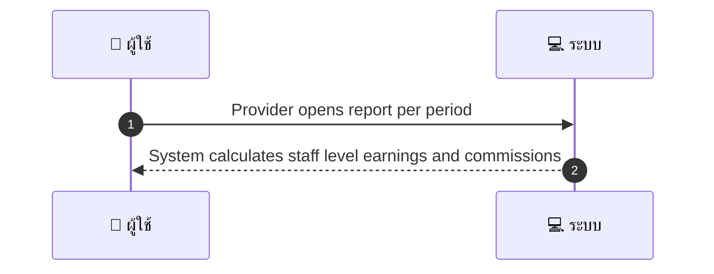
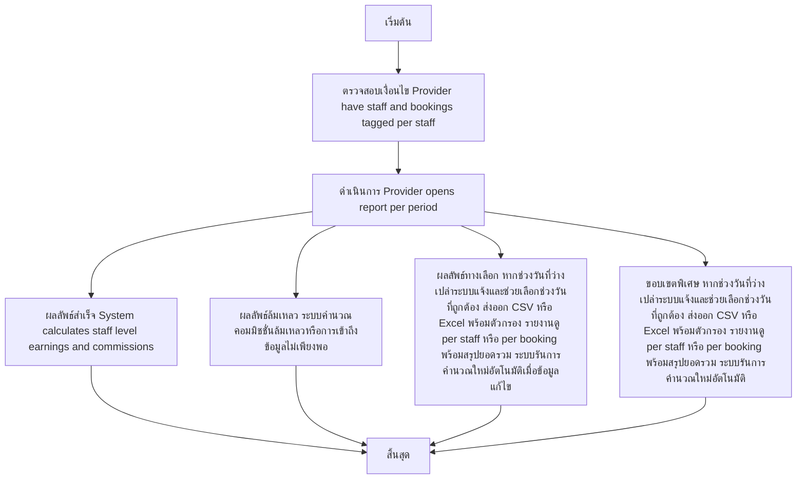

# MCC070 - รับจ่าย commission แยกตามพนักงาน Staff commission reports

## 👤 บทบาท
- ผู้ให้บริการ

## 🎯 เป้าหมายของเคส
- ในฐานะ ผู้ให้บริการ
- ต้องการ คำนวณและดูคอมมิชชั่นแยกตามพนักงานที่ให้บริการ
- เพื่อ จ่ายค่าตอบแทนภายในร้าน

## ⚙️ เงื่อนไขก่อนเริ่ม (Precondition)
- Provider have staff and bookings tagged per staff

## 🧭 ผลลัพธ์และสถานการณ์
- ✅ ผลลัพธ์ที่คาดหวัง (Success Flow): System calculates staff level earnings and commissions
- ❌ ผลลัพธ์ที่ Failure:
  - ระบบคำนวณคอมมิชชั่นล้มเหลวเมื่อข้อมูลการจองไม่ครบถ้วนหรือมีรูปแบบไม่ถูกต้อง
  - การส่งออกรายงานล้มเหลวเนื่องจากเซอร์วิสหมดเวลาหรือตัดสินใจเข้าถึงข้อมูลไม่เพียงพอ
  - ไม่พบข้อมูลพนักงานที่เกี่ยวข้องกับการจ่ายคอมมิชัน
- 🔄 ผลลัพธ์ทางเลือก:
  - หากช่วงวันที่ที่เลือกว่างเปล่าระบบจะแจ้งและช่วยให้เลือกช่วงวันที่ถูกต้อง
  - ผู้ใช้งานสามารถส่งออกเป็น CSV หรือ Excel พร้อมตัวกรองเพิ่มเติม
  - รายงานสามารถดูได้แบบ per staff หรือ per booking พร้อมสรุปยอดรวม
  - ระบบสามารถรันการคำนวณใหม่อัตโนมัติเมื่อมีการแก้ไขข้อมูลในช่วงเวลาที่เกี่ยวข้อง
- ⚠️ ผลลัพธ์ขอบเขตพิเศษ:
  - หากช่วงวันที่ที่เลือกว่างเปล่าระบบจะแจ้งและช่วยให้เลือกช่วงวันที่ถูกต้อง
  - ผู้ใช้งานสามารถส่งออกเป็น CSV หรือ Excel พร้อมตัวกรองเพิ่มเติม
  - รายงานสามารถดูได้แบบ per staff หรือ per booking พร้อมสรุปยอดรวม
  - ระบบสามารถรันการคำนวณใหม่อัตโนมัติเมื่อมีการแก้ไขข้อมูลในช่วงเวลาที่เกี่ยวข้อง

## ✅ เกณฑ์การยอมรับ (Acceptance Criteria)
- Exportable reports
- breakdown per booking/staff

## ⏱ ลำดับความสำคัญ / SLA
- Priority: P2
- SLA: Generate 60s

---

## 🔁 Sequence Diagram  
> แสดงลำดับเหตุการณ์ระหว่าง "ผู้ใช้" กับ "ระบบ"

---

## 🧭 Flowchart Diagram
> แสดงขั้นตอนการทำงานของระบบอย่างเข้าใจง่าย

