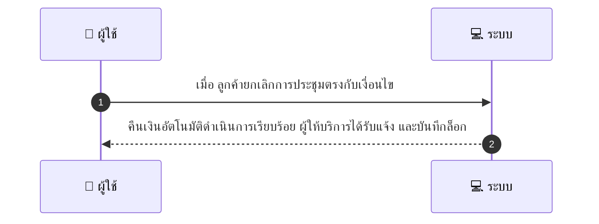
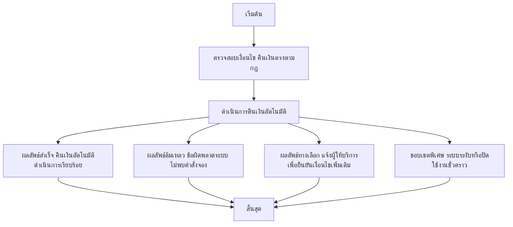

# MCC073 - ตั้งค่าการคืนเงินอัตโนมัติสำหรับบางกรณี Auto-refund rules

## 👤 บทบาท
- ผู้ให้บริการ

## 🎯 เป้าหมายของเคส
- ในฐานะ: ผู้ให้บริการ
- ต้องการ: กำหนดเงื่อนไขที่อนุญาตให้ระบบคืนเงินอัตโนมัติ ภายในนโยบาย marketplace
- เพื่อ: เพื่อให้กระบวนการคืนเงินรวดเร็ว

## ⚙️ เงื่อนไขก่อนเริ่ม (Precondition)
- ผู้ให้บริการกำหนดกฎเงื่อนไขการคืนเงิน ตัวอย่าง การยกเลิก 48 ชั่วโมงขึ้นไป

## 🧭 ผลลัพธ์และสถานการณ์
- ✅ ผลลัพธ์ที่คาดหวัง (Success Flow): คืนเงินอัตโนมัติดำเนินการเรียบร้อย ผู้ให้บริการได้รับแจ้ง และบันทึกล็อก
- ❌ ผลลัพธ์ที่ Failure:  
  - ระบบไม่สามารถดำเนินการคืนเงินอัตโนมัติได้เนื่องจากข้อผิดพลาดทางระบบ
  - ไม่พบคำสั่งจองที่ตรงกับเงื่อนไขคืนเงินตามนโยบายแพลตฟอร์ม
  - การคืนเงินล้มเหลวเมื่อชำระเงินผ่านผู้ให้บริการชำระเงินภายนอกถูกปฏิเสธหรือไม่สำเร็จ
  - เกิดข้อผิดพลาดในการบันทึกล็อกการคืนเงินและสถานะไม่ถูกต้องในระบบ
- 🔄 ผลลัพธ์ทางเลือก:  
  - การคืนเงินอัตโนมัติถูกระงับและดำเนินการคืนเงินด้วยมือโดยผู้ให้บริการ
  - ระบบแจ้งผู้ให้บริการเพื่อยืนยันเงื่อนไขเพิ่มเติมก่อนทำการคืนเงิน
  - คืนเงินสำเร็จผ่านกระบวนการ manual/เครดิตโน้ตแทนหรือผ่านช่องทางการชำระเงินที่ต่างออกไป
- ⚠️ ผลลัพธ์ขอบเขตพิเศษ:  
  - การคืนเงินอัตโนมัติถูกระงับและดำเนินการคืนเงินด้วยมือโดยผู้ให้บริการ
  - ระบบแจ้งผู้ให้บริการเพื่อยืนยันเงื่อนไขเพิ่มเติมก่อนทำการคืนเงิน
  - คืนเงินสำเร็จผ่านกระบวนการ manual/เครดิตโน้ตแทนหรือผ่านช่องทางการชำระเงินที่ต่างออกไป

## ✅ เกณฑ์การยอมรับ (Acceptance Criteria)
- กฎต้องสอดคล้องกับนโยบายของแพลตฟอร์ม
- โปร่งใสต่อผู้ใช้งาน

## ⏱ ลำดับความสำคัญ / SLA
- Priority: P2
- SLA: คืนเงินอัตโนมัติทันทีเมื่อเงื่อนไขตรง

---

## 🔁 Sequence Diagram  
> แสดงลำดับเหตุการณ์ระหว่าง "ผู้ใช้" กับ "ระบบ"

---

## 🧭 Flowchart Diagram
> แสดงขั้นตอนการทำงานของระบบอย่างเข้าใจง่าย

