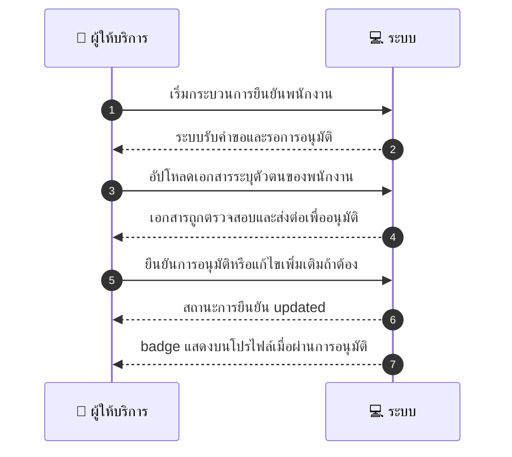
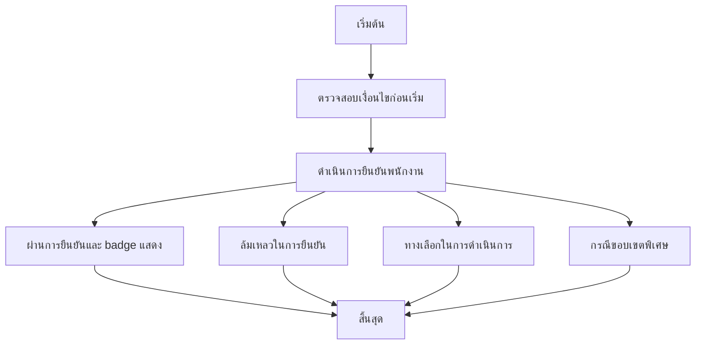

# MCC074 - ตั้ง thumbprint verification badge ของพนักงาน Staff verification

## 👤 บทบาท
- ผู้ให้บริการ

## 🎯 เป้าหมายของเคส
- ในฐานะ ผู้ให้บริการ
- ต้องการ ยืนยันผูกพนักงานกับ profile และแสดง badge ใน booking
- เพื่อ สร้างความน่าเชื่อถือ

## ⚙️ เงื่อนไขก่อนเริ่ม Precondition
- Provider adds staff and uploads ID

## 🧭 ผลลัพธ์และสถานการณ์
- ✅ ผลลัพธ์ที่คาดหวัง (Success Flow): Verification process logged badge visible on public profile if allowed
- ❌ ผลลัพธ์ที่ Failure:
  - เอกสารระบุตัวตนที่อัปโหลดไม่ชัดเจนหรือไม่ถูกต้อง ทำให้การยืนยันล้มเหลว
  - ข้อมูลพนักงานไม่ตรงกับบัญชีผู้ใช้หรือข้อมูลไม่ครบถ้วน
  - การอนุมัติล้มเหลวเพราะไม่ผ่านนโยบายตรวจสอบและยืนยันตัวตน
  - ระบบล้มเหลวระหว่างกระบวนการตรวจสอบหรือบันทึกสถานะ ทำให้ไม่สามารถออก badge ได้
  - Badge ไม่สามารถแสดงบนโปรไฟล์สาธารณะตามนโยบายความเป็นส่วนตัวการตั้งค่าความเป็นส่วนตัว
- 🔄 ผลลัพธ์ทางเลือก:
  - ผู้ให้บริการอัปโหลดเอกสารเพิ่มเติมและส่งให้ระบบตรวจสอบใหม่
  - ระบบอนุมัติแบบชั่วคราวและ badge สามารถแสดงเฉพาะใน booking จนกว่าการอนุมัติเต็มรูปแบบ
  - ผู้ดูแลระบบเรียกกระบวนการตรวจสอบด้วยตนเอง manual review เพื่อทบทวนข้อมูล
  - พนักงานยืนยันตัวตนด้วยวิธีอื่น OTP วิดีโอคอล ตามที่ระบบรองรับ
  - ผู้ใช้งานเลือกยกเลิกกระบวนการยืนยันแล้วเริ่มใหม่ภายหลัง
- ⚠️ ผลลัพธ์ขอบเขตพิเศษ:
  - ผู้ให้บริการอัปโหลดเอกสารเพิ่มเติมและส่งให้ระบบตรวจสอบใหม่
  - ระบบอนุมัติแบบชั่วคราวและ badgeสามารถแสดงเฉพาะใน booking จนกว่าการอนุมัติเต็มรูปแบบ
  - ผู้ดูแลระบบเรียกกระบวนการตรวจสอบด้วยตนเอง manual review เพื่อทบทวนข้อมูล
  - พนักงานยืนยันตัวตนด้วยวิธีอื่น OTP วิดีโอคอล ตามที่ระบบรองรับ
  - ผู้ใช้งานเลือกยกเลิกกระบวนการยืนยันแล้วเริ่มใหม่ภายหลัง

## ✅ เกณฑ์การยอมรับ (Acceptance Criteria)
- badge ถูกแสดงเมื่อผ่านการยืนยัน
- บันทึกกระบวนการยืนยันในระบบ
- badge แสดงบนโปรไฟล์สาธารณะตามการตั้งค่าความเป็นส่วนตัว
- กระบวนการเสร็จสมบูรณ์ภายในเวลาที่กำหนด

## ⏱ ลำดับความสำคัญ / SLA
- Priority: P2
- SLA: Verification 48h

---

## 🔁 Sequence Diagram  
> แสดงลำดับเหตุการณ์ระหว่าง ผู้ให้บริการ กับ ระบบ

---

## 🧭 Flowchart Diagram  
> แสดงขั้นตอนการทำงานของระบบอย่างเข้าใจง่าย

