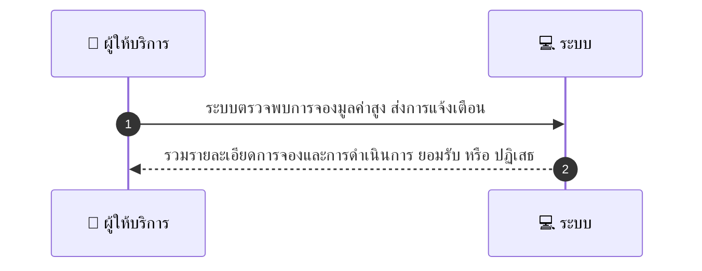
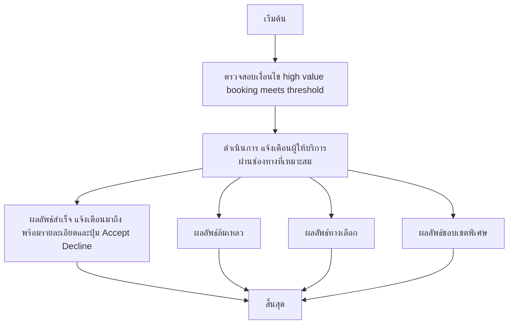

# MCC075 - รับการแจ้งเตือนเมื่อมีลูกค้า new high-value booking

## 👤 บทบาท
- ผู้ให้บริการ

## 🎯 เป้าหมายของเคส
- ในฐานะ
- ต้องการ
- เพื่อ

## ⚙️ เงื่อนไขก่อนเริ่ม (Precondition)
- High-value booking meets threshold

## 🧭 ผลลัพธ์และสถานการณ์
- ✅ ผลลัพธ์ที่คาดหวัง (Success Flow): รวมรายละเอียดการจองและการดำเนินการทันที ยอมรับหรือปฏิเสธ  
- ❌ ผลลัพธ์ที่ Failure:  
  - ไม่สามารถส่งการแจ้งเตือนไปยังผู้ให้บริการได้เนื่องจากปัญหาการเชื่อมต่อระบบ/เครือข่าย
  - ข้อมูล booking ที่ส่งมาไม่ครบถ้วนหรือมีค่าผิดพลาด ทำให้ไม่สามารถสร้างข้อความแจ้งเต้อนได้
  - บริการส่งการแจ้งเตือนไม่ตอบสนอง (Push/Email/SMS) และเกิด timeout
  - เกินขีดจำกัดการส่งต่อผู้ให้บริการ (rate limit) ทำให้ต้อง Retry ภายหลัง
  - ผู้ให้บริการสถานะ offline หรือปิดการรับการแจ้งเตือนชั่วคราว (Do Not Disturb)
- 🔄 ผลลัพธ์ทางเลือก:  
  - แจ้งเตือนส่งผ่านหลายช่องทางครบถ้วน (in-app, email, SMS) ทำให้แน่ใจว่าผู้ให้บริการเห็น booking
  - แจ้งเตือนส่งสำเร็จผ่านช่องทางเดียวแต่มีลิงก์ดูรายละเอียดและปุ่ม Accept/Decline พร้อมใช้งาน
  - ผู้ให้บริการเห็นรายละเอียดการจองครบถ้วนและสามารถกด Accept หรือ Decline ได้ทันที
  - ระบบสำรองหาก Push แจ้งเตือนล้มเหลว จะทำการแจ้งผ่าน Email/SMS อัตโนมัติ
  - หากผู้ให้บริการตอบรับ อัปเดตสถานะจองและเตรียมทรัพยากรตามที่แจ้ง
- ⚠️ ผลลัพธ์ขอบเขตพิเศษ:  
  - แจ้งเตือนส่งผ่านหลายช่องทางครบถ้วน (in-app, email, SMS) ทำให้แน่ใจว่าผู้ให้บริการเห็น booking
  - แจ้งเตือนส่งสำเร็จผ่านช่องทางเดียวแต่มีลิงก์ดูรายละเอียดและปุ่ม Accept/Decline พร้อมใช้งาน
  - ผู้ให้บริการเห็นรายละเอียดการจองครบถ้วนและสามารถกด Accept หรือ Decline ได้ทันที
  - ระบบสำรองหาก Push แจ้งเตือนล้มเหลว จะทำการแจ้งผ่าน Email/SMS อัตโนมัติ
  - หากผู้ให้บริการตอบรับ อัปเดตสถานะจองและเตรียมทรัพยากรตามที่แจ้ง

## ✅ เกณฑ์การยอมรับ (Acceptance Criteria)
- Threshold configurable
- notifications prioritized

## ⏱ ลำดับความสำคัญ / SLA
- Priority: P2
- SLA: Notify immediate

---

## 🔁 Sequence Diagram  
> แสดงลำดับเหตุการณ์ระหว่าง "ผู้ให้บริการ" กับ "ระบบ"

---

## 🧭 Flowchart Diagram
> แสดงขั้นตอนการทำงานของระบบอย่างเข้าใจง่าย

