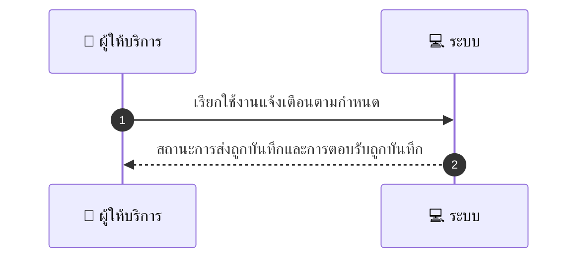
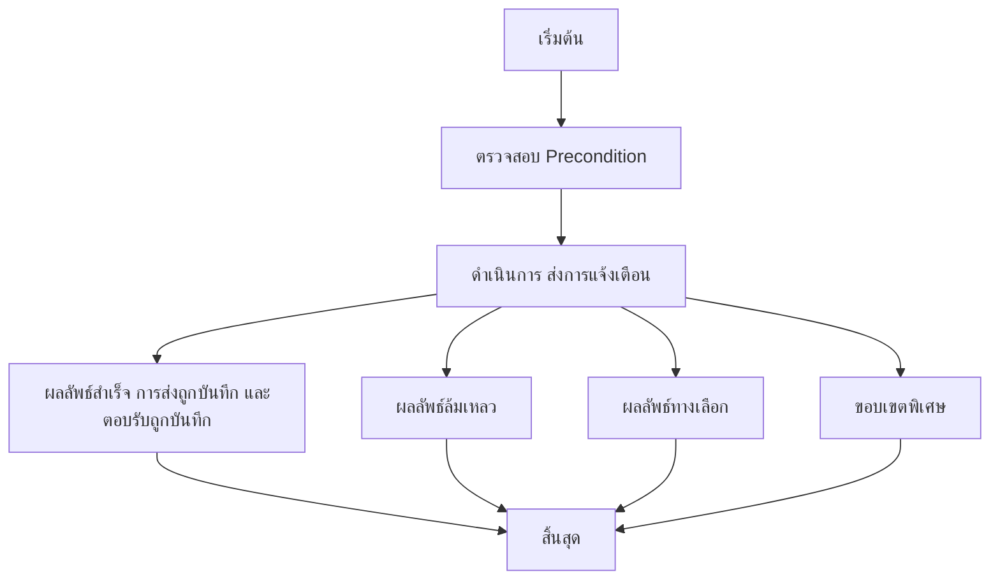

# MCC077 - เชื่อมต่อ SMS โทรศัพท์เพื่อยืนยันวันก่อนงาน Phone Reminder Integration

## 👤 บทบาท
- ผู้ให้บริการ

## 🎯 เป้าหมายของเคส
- ในฐานะ ผู้ให้บริการ
- ต้องการ ตั้งการโทรหรือ SMS ยืนยันวันก่อนงาน opt in
- เพื่อ เพื่อให้ลูกค้ายืนยันและลด no show

## ⚙️ เงื่อนไขก่อนเริ่ม (Precondition)
- Provider enable phone reminders

## 🧭 ผลลัพธ์และสถานการณ์
- ✅ ผลลัพธ์ที่คาดหวัง (Success Flow): Delivery logged, responses captured, opt-out respect
- ❌ ผลลัพธ์ที่ Failure:
  - Delivery ล้มเหลว หมายเลขไม่ถูกต้อง/ไม่สามารถส่งได้
  - การส่งล้มเหลวจากเครือข่ายผู้ให้บริการ
  - ไม่สามารถบันทึกสถานะการส่งได้หลังจากพยายามหลายครั้ง
  - ไม่สามารถติดตามผลลัพธ์การส่งและต้องการการตรวจสอบจากทีมสนับสนุน
- 🔄 ผลลัพธ์ทางเลือก:
  - ผู้รับตอบรับว่า ยืนยัน หรือ ยืนยันวัน/เวลา ทำให้วันและเวลาการแจ้งเตือนถูกยืนยัน
  - ผู้รับตอบว่า Reschedule หรือ เปลี่ยนวัน ระบบบันทึกการเปลี่ยนแปลงและกำหนดแจ้งเตือนใหม่
  - ผู้รับตอบว่า โทรภายหลัง หรือ Call me later ระบบเลื่อนการแจ้งเตือนตามเวลาร้องขอ
  - ผู้รับตอบว่า STOP หรือ ยกเลิกการรับข้อความ ระบบยกเลิกการแจ้งเตือนสำหรับเบอร์นั้น
- ⚠️ ผลลัพธ์ขอบเขตพิเศษ:
  - ผู้รับตอบรับว่า ยืนยัน หรือ ยืนยันวัน/เวลา ทำให้วันและเวลาการแจ้งเตือนถูกยืนยัน
  - ผู้รับตอบว่า Reschedule หรือ เปลี่ยนวัน ระบบบันทึกการเปลี่ยนแปลงและกำหนดแจ้งเตือนใหม่
  - ผู้รับตอบว่า โทรภายหลัง หรือ Call me later ระบบเลื่อนการแจ้งเตือนตามเวลาร้องขอ
  - ผู้รับตอบว่า STOP หรือ ยกเลิกการรับข้อความ ระบบยกเลิกการแจ้งเตือนสำหรับเบอร์นั้น

## ✅ เกณฑ์การยอมรับ (Acceptance Criteria)
- ระบบต้องบันทึกการส่งแต่ละครั้งรวมถึงสถานะการส่ง
- รวบรวมและบันทึกการตอบรับจากลูกค้าทันที
- หากลูกค้ opt out ระบบหยุดส่งข้อความถาวรสำหรับเบอร์นั้น
- การแจ้งเตือนต้องสอดคล้องกับการตั้งค่า provider
- รายงานสถานะการแจ้งเตือนต้องพร้อมใช้งานสำหรับทีมสนับสนุน

## ⏱ ลำดับความสำคัญ / SLA
- Priority: P2
- SLA: Attempt schedule per provider settings

---

## 🔁 Sequence Diagram  
> แสดงลำดับเหตุการณ์ระหว่าง "ผู้ให้บริการ" กับ "ระบบ"

---

## 🧭 Flowchart Diagram
> แสดงขั้นตอนการทำงานของระบบอย่างเข้าใจง่าย

